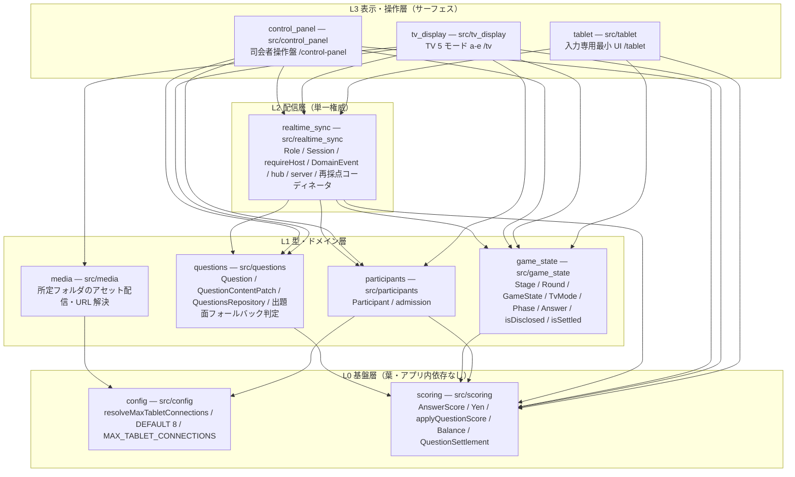
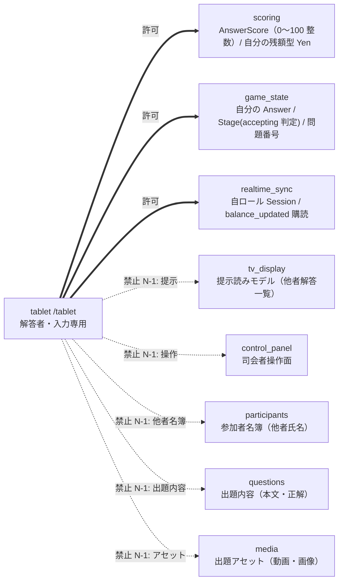
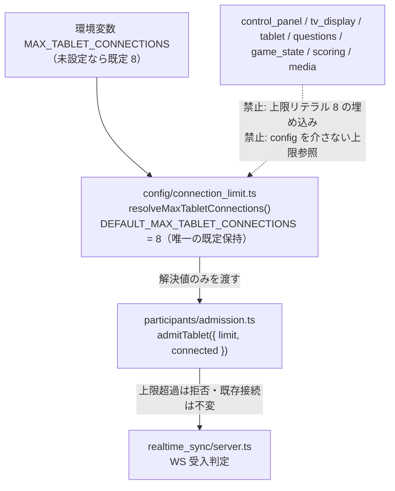

---
codd:
  node_id: detailed_design:component-dependency-map
  type: design
  depends_on:
  - id: design:system-design
    relation: depends_on
    semantic: technical
  - id: detailed_design:shared-domain-model
    relation: depends_on
    semantic: technical
  depended_by:
  - id: test:test-strategy
    relation: depends_on
    semantic: verification
  conventions:
  - targets:
    - module:tablet
    - module:tv_display
    reason: タブレット（入力専用）と TV（提示専用）の責務を分離し、タブレットが提示・他者情報を持つ依存を作らない（第三要件・N-1）。違反時リリース不可。
  - targets:
    - module:config
    reason: 接続上限等の設定値は config を経由して参照し、各モジュールに定数埋め込みしない依存構造とする（論点10）。違反時リリース不可。
  modules:
  - questions
  - media
  - scoring
  - game_flow
  - participants
  - control_panel
  - tablet
  - tv_display
  - realtime_sync
  - config
  operation_flow:
    actors:
    - id: host
      label: 司会者（制御盤）
      surface: /control-panel
    - id: contestant
      label: 解答者（タブレット）
      surface: /tablet
    - id: audience
      label: 観客（TV）
      surface: /tv
    - id: system
      label: クラウドサーバ（realtime_sync）
    operations:
    - id: op_load_questions
      actor: host
      verb: load
      target: question_set
      trigger: 制御盤で事前問題ファイルの読込を実行
      route: /control-panel
      preconditions:
      - ゲーム未開始またはライブ編集フェーズ
      measurement_source: 事前問題ファイル
      durable_state: questions テーブル（text / image_path / video_path / correct_value）
      readback: ランタイム出題は questions テーブルから供給（ファイル再読込に依存しない）
      expected_outcomes:
      - 各問が questions テーブルへ登録される
      - correct_value が 0〜100 の整数（AnswerScore）で保持される
      dod_obligations:
      - id: dod_load_persist
        text: 読み込んだ全問が questions テーブルに登録され、再取得で登録時と同一の text と correct_value を返す
      - id: dod_cdm_questions_write_owner
        text: questions テーブルへの書込みは src/questions の QuestionsRepository 経由のみで、control_panel
          は realtime_sync 経由で questions を呼び出し独自の questions 書込みを持たない
    - id: op_join_game
      actor: contestant
      verb: join
      target: game_session
      trigger: 制御盤の QR を読取り /join で氏名を自己入力して参加確定
      route: /join
      ui_pattern: qr_scan_then_name_input
      preconditions:
      - 接続数が MAX_TABLET_CONNECTIONS 未満
      durable_state: participants テーブル（name / connection_id）＋ balances 行の初期化
      readback: 制御盤の参加者一覧と TV e モードに反映
      visible_to:
      - host
      - audience
      forbidden_actors: []
      expected_outcomes:
      - 自己入力氏名で participants に 1 人 1 レコードが作られる
      - 当該参加者の balances が 10000 円で初期化される
      dod_obligations:
      - id: dod_join_self_name
        text: 参加者が自己入力した氏名が participants に永続し制御盤の参加者一覧に表示される
      - id: dod_cdm_join_write_owner
        text: participants への書込みは src/participants が単一所有し、balances 初期化は src/scoring
          の balance リポジトリを participants が呼び出して行い INITIAL_GRANT=10000 を scoring/yen.ts
          から import する
    - id: op_enforce_connection_limit
      actor: system
      verb: reject
      target: tablet_connection
      trigger: 接続数が MAX_TABLET_CONNECTIONS に達した状態での新規接続試行
      measurement_source: 現在接続数と config の MAX_TABLET_CONNECTIONS 解決値
      threshold: MAX_TABLET_CONNECTIONS（既定 8）
      preconditions:
      - connected >= MAX_TABLET_CONNECTIONS
      durable_state: 既存接続は不変
      expected_outcomes:
      - 上限超過の接続は断られる
      - 既存接続は影響を受けない
      boundary_cases:
      - 既定 8: 8 台目は接続可・9 台目は拒否
      - 設定 16: 16 台目は接続可・17 台目は拒否
      - 設定 32: 32 台目は接続可・33 台目は拒否
      dod_obligations:
      - id: dod_limit_default_eight
        text: 設定未指定時に 8 台まで接続でき 9 台目が拒否される
      - id: dod_limit_config_follows
        text: MAX_TABLET_CONNECTIONS を 16/32 へ設定変更するとコード改修なしに上限がその値へ追随する
      - id: dod_cdm_config_single_point
        text: 上限判定経路は participants/admission.ts が config/connection_limit.ts の resolveMaxTabletConnections
          解決値を参照する 1 本のみで、config 以外のソースに上限リテラル 8 が存在しない
    - id: op_submit_answer
      actor: contestant
      verb: submit
      target: answer
      trigger: タブレットの 4 ボタン（+1/-1/+10/-10）で値を作り送信
      route: /tablet
      ui_pattern: four_button_stepper
      measurement_source: タブレット数値入力
      preconditions:
      - 当該問の rounds.stage が accepting
      from_state: accepting
      to_state: accepting
      durable_state: answers テーブル（value / submitted_at）
      readback: 送信済み表示と自分の残額のみ（他者情報は不可視）
      expected_outcomes:
      - 0〜100 の整数のみ answer_submitted として永続化される
      boundary_cases:
      - 0 は受理
      - 100 は受理
      - -1 は UI とサーバの双方で拒否
      - 101 は UI とサーバの双方で拒否
      - 50.5 は UI とサーバの双方で拒否
      dod_obligations:
      - id: dod_submit_range_dual_guard
        text: 負値・小数・100 超・非数値は UI とサーバの双方で拒否され answers に入らない
      - id: dod_cdm_tablet_min_deps
        text: src/tablet 配下のいずれのファイルも tv_display/control_panel/participants/questions/media
          を import せず、回答検証は scoring/answer_score.ts の assertAnswerScore を import して用いる
      - id: dod_cdm_tablet_readmodel_self_only
        text: タブレットが購読・表示する読みモデルは自分の Answer と自分の Balance のみで、他者の Answer/Balance/QuestionSettlement
          を取得する依存辺を持たない
    - id: op_lock_answers
      actor: host
      verb: lock
      target: answers
      trigger: 制御盤で「そこまで」を押下
      route: /control-panel
      forbidden_actors:
      - contestant
      from_state: accepting
      to_state: answers_locked
      durable_state: rounds.stage = answers_locked
      consumer_surfaces:
      - contestant_tablets
      expected_outcomes:
      - 全解答者タブレットの入力がロックされる
      - 締切後の answers への書込みは拒否される
      dod_obligations:
      - id: dod_lock_host_only
        text: 締切は role host のみ発動でき contestant からの締切コマンドは 401/403 で拒否される
      - id: dod_lock_blocks_submit
        text: rounds.stage が answers_locked 以降のとき game_state の Answer リポジトリが answers
          への挿入/更新を拒否する
      - id: dod_cdm_host_guard_single
        text: 締切コマンドは realtime_sync/session.ts の requireHost を通過した経路のみが game_state
          の stage 遷移を起動し、コマンドハンドラが独自のロール判定を再実装しない
    - id: op_open_answers
      actor: host
      verb: open
      target: answers
      trigger: 制御盤で「解答オープン！」を押下
      route: /control-panel
      forbidden_actors:
      - contestant
      from_state: answers_locked
      to_state: answers_opened
      durable_state: rounds.stage = answers_opened
      visible_to:
      - audience
      consumer_surfaces:
      - tv_mode_b
      expected_outcomes:
      - 開示前は他者解答が全端末向け読みモデルに含まれない
      - 開示後 TV(b) に氏名と解答が一斉表示される
      dod_obligations:
      - id: dod_open_hidden_before
        text: rounds.stage が answers_opened 未満の間はどの端末向け読みモデルにも他者の解答が含まれない
      - id: dod_cdm_open_tv_only
        text: 開示後の他者氏名＋解答の一斉表示は tv_display 経路にのみ供給され、tablet はこの読みモデルへの依存辺を持たないため開示情報が載らない
    - id: op_reveal_correct
      actor: host
      verb: reveal
      target: correct_value
      trigger: 制御盤で正解発表を実行
      route: /control-panel
      forbidden_actors:
      - contestant
      from_state: answers_opened
      to_state: answer_revealed
      durable_state: rounds.stage = answer_revealed
      consumer_surfaces:
      - tv_mode_c
      expected_outcomes:
      - TV(c) に questions.correct_value が提示される
      - 以降の正解ライブ編集は自動再採点の対象となる
      dod_obligations:
      - id: dod_reveal_marks_disclosed
        text: 正解発表の実行で当該問の rounds.stage が answer_revealed（開示済み c 以降）として記録される
      - id: dod_cdm_is_disclosed_owner
        text: 開示済み判定は game_state/progression.ts の isDisclosed のみを用い、scoring や表示層が独自の開示判定を再実装しない
    - id: op_compute_settlement
      actor: host
      verb: settle
      target: balances
      trigger: 制御盤で得点精算を実行
      route: /control-panel
      from_state: answer_revealed
      to_state: settlement_computed
      measurement_source: answers.value と questions.correct_value
      durable_state: settlements（error / delta_yen / pitari_bonus_yen）＋ balances（円・整数）＋
        rounds.stage = settlement_computed
      consumer_surfaces:
      - tv_mode_d
      - tv_mode_e
      expected_outcomes:
      - 誤差 = 絶対値(answer - correct) が 0〜100 整数で算出される
      - 増減円 = 誤差 × -100 で balances が更新される
      - 誤差 0 のピタリ賞 +1000 円が balances へ加算される
      boundary_cases:
      - 誤差 0 は +1000（丁度）
      - 誤差 1 は -100 のみ（直上）
      dod_obligations:
      - id: dod_settle_delta
        text: 誤差 5 の精算後に当該プレイヤーの balances が精算前より 500 円少ない
      - id: dod_settle_currency_yen
        text: settlements と balances と API 応答と d の 6 列表が円建てで表され point/pt/点 の語が存在しない
      - id: dod_cdm_settle_owner_chain
        text: 精算は realtime_sync コーディネータが questions(correct_value) と answers を集約し scoring/apply_question_score.ts
          の applyQuestionScore を呼び、settlements と balances の書込みは src/scoring のリポジトリが単一所有する
    - id: op_live_edit_correct
      actor: host
      verb: edit
      target: question_or_correct_value
      trigger: 制御盤のライブ編集 UI で問題または正解を更新
      route: /control-panel
      forbidden_actors:
      - contestant
      durable_state: questions 更新（text / image_path / video_path / correct_value）
      readback: DB 再取得で編集後の値を返す
      expected_outcomes:
      - 問題・正解の双方を進行中に編集でき questions に永続する
      dod_obligations:
      - id: dod_edit_persist
        text: 進行中に編集した問題文と正解値が questions に永続し再取得で読み戻せる
      - id: dod_cdm_patch_write_owner
        text: 編集入力は questions の QuestionContentPatch 型で questions リポジトリのみが書込み、正解は
          scoring/answer_score.ts の assertAnswerScore で検証される
    - id: op_auto_rescore
      actor: system
      verb: rescore
      target: balances
      trigger: 開示済み（rounds.stage が answer_revealed 以降）の問題で正解をライブ編集
      preconditions:
      - 当該問の rounds.stage が answer_revealed 以降
      measurement_source: 編集後 questions.correct_value と既存 answers.value
      from_state: answer_revealed
      to_state: answer_revealed
      durable_state: settlements 再計算 ＋ balances 差分更新
      consumer_surfaces:
      - tv_mode_d
      - tv_mode_e
      expected_outcomes:
      - 正解訂正で当該問の全 settlements が再計算される
      - balances が旧拠出との差分で更新される
      - rounds.stage が settlement_computed の問は TV d/e が同時更新される
      boundary_cases:
      - c 到達問の正解訂正 → 再採点が走る
      - c 未到達（isDisclosed 偽）の正解編集 → 再採点は走らない（境界外）
      dod_obligations:
      - id: dod_rescore_after_c
        text: rounds.stage が answer_revealed 以降で正解を直すと settlements と balances が再計算され各人の残額へ即時反映される
      - id: dod_rescore_no_before_c
        text: rounds.stage が answer_revealed 未満の正解編集では settlements と balances が変化しない
      - id: dod_cdm_rescore_coordinator
        text: 再採点コーディネータは src/realtime_sync に置かれ questions(correct_value) と answers
          を読み game_state の isDisclosed/isSettled で範囲を決め scoring の applyQuestionScore
          で値を計算する。scoring は game_state/questions を import せず、game_state は questions
          を import しない
    - id: op_undo_trigger
      actor: host
      verb: undo
      target: last_trigger
      trigger: 制御盤で取消を実行
      route: /control-panel
      forbidden_actors:
      - contestant
      durable_state: trigger_undone イベント
      expected_outcomes:
      - 直近の対象操作が取り消される
      boundary_cases:
      - 取消の具体挙動（直近のみか任意問題再開示か）は未確定（F-03・fixme）
      dod_obligations:
      - id: dod_undo_host_only
        text: 取消は role host のみ発動でき contestant からの取消コマンドは 401/403 で拒否される
      - id: dod_cdm_undo_event_owner
        text: trigger_undone は realtime_sync/events.ts の DomainEvent ユニオンの一員として realtime_sync
          の単一発行者からのみ配信される
    - id: op_switch_tv_mode
      actor: host
      verb: switch
      target: tv_mode
      trigger: 制御盤の「次へ」「戻る」または各モード個別ジャンプ
      route: /control-panel
      ui_pattern: next_back_jump
      durable_state: game_state.tv_mode
      consumer_surfaces:
      - tv_mode_a
      - tv_mode_b
      - tv_mode_c
      - tv_mode_d
      - tv_mode_e
      expected_outcomes:
      - 3 系統の操作で TV の表示モードが対応して切り替わる
      - a モードは動画→画像→テキストの 3 段で出題面を解決する
      boundary_cases:
      - 動画パス有 → 動画
      - 動画無・画像有 → 画像
      - 双方無 → テキスト
      dod_obligations:
      - id: dod_tv_three_switch_systems
        text: 次へ・戻る・個別ジャンプの 3 系統いずれでも TV の表示モードが対応値へ切り替わる
      - id: dod_cdm_tvmode_owner
        text: TvMode 列挙は game_state/game_state.ts のみが定義し tv_display は import のみで再定義しない。a
          モードのアセット実体解決は media 経由・面選択は questions の resolveQuestionFace で行い tv_display
          はそれらを組む
    - id: op_determine_winner
      actor: system
      verb: determine
      target: winner
      trigger: 10 問目の得点精算が完了
      preconditions:
      - 10 問すべての rounds.stage が settlement_computed
      measurement_source: 全問通算の balances.amount
      from_state: settlement_computed
      to_state: game_finished
      durable_state: game_state.phase = finished
      consumer_surfaces:
      - tv_mode_e
      expected_outcomes:
      - balances.amount 最多のプレイヤーが e モードで勝者として判別可能に表示される
      dod_obligations:
      - id: dod_winner_most_balance
        text: 10 問終了時に balances.amount 最多のプレイヤーが e モードで勝者として判別できる
      - id: dod_cdm_winner_read_only
        text: 勝者判定は balances.amount(Yen) の比較のみで決まり tv_display は Balance を import して表示するだけで再計算・書込みを行わない
---

# コンポーネント依存マップ（モジュール境界・依存方向／Mermaid graph）

## 1. Overview

### 1.1 本書の位置づけとスコープ

本書は `save-money-switcher`（フジテレビ『賞金先渡しクイズ SAVE MONEY』方式を家族で遊ぶクイズ操作盤）の **コンポーネント依存マップ** を確定する詳細設計書である。上位の `design:system-design`（クラウド WEB アプリ・トポロジ／`depends_on`・technical）と `detailed_design:shared-domain-model`（型・単一所有／同一系統）を唯一の真実源とし、両書が定めたモジュール群を **どの `src/` モジュールがどのモジュールを import してよいか（依存方向）／してはならないか（禁止辺）** という一方向 DAG として一段具体化する。

役割分担を明確にする：`shared-domain-model` は **型と正準所有ファイル**（`AnswerScore`/`Yen`/`Role`/`DomainEvent` 等）を所有し、`system-design` は **トポロジ・不変条件・運用挙動** を所有する。**本書はモジュール境界・依存方向・禁止依存辺・永続状態の書込み単一所有（CRUD 境界）・DomainEvent の単一発行者を所有する。** 依存方向を DAG として固定し、循環と越境 import を封じ、同一責務の二重実装（reimplementation drift）を構造で防ぐことが本書の中核目的である。

ここに記す 🟦 依存方向・禁止辺・単一所有割当に反する成果物は **リリース不可（release-blocking）** として扱う。

### 1.2 依存方向の不変条件マップ（本書が具体化する制約）

依存方向は **一方向 4 層 DAG** とし、逆流・循環を認めない。層は上流（葉）から下流（サーフェス）へ：

| 層 | モジュール（`src/`） | 役割 | 依存できる相手 |
|---|---|---|---|
| **L0 基盤層（葉）** | `config`, `scoring` | 設定解決／純粋スコアリング・値型 | アプリ内モジュールに依存しない（葉） |
| **L1 型・ドメイン層** | `media`, `questions`, `game_state`, `participants` | エンティティ型・リポジトリ・純粋述語・アセット配信 | L0 のみ |
| **L2 配信層（単一権威）** | `realtime_sync` | クラウド WebSocket 権威・ロール／権限・DomainEvent・再採点コーディネータ | L0・L1 |
| **L3 表示・操作層（サーフェス）** | `control_panel`, `tv_display`, `tablet` | 司会者操作盤／TV 提示／タブレット入力 | L0・L1・L2 |

| # | 対象 | 不変条件（依存方向としての具体化） | 本書での準拠箇所 |
|---|---|---|---|
| **N-1（非交渉 1）** | `module:tablet`, `module:tv_display` | タブレット（入力専用）と TV（提示専用）の責務を分離し、**タブレットが提示・他者情報を持つ依存を作らない**（第三要件）。`tablet → tv_display`／`tablet → participants`（名簿）／`tablet → questions`（出題内容）／`tablet → control_panel`／`tablet → media` は禁止辺。違反時リリース不可 | §2.2・§3.3・§3.5・§4.2 |
| **N-2（非交渉 2）** | `module:config` | 接続上限等の設定値は **`config` を経由して参照**し、各モジュールに定数埋め込みしない依存構造とする（論点10）。上限判定経路は `participants/admission → config` のみ、数値リテラル `8` を他所に持たない | §2.3・§3.3・§3.5・§4.2 |
| INV-1（継承） | `module:realtime_sync` | クラウド WebSocket が単一権威。ホスト PC をサーバにしない。表示層は `realtime_sync` を import するが `realtime_sync` は表示層を import しない（循環禁止） | §2.1・§3.4 |
| INV-2（継承） | `module:questions` | 問題は DB 登録・DB 供給。`questions` テーブルへの書込みは `questions` リポジトリ経由のみ | §3.2 |
| INV-3（継承） | `module:config`/`module:participants` | 接続上限はハードコード禁止・設定解決。16/32 へ非改修追随 | §2.3・§3.2 |
| INV-4（継承） | `module:participants` | 家族限定アクセス制御を設計責務として保持。無制御公開はリリース不可 | §4.5・§5.3 |
| INV-5（継承） | `role:host`/`role:contestant` | 締切・開示・取消は host のみ。ガードは `realtime_sync/session` の `requireHost` 単一経路 | §3.4・§4.5 |
| INV-6（継承） | `module:scoring`/`module:tablet` | 0〜100 整数のみ受理、UI＋サーバ二重防衛。両経路が同一 `assertAnswerScore`（scoring）を import | §3.1・§4.2 |
| INV-7（継承） | `module:scoring`/`module:tv_display` | 円建て固定。金額型は `scoring/yen.ts` の `Yen` に収束、`tv_display` は import のみ | §3.1 |

### 1.3 ツールチェーン・レイアウト・モジュール指定子前提（scaffold 固定・釈義不可）

- **実装言語 = TypeScript のみ。** 本書のモジュールパス・依存参照・import 例はすべて TypeScript 慣行のみを用い、他言語の拡張子・マニフェスト・ツールを例示・フォールバックとしても登場させない。
- **テストランナー = Vitest（固定・release-blocking のグラウンドトゥルース）。** 依存方向の自動検証（§4.2 のアーキテクチャフィットネステスト）を含め、全テストは Vitest 自身の宣言 API（`import { describe, it, expect } from "vitest";`）で記述する。「ランタイム依存を最小化する」方針は **出荷コードのランタイム依存** にのみ及び、テストランナーには及ばない。依存数の哲学を根拠に別フレームワークや Node 組み込み `node:test` を用いてはならない（テスト内で `node:fs` を利用しても、走らせるのは Vitest である）。
- **モジュール解決 = NodeNext/Node16。** すべての相対 import 指定子は **出力される `.js` ファイル名を明示した拡張子** を伴う（`import { admitTablet } from "../participants/admission.js";`。`"./x"`・`"./x.ts"` は不可）。re-export・default/namespace import・type-only import も同一規約。拡張子欠落は TS2835 でコンパイル不能であり、**独立生成されたモジュールが依存辺を張れない** ため、依存マップの成立自体が拡張子規約に依存する。
- **レイアウト契約（output-path fence 強制）。** ソースは **必ず `src/` 配下**、テストは **必ず `tests/` 配下**（`test/`・`spec/`・`specs/` を発明しない。`tests/architecture/` 等のサブディレクトリは可）。`package.json`・`package-lock.json`・`tsconfig.json`・`vitest.config.ts` は harness scaffold 所有につき、本書はこれらを成果物として出力・宣言しない。

### 1.4 アクター向けサーフェス → モジュール対応・コピー義務

各サーフェスは L3 の 1 モジュールが所有し、供給データは下流依存でのみ得る。可視コピーには可視ラベル（司会者／解答者／観客）を用い、内部識別子（`host`/`contestant`）・実装根拠・環境前提・権限境界の説明を露出させない。全サーフェス共通で `point`／`pt`／`点` を禁止パターンとし、金額は「円」で表す。

| サーフェス | ルート | 所有モジュール | 主対象 | 許可ナビ／アクション | 禁止ナビ／アクション | 必須の可視コピー意図 / 禁止コピー |
|---|---|---|---|---|---|---|
| 制御盤 | `/control-panel` | `control_panel` | 司会者 | 締切・開示・正解発表・得点精算・取消・問題/正解編集・TV モード切替（次へ/戻る/個別ジャンプ）・参加 QR 表示 | 解答者の入力操作面を出さない | 「そこまで」「解答オープン！」「正解発表」等の司会者向け操作語・参加 QR ／ 内部 role 識別子・テスト/デモ/サンプル表記・`point`/`pt`/`点` |
| TV | `/tv` | `tv_display` | 観客 | 表示のみ（受動） | いかなる入力・操作要素も置かない | a 出題面／b 氏名＋解答／c 正解値／d 6 列表（氏名/解答/誤差/増減円/ピタリ賞/残額）・**円**／e 全問通算一覧 ／ 実装ノート・`point`/`pt`/`点` |
| タブレット | `/tablet` | `tablet` | 解答者 | 4 ボタン（+1/−1/+10/−10）で 0〜100 を増減・送信・送信済み確認・自分の残額閲覧 | 他者の残額/得点/解答・出題内容・全体一覧・締切/開示/取消の各操作を出さない | 問題番号・数値入力・送信済み表示・自分の残額（**円**）／ 他者情報・司会者操作語・`point`/`pt`/`点` |
| 参加受付 | `/join` | `participants` | 解答者 | 氏名入力・参加確定 | 事前氏名台帳／座席固定割当の提示、保護された制御盤ナビの露出 | 「お名前を入力してください」等の参加導線 ／ ロール解決済みの曖昧な保護ナビ・環境前提 |

**エントリ／事前認証サーフェス**（`/join`・未認証時の到達点）は、アクセス状態に整合しない保護ナビ（制御盤操作等）を露出しない。**タブレットのクロスアクター非露出は依存辺そのもので担保する**：`tablet` が `participants`（名簿）・`questions`（出題内容）・`tv_display`（提示読みモデル）を import しなければ、他者情報を UI に載せる経路が構造的に存在しない（§2.2）。

---

## 2. Mermaid Diagrams

### 2.1 モジュール依存 DAG（全体・4 層一方向）



矢印 `X --> Y` は「X が Y を import する（X が Y に依存する）」を表す。**基盤層 `{config, scoring}` → 型・ドメイン層 `{media, questions, game_state, participants}` → 配信層 `{realtime_sync}` → 表示・操作層 `{control_panel, tv_display, tablet}`** の一方向 DAG であり循環はない。この方向性が単一所有を成立させる：`scoring` は純粋な葉であり `game_state` を import しないため、**再採点範囲の判定（`isDisclosed`/`isSettled`）は `game_state` が所有し、値計算（`applyQuestionScore`）は `scoring` が所有する** という責務分割が構造で固定される。`realtime_sync` は L1 の型を import してイベントペイロードを型付けるが、L1 は `realtime_sync` を import しない（`Role`/`Session`/`DomainEvent` は `realtime_sync` の単独所有）。`participants/admission` は接続数のみを扱い `config` に依存するため、`participants ⇄ realtime_sync` の循環は生じない。**`tablet` の依存先が `{realtime_sync, scoring, game_state}` の 3 つに限定される**ことが N-1 の中核であり、これにより出題内容・他者名簿・提示読みモデルを取得する経路がタブレット側に存在しない（§2.2 で拡大図）。

### 2.2 タブレット隔離境界（N-1・禁止依存辺）



太実線が **許可辺**、点線が **禁止辺（release-blocking）** である。第三要件（タブレット＝入力専用）と N-1 規約を、コメントや UI 上の運用ではなく **import グラフの構造** で担保する。タブレットは (1) 自分の回答値を作るための `AnswerScore` と自分の残額表示のための `Yen` を `scoring` から、(2) 現在の問題番号と締切判定（`Stage === "accepting"`）と自分の `Answer` 型を `game_state` から、(3) 自ロールの `Session` と `balance_updated` イベント購読を `realtime_sync` から、それぞれ import する。**`tv_display`・`control_panel`・`participants`・`questions`・`media` を一切 import しない**ため、他者の解答・残額・氏名、出題本文・正解、司会者操作、動画/画像アセットをタブレット UI に載せる依存経路が構造的に閉じている。この禁止辺は §4.2 の Vitest フィットネステストで機械検証し、違反 import が混入した瞬間にビルドが赤になる。TV（`tv_display`）は逆に提示専用として `questions`/`media`/`participants` を import してよいが、`tablet` を import してはならない（提示層が入力層に依存しない）。

### 2.3 接続上限の単一解決点（N-2・論点10）



実線が **唯一許可された上限解決経路**、点線が **禁止パターン** である。N-2 規約への準拠として、接続上限は `src/config/connection_limit.ts` の `resolveMaxTabletConnections()` が **唯一解決** し、既定値 `8` は `DEFAULT_MAX_TABLET_CONNECTIONS` のみが保持する。上限判定は `participants/admission.ts` が **config の解決値を引数で受けて** 行い、`realtime_sync/server.ts` の WS 受入は `admitTablet` を呼ぶ。**他のどのモジュールも数値リテラル `8` を上限として埋め込まず、config を介さずに上限を参照しない。** これにより `MAX_TABLET_CONNECTIONS` を `16`／`32` へ設定変更するとコード改修なしに上限がその値へ追随し（既定 8: 9 台目拒否／設定 16: 17 台目拒否／設定 32: 33 台目拒否）、32 台程度までの同時接続で同期基盤が破綻しない（INV-3）。config は葉モジュールであり、`config → 他モジュール` の逆流は禁止辺である。

---

## 3. Ownership Boundaries

### 3.1 モジュール → 格納先 → 責務 → 依存先マトリクス

各モジュールの依存先は下表が唯一の許可集合であり、これ以外の import は禁止辺（§3.3）である。共有型の正準所有は `shared-domain-model` §3.1 に従い、本書はそれを import する側の方向を固定する。

| モジュール | 格納先（`src/`） | 主責務 | 許可依存先 | 主に所有／供給する型・記号 |
|---|---|---|---|---|
| `config` | `src/config/` | 設定の単一解決点（接続上限・アセットルート） | （葉） | `resolveMaxTabletConnections`, `DEFAULT_MAX_TABLET_CONNECTIONS=8`, `ConfigSource` |
| `scoring` | `src/scoring/` | 純粋スコアリング・値型・派生連鎖 | （葉） | `AnswerScore`, `Yen`, `CURRENCY="円"`, `applyQuestionScore`, `QuestionSettlement`, `Balance`, `ScoreInput`/`ScoreResult` |
| `media` | `src/media/` | 所定フォルダのアセット配信・URL 解決 | `config` | アセット解決関数（`resolveAssetUrl` 等）・アセットルート参照 |
| `questions` | `src/questions/` | 事前ファイル読込→DB 登録・ライブ編集・出題面フォールバック判定 | `scoring` | `Question`, `QuestionContentPatch`, `QuestionsRepository`, `resolveQuestionFace` |
| `game_state` | `src/game_state/` | 進行段階・TV モード・回答エンティティ・範囲述語 | `scoring` | `Stage`, `Round`, `GameState`, `TvMode`, `Phase`, `Answer`, `isDisclosed`, `isSettled` |
| `participants` | `src/participants/` | QR 参加・氏名自己入力・接続上限判定・初期残額 | `scoring`, `config` | `Participant`, `admitTablet` |
| `realtime_sync` | `src/realtime_sync/` | クラウド WS 権威・ロール／権限・DomainEvent・再採点コーディネータ | `questions`, `game_state`, `scoring`, `participants` | `Role`, `Session`, `requireHost`, `isHost`, `ForbiddenRoleError`, `ROLE_LABELS`, `DomainEvent`, `hub`, `server` |
| `control_panel` | `src/control_panel/` | 司会者操作盤・ライブ編集 UI・MC 切替・QR 提示 | `realtime_sync`, `questions`, `game_state`, `scoring`, `participants`（＋ preview 時 `media`） | 制御盤 UI（新規ドメイン型を定義しない） |
| `tv_display` | `src/tv_display/` | TV 5 モード（a〜e）提示 | `realtime_sync`, `game_state`, `scoring`, `questions`, `participants`, `media` | TV UI（新規ドメイン型を定義しない） |
| `tablet` | `src/tablet/` | 入力専用最小 UI・4 ボタン・自分の残額のみ | `realtime_sync`, `scoring`, `game_state` | タブレット UI（新規ドメイン型を定義しない） |

**再利用の含意**：L3 の 3 サーフェスモジュールは **新規ドメイン型を定義せず**、L0〜L2 の正準型を import するだけである。例として `tv_display` の d 6 列表は `QuestionSettlement`（`scoring`）と `Participant.name`（`participants`）と `Balance`（`scoring`）を組むだけで、独自の金額型や誤差型を宣言しない。`media` は葉に近い L1 モジュールで、questions が保持する `Question.videoPath`/`imagePath`（`string | null`）の **物理アセット解決**（所定フォルダ＋config のアセットルートから URL 化）のみを担い、**出題面の選択判定（動画→画像→テキスト）は `questions` の `resolveQuestionFace` が唯一所有** する。この分割により、a モードフォールバックの再実装（drift）を防ぐ。

### 3.2 永続状態の書込み単一所有（CRUD 境界）

各永続テーブル／アセットへの **書込みは 1 モジュールのリポジトリ経由のみ** とし、他モジュールは読取り読みモデルを介するか、書込み所有モジュールの関数を呼ぶ。

| 永続対象 | 書込み単一所有モジュール | 書込みを起動する公開トリガー経路 | 読取り消費者 |
|---|---|---|---|
| `questions` テーブル | `questions`（`QuestionsRepository`） | `control_panel` の読込／ライブ編集 → `realtime_sync` → `questions`（host ガード後） | `tv_display`（a/c 出題・正解）, `realtime_sync`（再採点コーディネータ） |
| `answers` テーブル | `game_state`（Answer リポジトリ） | `tablet` の送信 → `realtime_sync` → `game_state`（`stage=accepting` のみ許可） | `scoring`（精算入力）, `control_panel`, `tv_display`（b 開示後） |
| `participants` テーブル | `participants` | `/join` の自己入力 → `realtime_sync` → `participants`（上限判定後） | `control_panel`（一覧）, `tv_display`（e） |
| `rounds` / `game_state` テーブル | `game_state` | `control_panel` の締切/開示/正解発表/精算/切替 → `realtime_sync` → `game_state`（host ガード後） | 全サーフェス（進行・TV モード） |
| `settlements` テーブル | `scoring`（`settlement` リポジトリ） | `realtime_sync` 再採点コーディネータ（精算／再採点時） | `tv_display`（d の 6 列） |
| `balances` テーブル | `scoring`（`balance` リポジトリ） | 参加時初期化（`participants`）／精算・再採点（`realtime_sync` コーディネータ経由 `scoring`） | `tablet`（自分のみ）, `tv_display`（d/e） |
| アセット（所定フォルダ） | `media`（読取り・配信のみ／実体は事前配置） | 事前配置（当日入力に依存しない） | `tv_display`（a）, `control_panel`（preview） |

この単一所有により、例えば `balances` の更新は必ず `scoring` の balance リポジトリを通り、`tv_display` や `tablet` が独自に残額を書き換える経路が存在しない。`answers` の書込みは `stage=accepting` のときのみ許可され、締切後（`answers_locked` 以降）は `game_state` 側の終端状態ガードでサーバ拒否される（`dod_lock_blocks_submit`）。

### 3.3 禁止依存辺の一覧（release-blocking）

以下の import は本書の依存 DAG を破壊するため禁止辺であり、混入はリリース不可。§4.2 の Vitest フィットネステストで機械検証する。

- **N-1（タブレット隔離）**: `tablet → tv_display` / `tablet → control_panel` / `tablet → participants` / `tablet → questions` / `tablet → media`。タブレットは `{realtime_sync, scoring, game_state}` 以外を import しない。
- **提示層の逆流禁止**: `tv_display → tablet` / `tv_display → control_panel`。提示専用が入力・操作層に依存しない。
- **配信層の逆流禁止（INV-1）**: `realtime_sync → control_panel` / `realtime_sync → tv_display` / `realtime_sync → tablet`。L2 は L3 を import しない（循環禁止・単一権威）。
- **基盤層の葉性**: `scoring → *`（アプリ内モジュール）/ `config → *`。L0 はアプリ内モジュールを一切 import しない。とりわけ `scoring → game_state` / `scoring → questions` は禁止（値計算を範囲判定・DB から切り離す）。
- **型層の相互越境禁止**: `questions → game_state` / `game_state → questions`。両者は L1 の peer であり相互依存しない（`Answer` は `questionId: string` で参照し `Question` 型を import しない。再採点で両者を組む必要は `realtime_sync` コーディネータが担う）。
- **N-2（設定単一解決）**: `config` を介さない接続上限参照、および `config` 以外での上限リテラル `8` の埋め込み。

### 3.4 DomainEvent の単一発行者と権限ガードの単一経路（INV-1・INV-5）

- **DomainEvent 単一発行**: `DomainEvent` ユニオン（`answers_locked`/`answers_opened`/`answer_revealed`/`settlement_computed`/`trigger_undone`/`tv_mode_changed`/`participant_joined`/`balance_updated`）は `src/realtime_sync/events.ts` が唯一所有し、**クラウド WebSocket 権威（`src/realtime_sync/server.ts` + `hub.ts`）のみが発行者** である。`control_panel`/`tv_display`/`tablet` はイベントを購読・型参照するだけで直接発行しない（ホスト PC をサーバにしない・INV-1）。イベント名は `domain_event` 語彙の snake_case を正準とし、discriminated union の `type` フィールドに同一文字列を用いて名称のゆらぎを封じる。
- **権限ガード単一経路**: `requireHost(session)`（`src/realtime_sync/session.ts`）が締切・開示・正解発表・得点精算・取消・ライブ編集・TV モード切替の **唯一のガード** である。各コマンドハンドラは `requireHost` を再実装せず import し、非 host は `ForbiddenRoleError` → HTTP/WS 層で **401/403** に写像する。`Role` の判定源は `Session.role` の一点のみ。

### 3.5 非交渉規約への準拠明言

- **非交渉規約 1（`module:tablet` / `module:tv_display` 分離）への準拠**: タブレット（入力専用）と TV（提示専用）を別モジュール（`src/tablet/`・`src/tv_display/`）に分離し、依存 DAG（§2.1）と禁止辺（§3.3）で **`tablet` が提示・他者情報を持つ依存を作れない** 構造にした。`tablet` の許可依存は `{realtime_sync, scoring, game_state}` に限定し、`tv_display`/`participants`/`questions`/`control_panel`/`media` への import を禁止辺として §4.2 の Vitest で機械検証する。
- **非交渉規約 2（`module:config` 経由）への準拠**: 接続上限を `src/config/connection_limit.ts` の `resolveMaxTabletConnections()` に単一解決させ（§2.3）、`participants/admission.ts` はその解決値を引数で受けて判定する。config 以外での上限リテラル `8` の埋め込みと config を介さない上限参照を禁止辺とし、`MAX_TABLET_CONNECTIONS` の設定変更（8→16→32）にコード改修なしで追随することを §4.2 のテストで固定する。

### Operational Behavior Model

以下の単一 YAML ブロックが、コンポーネント依存マップの観点（各操作の書込み単一所有モジュール・依存辺・禁止辺・単一権限ガード・単一発行者・設定単一解決）から見た運用挙動の権威的出典であり、CoDD がドキュメントメタデータへ lift して実装計画と E2E 生成が共有する。上位 2 書と operation ID を一致させ、本書は各操作へ **モジュール境界・依存方向** の観点の `dod_obligations`（`dod_cdm_*`）を追加する。MECE 軸（happy path／永続・readback／権限境界／終端状態ガード／クロスアクター反映／派生読みモデル連鎖／閾値・境界）を横断して列挙し、未確定は `boundary_cases` または §5 のフラグへ回して発明しない。

```yaml
operation_flow:
  actors:
    - id: host
      label: 司会者（制御盤）
      surface: /control-panel
    - id: contestant
      label: 解答者（タブレット）
      surface: /tablet
    - id: audience
      label: 観客（TV）
      surface: /tv
    - id: system
      label: クラウドサーバ（realtime_sync）
  operations:
    - id: op_load_questions
      actor: host
      verb: load
      target: question_set
      trigger: 制御盤で事前問題ファイルの読込を実行
      route: /control-panel
      preconditions:
        - ゲーム未開始またはライブ編集フェーズ
      measurement_source: 事前問題ファイル
      durable_state: questions テーブル（text / image_path / video_path / correct_value）
      readback: ランタイム出題は questions テーブルから供給（ファイル再読込に依存しない）
      expected_outcomes:
        - 各問が questions テーブルへ登録される
        - correct_value が 0〜100 の整数（AnswerScore）で保持される
      dod_obligations:
        - id: dod_load_persist
          text: 読み込んだ全問が questions テーブルに登録され、再取得で登録時と同一の text と correct_value を返す
        - id: dod_cdm_questions_write_owner
          text: questions テーブルへの書込みは src/questions の QuestionsRepository 経由のみで、control_panel は realtime_sync 経由で questions を呼び出し独自の questions 書込みを持たない
    - id: op_join_game
      actor: contestant
      verb: join
      target: game_session
      trigger: 制御盤の QR を読取り /join で氏名を自己入力して参加確定
      route: /join
      ui_pattern: qr_scan_then_name_input
      preconditions:
        - 接続数が MAX_TABLET_CONNECTIONS 未満
      durable_state: participants テーブル（name / connection_id）＋ balances 行の初期化
      readback: 制御盤の参加者一覧と TV e モードに反映
      visible_to: [host, audience]
      forbidden_actors: []
      expected_outcomes:
        - 自己入力氏名で participants に 1 人 1 レコードが作られる
        - 当該参加者の balances が 10000 円で初期化される
      dod_obligations:
        - id: dod_join_self_name
          text: 参加者が自己入力した氏名が participants に永続し制御盤の参加者一覧に表示される
        - id: dod_cdm_join_write_owner
          text: participants への書込みは src/participants が単一所有し、balances 初期化は src/scoring の balance リポジトリを participants が呼び出して行い INITIAL_GRANT=10000 を scoring/yen.ts から import する
    - id: op_enforce_connection_limit
      actor: system
      verb: reject
      target: tablet_connection
      trigger: 接続数が MAX_TABLET_CONNECTIONS に達した状態での新規接続試行
      measurement_source: 現在接続数と config の MAX_TABLET_CONNECTIONS 解決値
      threshold: MAX_TABLET_CONNECTIONS（既定 8）
      preconditions:
        - connected >= MAX_TABLET_CONNECTIONS
      durable_state: 既存接続は不変
      expected_outcomes:
        - 上限超過の接続は断られる
        - 既存接続は影響を受けない
      boundary_cases:
        - 既定 8: 8 台目は接続可・9 台目は拒否
        - 設定 16: 16 台目は接続可・17 台目は拒否
        - 設定 32: 32 台目は接続可・33 台目は拒否
      dod_obligations:
        - id: dod_limit_default_eight
          text: 設定未指定時に 8 台まで接続でき 9 台目が拒否される
        - id: dod_limit_config_follows
          text: MAX_TABLET_CONNECTIONS を 16/32 へ設定変更するとコード改修なしに上限がその値へ追随する
        - id: dod_cdm_config_single_point
          text: 上限判定経路は participants/admission.ts が config/connection_limit.ts の resolveMaxTabletConnections 解決値を参照する 1 本のみで、config 以外のソースに上限リテラル 8 が存在しない
    - id: op_submit_answer
      actor: contestant
      verb: submit
      target: answer
      trigger: タブレットの 4 ボタン（+1/-1/+10/-10）で値を作り送信
      route: /tablet
      ui_pattern: four_button_stepper
      measurement_source: タブレット数値入力
      preconditions:
        - 当該問の rounds.stage が accepting
      from_state: accepting
      to_state: accepting
      durable_state: answers テーブル（value / submitted_at）
      readback: 送信済み表示と自分の残額のみ（他者情報は不可視）
      expected_outcomes:
        - 0〜100 の整数のみ answer_submitted として永続化される
      boundary_cases:
        - 0 は受理
        - 100 は受理
        - -1 は UI とサーバの双方で拒否
        - 101 は UI とサーバの双方で拒否
        - 50.5 は UI とサーバの双方で拒否
      dod_obligations:
        - id: dod_submit_range_dual_guard
          text: 負値・小数・100 超・非数値は UI とサーバの双方で拒否され answers に入らない
        - id: dod_cdm_tablet_min_deps
          text: src/tablet 配下のいずれのファイルも tv_display/control_panel/participants/questions/media を import せず、回答検証は scoring/answer_score.ts の assertAnswerScore を import して用いる
        - id: dod_cdm_tablet_readmodel_self_only
          text: タブレットが購読・表示する読みモデルは自分の Answer と自分の Balance のみで、他者の Answer/Balance/QuestionSettlement を取得する依存辺を持たない
    - id: op_lock_answers
      actor: host
      verb: lock
      target: answers
      trigger: 制御盤で「そこまで」を押下
      route: /control-panel
      forbidden_actors: [contestant]
      from_state: accepting
      to_state: answers_locked
      durable_state: rounds.stage = answers_locked
      consumer_surfaces: [contestant_tablets]
      expected_outcomes:
        - 全解答者タブレットの入力がロックされる
        - 締切後の answers への書込みは拒否される
      dod_obligations:
        - id: dod_lock_host_only
          text: 締切は role host のみ発動でき contestant からの締切コマンドは 401/403 で拒否される
        - id: dod_lock_blocks_submit
          text: rounds.stage が answers_locked 以降のとき game_state の Answer リポジトリが answers への挿入/更新を拒否する
        - id: dod_cdm_host_guard_single
          text: 締切コマンドは realtime_sync/session.ts の requireHost を通過した経路のみが game_state の stage 遷移を起動し、コマンドハンドラが独自のロール判定を再実装しない
    - id: op_open_answers
      actor: host
      verb: open
      target: answers
      trigger: 制御盤で「解答オープン！」を押下
      route: /control-panel
      forbidden_actors: [contestant]
      from_state: answers_locked
      to_state: answers_opened
      durable_state: rounds.stage = answers_opened
      visible_to: [audience]
      consumer_surfaces: [tv_mode_b]
      expected_outcomes:
        - 開示前は他者解答が全端末向け読みモデルに含まれない
        - 開示後 TV(b) に氏名と解答が一斉表示される
      dod_obligations:
        - id: dod_open_hidden_before
          text: rounds.stage が answers_opened 未満の間はどの端末向け読みモデルにも他者の解答が含まれない
        - id: dod_cdm_open_tv_only
          text: 開示後の他者氏名＋解答の一斉表示は tv_display 経路にのみ供給され、tablet はこの読みモデルへの依存辺を持たないため開示情報が載らない
    - id: op_reveal_correct
      actor: host
      verb: reveal
      target: correct_value
      trigger: 制御盤で正解発表を実行
      route: /control-panel
      forbidden_actors: [contestant]
      from_state: answers_opened
      to_state: answer_revealed
      durable_state: rounds.stage = answer_revealed
      consumer_surfaces: [tv_mode_c]
      expected_outcomes:
        - TV(c) に questions.correct_value が提示される
        - 以降の正解ライブ編集は自動再採点の対象となる
      dod_obligations:
        - id: dod_reveal_marks_disclosed
          text: 正解発表の実行で当該問の rounds.stage が answer_revealed（開示済み c 以降）として記録される
        - id: dod_cdm_is_disclosed_owner
          text: 開示済み判定は game_state/progression.ts の isDisclosed のみを用い、scoring や表示層が独自の開示判定を再実装しない
    - id: op_compute_settlement
      actor: host
      verb: settle
      target: balances
      trigger: 制御盤で得点精算を実行
      route: /control-panel
      from_state: answer_revealed
      to_state: settlement_computed
      measurement_source: answers.value と questions.correct_value
      durable_state: settlements（error / delta_yen / pitari_bonus_yen）＋ balances（円・整数）＋ rounds.stage = settlement_computed
      consumer_surfaces: [tv_mode_d, tv_mode_e]
      expected_outcomes:
        - 誤差 = 絶対値(answer - correct) が 0〜100 整数で算出される
        - 増減円 = 誤差 × -100 で balances が更新される
        - 誤差 0 のピタリ賞 +1000 円が balances へ加算される
      boundary_cases:
        - 誤差 0 は +1000（丁度）
        - 誤差 1 は -100 のみ（直上）
      dod_obligations:
        - id: dod_settle_delta
          text: 誤差 5 の精算後に当該プレイヤーの balances が精算前より 500 円少ない
        - id: dod_settle_currency_yen
          text: settlements と balances と API 応答と d の 6 列表が円建てで表され point/pt/点 の語が存在しない
        - id: dod_cdm_settle_owner_chain
          text: 精算は realtime_sync コーディネータが questions(correct_value) と answers を集約し scoring/apply_question_score.ts の applyQuestionScore を呼び、settlements と balances の書込みは src/scoring のリポジトリが単一所有する
    - id: op_live_edit_correct
      actor: host
      verb: edit
      target: question_or_correct_value
      trigger: 制御盤のライブ編集 UI で問題または正解を更新
      route: /control-panel
      forbidden_actors: [contestant]
      durable_state: questions 更新（text / image_path / video_path / correct_value）
      readback: DB 再取得で編集後の値を返す
      expected_outcomes:
        - 問題・正解の双方を進行中に編集でき questions に永続する
      dod_obligations:
        - id: dod_edit_persist
          text: 進行中に編集した問題文と正解値が questions に永続し再取得で読み戻せる
        - id: dod_cdm_patch_write_owner
          text: 編集入力は questions の QuestionContentPatch 型で questions リポジトリのみが書込み、正解は scoring/answer_score.ts の assertAnswerScore で検証される
    - id: op_auto_rescore
      actor: system
      verb: rescore
      target: balances
      trigger: 開示済み（rounds.stage が answer_revealed 以降）の問題で正解をライブ編集
      preconditions:
        - 当該問の rounds.stage が answer_revealed 以降
      measurement_source: 編集後 questions.correct_value と既存 answers.value
      from_state: answer_revealed
      to_state: answer_revealed
      durable_state: settlements 再計算 ＋ balances 差分更新
      consumer_surfaces: [tv_mode_d, tv_mode_e]
      expected_outcomes:
        - 正解訂正で当該問の全 settlements が再計算される
        - balances が旧拠出との差分で更新される
        - rounds.stage が settlement_computed の問は TV d/e が同時更新される
      boundary_cases:
        - c 到達問の正解訂正 → 再採点が走る
        - c 未到達（isDisclosed 偽）の正解編集 → 再採点は走らない（境界外）
      dod_obligations:
        - id: dod_rescore_after_c
          text: rounds.stage が answer_revealed 以降で正解を直すと settlements と balances が再計算され各人の残額へ即時反映される
        - id: dod_rescore_no_before_c
          text: rounds.stage が answer_revealed 未満の正解編集では settlements と balances が変化しない
        - id: dod_cdm_rescore_coordinator
          text: 再採点コーディネータは src/realtime_sync に置かれ questions(correct_value) と answers を読み game_state の isDisclosed/isSettled で範囲を決め scoring の applyQuestionScore で値を計算する。scoring は game_state/questions を import せず、game_state は questions を import しない
    - id: op_undo_trigger
      actor: host
      verb: undo
      target: last_trigger
      trigger: 制御盤で取消を実行
      route: /control-panel
      forbidden_actors: [contestant]
      durable_state: trigger_undone イベント
      expected_outcomes:
        - 直近の対象操作が取り消される
      boundary_cases:
        - 取消の具体挙動（直近のみか任意問題再開示か）は未確定（F-03・fixme）
      dod_obligations:
        - id: dod_undo_host_only
          text: 取消は role host のみ発動でき contestant からの取消コマンドは 401/403 で拒否される
        - id: dod_cdm_undo_event_owner
          text: trigger_undone は realtime_sync/events.ts の DomainEvent ユニオンの一員として realtime_sync の単一発行者からのみ配信される
    - id: op_switch_tv_mode
      actor: host
      verb: switch
      target: tv_mode
      trigger: 制御盤の「次へ」「戻る」または各モード個別ジャンプ
      route: /control-panel
      ui_pattern: next_back_jump
      durable_state: game_state.tv_mode
      consumer_surfaces: [tv_mode_a, tv_mode_b, tv_mode_c, tv_mode_d, tv_mode_e]
      expected_outcomes:
        - 3 系統の操作で TV の表示モードが対応して切り替わる
        - a モードは動画→画像→テキストの 3 段で出題面を解決する
      boundary_cases:
        - 動画パス有 → 動画
        - 動画無・画像有 → 画像
        - 双方無 → テキスト
      dod_obligations:
        - id: dod_tv_three_switch_systems
          text: 次へ・戻る・個別ジャンプの 3 系統いずれでも TV の表示モードが対応値へ切り替わる
        - id: dod_cdm_tvmode_owner
          text: TvMode 列挙は game_state/game_state.ts のみが定義し tv_display は import のみで再定義しない。a モードのアセット実体解決は media 経由・面選択は questions の resolveQuestionFace で行い tv_display はそれらを組む
    - id: op_determine_winner
      actor: system
      verb: determine
      target: winner
      trigger: 10 問目の得点精算が完了
      preconditions:
        - 10 問すべての rounds.stage が settlement_computed
      measurement_source: 全問通算の balances.amount
      from_state: settlement_computed
      to_state: game_finished
      durable_state: game_state.phase = finished
      consumer_surfaces: [tv_mode_e]
      expected_outcomes:
        - balances.amount 最多のプレイヤーが e モードで勝者として判別可能に表示される
      dod_obligations:
        - id: dod_winner_most_balance
          text: 10 問終了時に balances.amount 最多のプレイヤーが e モードで勝者として判別できる
        - id: dod_cdm_winner_read_only
          text: 勝者判定は balances.amount(Yen) の比較のみで決まり tv_display は Balance を import して表示するだけで再計算・書込みを行わない
```

---

## 4. Implementation Implications

### 4.1 依存方向を成立させるモジュール指定子・バレル

- 全相対 import は **`.js` 拡張子明示**（type-only・re-export・default/namespace も同一）。依存辺は拡張子付き指定子で張るため、これを守らないと依存マップそのものがコンパイル面で成立しない（TS2835）。
- 各モジュールの公開面はバレル（`index.ts`）で **再輸出のみ** を行い、新規型を定義しない（単一所有維持）。下流はバレルまたは正準ファイルを import する。

```typescript
// src/participants/admission.ts — 上限判定は config の解決値を受け取るのみ（N-2）
import { assertYen, INITIAL_GRANT, type Yen } from "../scoring/yen.js";
import { resolveMaxTabletConnections } from "../config/connection_limit.js";

export interface AdmissionState { limit: number; connected: number; }

export function admitTablet(state: AdmissionState, applicant: { name: string }): { initialBalance: Yen } {
  if (state.connected >= state.limit) {
    throw new Error("接続上限に達しています");
  }
  // 初期残額は scoring/yen.ts の INITIAL_GRANT を import（独自リテラルを持たない）
  return { initialBalance: assertYen(INITIAL_GRANT) };
}

// WS 受入側は config の解決値だけを注入する（admission は config を直接読まなくてよい）
export function currentLimit(): number {
  return resolveMaxTabletConnections();
}
```

```typescript
// src/tablet/answer_input.ts — tablet は scoring/game_state/realtime_sync のみ import（N-1）
import { assertAnswerScore, ANSWER_MIN, ANSWER_MAX, type AnswerScore } from "../scoring/answer_score.js";
import type { Stage } from "../game_state/progression.js";
// 禁止: import ... from "../tv_display/..."; / "../participants/..."; / "../questions/..."; / "../control_panel/..."; / "../media/...";

export function buildAnswer(raw: number, stage: Stage): AnswerScore {
  if (stage !== "accepting") {
    throw new Error("受付は締め切られました");
  }
  const clamped = Math.min(ANSWER_MAX, Math.max(ANSWER_MIN, raw)); // 4 ボタンの UI 側ガード
  return assertAnswerScore(clamped);                               // サーバ側と同一の検証を import
}
```

### 4.2 依存規則の自動検証（Vitest アーキテクチャフィットネステスト）

依存 DAG・禁止辺・N-1・N-2・NodeNext 規約を **CI で機械検証** する。`node:fs` を用いるが走らせるのは Vitest である（`node:test` は使わない）。テストは `tests/architecture/` 配下に置く。

```typescript
// tests/architecture/dependency_rules.test.ts — 依存方向の自動検証（release-blocking）
import { describe, it, expect } from "vitest";
import { readFileSync, readdirSync, statSync } from "node:fs";
import { join, relative } from "node:path";

const SRC = join(process.cwd(), "src");

function walk(dir: string): string[] {
  return readdirSync(dir).flatMap((entry) => {
    const p = join(dir, entry);
    return statSync(p).isDirectory() ? walk(p) : p.endsWith(".ts") ? [p] : [];
  });
}
function moduleOf(file: string): string {
  return relative(SRC, file).split(/[/\\]/)[0];
}
function importsOf(src: string): string[] {
  return [...src.matchAll(/(?:from|import)\s+["']([^"']+)["']/g)].map((m) => m[1]);
}
const files = walk(SRC);

describe("N-1 タブレットの隔離（第三要件）", () => {
  const forbidden = ["tv_display", "control_panel", "participants", "questions", "media"];
  it("tablet は提示・他者情報・出題内容・アセットモジュールを import しない", () => {
    for (const file of files.filter((f) => moduleOf(f) === "tablet")) {
      const specs = importsOf(readFileSync(file, "utf8"));
      for (const spec of specs) {
        for (const mod of forbidden) {
          expect(spec.includes(`/${mod}/`), `${file} が ${mod} を import`).toBe(false);
        }
      }
    }
  });
});

describe("N-2 接続上限の単一解決（論点10）", () => {
  it("config 以外に上限リテラル 8 の代入を持たない", () => {
    for (const file of files.filter((f) => moduleOf(f) !== "config")) {
      const src = readFileSync(file, "utf8");
      expect(/MAX_TABLET_CONNECTIONS\s*=\s*8/.test(src), `${file} に上限リテラル`).toBe(false);
    }
  });
});

describe("基盤層の葉性と型層の非越境", () => {
  const appModules = ["media","questions","game_state","participants","realtime_sync","control_panel","tv_display","tablet"];
  it("scoring / config はアプリ内モジュールを import しない", () => {
    for (const file of files.filter((f) => ["scoring","config"].includes(moduleOf(f)))) {
      const specs = importsOf(readFileSync(file, "utf8"));
      for (const spec of specs) {
        for (const mod of appModules) {
          expect(spec.includes(`../${mod}/`), `${file}（葉）が ${mod} を import`).toBe(false);
        }
      }
    }
  });
  it("questions と game_state は相互 import しない", () => {
    for (const file of files) {
      const m = moduleOf(file);
      if (m !== "questions" && m !== "game_state") continue;
      const other = m === "questions" ? "game_state" : "questions";
      const specs = importsOf(readFileSync(file, "utf8"));
      expect(specs.some((s) => s.includes(`../${other}/`)), `${file} が ${other} を越境 import`).toBe(false);
    }
  });
});

describe("NodeNext モジュール指定子", () => {
  it("相対 import はすべて .js 拡張子を持つ", () => {
    for (const file of files) {
      const specs = importsOf(readFileSync(file, "utf8")).filter((s) => s.startsWith("."));
      for (const spec of specs) {
        expect(spec.endsWith(".js"), `${file} の相対 import ${spec} は .js 必須`).toBe(true);
      }
    }
  });
});
```

このフィットネステストは N-1・N-2・葉性・型層非越境・拡張子規約を **1 つの Vitest スイート** で常時検証し、依存 DAG の破壊を実装時点で赤くする。設定上限の追随（16/32）は §2.3 の `resolveMaxTabletConnections()` を対象にした別テスト（`tests/config/connection_limit.test.ts`）で `process.env.MAX_TABLET_CONNECTIONS` を切り替えて確認する。

### 4.3 再採点コーディネータの配置（依存方向の帰結）

`op_auto_rescore` は `questions.correct_value`（`questions`）・`answers.value`（`game_state`）・範囲述語（`game_state` の `isDisclosed`/`isSettled`）・値計算（`scoring.applyQuestionScore`）を統合する。これらすべてを import できるのは **L2 の `realtime_sync` のみ**（L1 の `game_state`/`questions` は相互 import 禁止・`scoring` は葉）であるため、**再採点コーディネータは `src/realtime_sync/` に配置** する。コーディネータは範囲判定を `game_state` に、値計算を `scoring` に委譲し、`settlements`/`balances` の書込みは `scoring` のリポジトリへ委譲する。差分更新は最適化であり、監査時は `answers` と `correct_value` からの全再計算と一致すること（`dod_rescore_matches_full_recompute`・上位書）を不変式とする。

### 4.4 メディア解決の配置（面選択 vs 実体配信の分離）

a モードの出題面フォールバック（動画→画像→テキスト）は **面の選択判定** と **アセットの実体解決** に分かれる。前者は `Question.videoPath`/`imagePath`（`string | null`）に対する純粋判定で `questions` の `resolveQuestionFace` が唯一所有し、後者は所定フォルダ＋config のアセットルートからの URL 化で `media` が所有する。`tv_display` は `questions.resolveQuestionFace` で面を決め、動画/画像なら `media` で URL を得て描画する。この分離により、面選択ロジックが `tv_display` と `control_panel`（preview）で二重実装される drift を防ぐ（両者とも `questions` の同一関数を import）。

### 4.5 非機能・アクセス制御・プライバシーの依存的担保

- **アクセス制御（INV-5）**: host 限定コマンドの型シグネチャは `Session`（`realtime_sync/session.ts`）を要求し、`requireHost` を単一ガードとして import する。表示層のうち非 host サーフェス（`tablet`/`tv_display`）は該当コマンドの依存辺を持たず、無認可経路をコンパイル面から縮小する。
- **プライバシー（INV-4 継承）**: 個人データは `Participant.name`（自己入力）と当日の `Answer`・`Balance` に限る。`tablet` は `participants`（名簿）への依存辺を持たないため、他者氏名をタブレットへ載せる経路が構造的に存在しない。恒久的事前氏名台帳のモジュール／型を設けない。
- **家族限定アクセス制御（INV-4）**: 参加ベクタは QR が指すクラウド公開 URL（`/join`・`participants` 所有）。分岐 A（URL 秘匿）／B（認証）いずれでも判定は単一解決点（`config` の上限・`realtime_sync/session` の host チェック）を経由する。無制御公開はリリース不可。
- **同期反映（F-04 継承）**: `DomainEvent` の全端末反映は上位設計の **p95 ≤ 2,000ms** を暫定テストゲートとして扱い、SLA 確定時に更新する。発行者は `realtime_sync` の単一権威（INV-1）。
- **健全性（INV-1・AC-01）**: 全 HTTP 応答は `< 500`。依存方向が `realtime_sync → 表示層` を禁じることで、クラウド WebSocket 権威が表示層に依存する循環を排し、制御盤停止時も TV・タブレット同期が継続する構造を崩さない（ホスト PC をサーバにしない）。

---

## 5. Open Questions

壁打ち（要件定義）フェーズはクローズ済で殿判断待ちの論点は残っていない。以下はコンポーネント依存マップに関して実装組み立てフェーズで MAS が決める選定、推測実装せず殿判断を仰ぐ点、検証ゲートで暫定運用中のフラグである。いずれも「推奨なし」「要検討」「TBD」の空白は残さず、確定した制約・既定機構・暫定ゲート値を明記する。

### 5.1 依存構成の選定（MAS 決定・殿判断不要）

| 項目 | 決定/既定 | 制約・選定軸 |
|---|---|---|
| `media` モジュールの粒度 | **`src/media/` を独立モジュールとして保持**し、面選択は `questions.resolveQuestionFace`、実体配信は `media` が所有（§4.4） | module リストに `media` が含まれるため独立モジュールとして扱う。`media → config` のみを依存辺とし、`media` は他モジュールを import しない（葉に近い L1）。将来 `media` を `questions` に畳む場合も面選択と実体配信の単一所有を維持する |
| 再採点コーディネータの物理配置 | **`src/realtime_sync/` に配置**（`questions`＋`game_state`＋`scoring` を統合できる唯一の層） | `game_state ⇄ questions` 相互 import 禁止・`scoring` 葉性を守るための帰結。範囲判定は `game_state`、値計算は `scoring` へ委譲 |
| バレル（`index.ts`）採否 | 各モジュールに **再輸出のみのバレル** を置いてよい | バレルで新規型を定義しない（単一所有維持）。相対 import は `.js` 明示。バレル経由でも禁止辺は §4.2 で検証される |
| 依存検証の実装方式 | **Vitest フィットネステスト（`tests/architecture/`）** をグラウンドトゥルースとする（§4.2） | 追加の静的解析ツールを入れる場合もランタイム依存最小化方針の対象であり、テストランナーは Vitest 固定（`node:test` 不可） |

### 5.2 F028 エスカレーション（推測実装しない・依存辺は最小確定分のみ）

- **取消操作の状態影響（論点 7・F-03）**: `trigger_undone` は `realtime_sync/events.ts` の `DomainEvent` の一員として単一発行者から配信する（依存辺は確定）。ただし取消が `game_state.stage` を 1 段戻すのか任意問題を再開示（`answer_revealed` へ戻し `realtime_sync` コーディネータで再採点）するのかは未確定。**発動権限＝host のみ** は確定ゆえ実装・検証し、遷移詳細と再採点コーディネータへの波及範囲は選択肢を添えて F028 で殿判断を仰ぐ（E2E は `test.fixme()`）。
- **ピタリ賞の拠出配分（B・F-02）**: 加算側 +1,000 円は確定・実装必須で、書込みは `scoring` の `settlement`/`balance` リポジトリが単一所有する（依存辺は確定）。拠出元と配分（総額 1,000 か各人からか、複数同時ピタリの扱い）が未確定な間は拠出減算を 0 とし、確定後に負の拠出行を `settlements` へ追加する型的拡張余地を残す。挙動詳細は E2E で `test.fixme()`。

### 5.3 検証ゲートで暫定運用中のフラグ（設計義務の欠落・発明せず flag）

- **F-01（残額の下限・脱落）**: 確定要件は「誤差 × −100 円」「先渡し 10,000 円」のみで、`balances` の 0 下限や全額喪失での脱落は確定要件に無い。`scoring` は下限制約を課さず負残高も表現可能とする。下限/脱落を導入する実装が現れた場合にフラグする。
- **F-04（同期レイテンシ SLA）**: 固定 SLA が無いため `DomainEvent` 全端末反映は **p95 ≤ 2,000ms** を暫定ゲートとして扱い、SLA 確定時に更新する。
- **F-05（家族限定アクセス制御）**: `participants` へ書き込める参加ベクタは QR が指すクラウド公開 URL（`/join`）。認証導入時は `Participant` 書込み前にログイン→リダイレクト→描画フローを検証し、未実装なら該当ブラウザテストを `test.fixme()`。無制御公開のまま出荷はリリース不可（INV-4 継承）。
