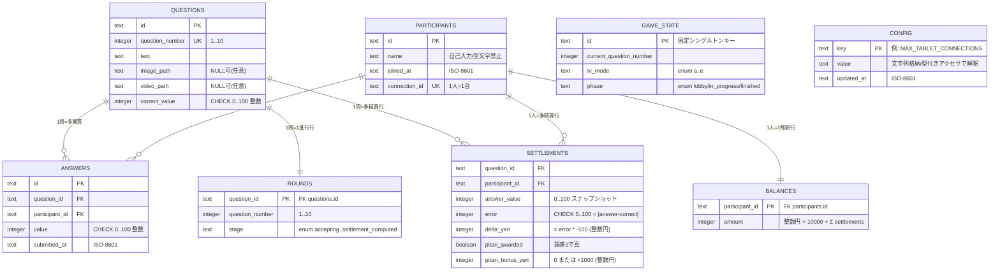
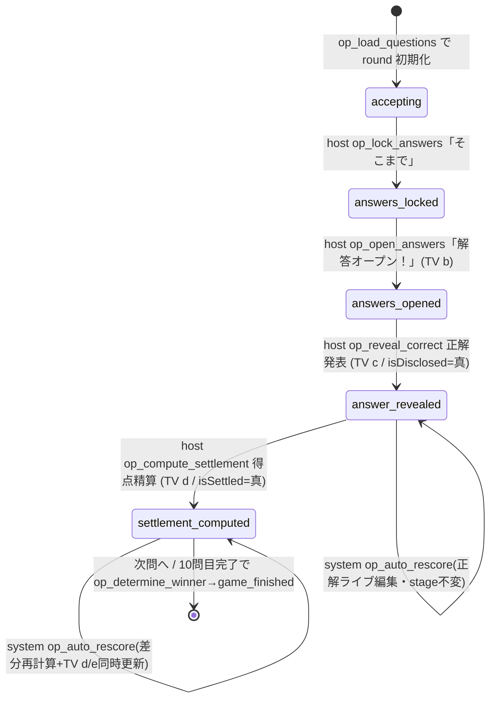
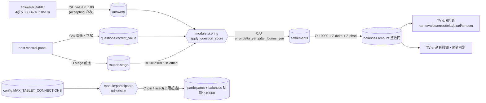

---
codd:
  node_id: detailed_design:er-crud-model
  type: design
  depends_on:
  - id: design:data-model-design
    relation: depends_on
    semantic: technical
  depended_by:
  - id: plan:implementation-plan
    relation: depends_on
    semantic: technical
  - id: test:test-strategy
    relation: depends_on
    semantic: verification
  conventions:
  - targets:
    - db:questions
    - module:questions
    reason: 問題テーブルは動画/画像/テキスト/正解値を保持しライブ編集で更新可能（E-2/E-3/N-2）。違反時リリース不可。
  - targets:
    - db:rounds
    - module:game_flow
    reason: 問題別進行（b/c/d）を永続化し再採点判定の根拠にする（E-3残）。違反時リリース不可。
  - targets:
    - db:config
    - module:config
    reason: 接続上限等の可変値を設定として持ち、コードに定数リテラル埋め込みしない（論点10）。違反時リリース不可。
  modules:
  - questions
  - scoring
  - game_flow
  - participants
  - config
  operation_flow:
    actors:
    - id: host
      label: 司会者（制御盤）
      surface: /control-panel
    - id: answerer
      label: 解答者（タブレット）
      surface: /tablet
    - id: audience
      label: 観客（TV）
      surface: /tv
    - id: system
      label: クラウドサーバ（realtime_sync）
    operations:
    - id: op_load_questions
      actor: host
      verb: load
      target: question_set
      trigger: 制御盤で事前問題ファイルの読込を実行
      route: /control-panel
      preconditions:
      - ゲーム未開始またはライブ編集フェーズ
      measurement_source: 事前問題ファイル
      durable_state: questions テーブル（text / image_path / video_path / correct_value）＋
        rounds 初期化（stage=accepting）＋ game_state シングルトン（phase=lobby）
      readback: ランタイム出題は questions テーブルから供給（ファイル再読込に依存しない）
      expected_outcomes:
      - 各問が questions テーブルへ登録される
      - correct_value が 0〜100 の整数で保持される
      - image_path / video_path は任意（NULL 許容）で保持される
      dod_obligations:
      - id: dod_load_persist
        text: 読み込んだ全問が questions に登録され、再取得で登録時と同一の text と correct_value を返す
      - id: dod_load_runtime_from_db
        text: 出題面の解決元は questions テーブルであり、問題ファイルの再読込に依存しない
      - id: dod_load_media_paths_optional
        text: image_path と video_path は未指定でも登録でき NULL として保持される
      - id: dod_load_correct_value_integer
        text: correct_value が 0〜100 の整数以外では登録が拒否される（DB CHECK を含む）
    - id: op_join_game
      actor: answerer
      verb: join
      target: game_session
      trigger: 制御盤の QR を読取り /join で氏名を自己入力して参加確定
      route: /join
      ui_pattern: qr_scan_then_name_input
      preconditions:
      - 接続数が MAX_TABLET_CONNECTIONS 未満
      durable_state: participants テーブル（name / connection_id）＋ balances 行の初期化
      readback: 制御盤の参加者一覧と TV e モードに反映
      visible_to:
      - host
      - audience
      expected_outcomes:
      - 自己入力した氏名で participants に 1 人 1 レコードが作られる
      - 当該参加者の balances が 10000 円で初期化される
      forbidden_actors: []
      dod_obligations:
      - id: dod_join_self_name
        text: 参加者が自己入力した氏名が participants に永続し、制御盤の参加者一覧に表示される
      - id: dod_join_no_seat_fixed
        text: 端末番号の固定割当や事前氏名台帳の列/API を用いずに参加が成立する
      - id: dod_join_one_device
        text: connection_id は一意で 1 人 1 台が担保される
    - id: op_submit_answer
      actor: answerer
      verb: submit
      target: answer
      trigger: タブレットの 4 ボタン（+1/-1/+10/-10）で値を作り送信
      route: /tablet
      ui_pattern: four_button_stepper
      measurement_source: タブレット数値入力
      preconditions:
      - 当該問の rounds.stage が accepting
      durable_state: answers テーブル（value / submitted_at）
      readback: 送信済み表示と自分の残額のみ（他者情報は不可視）
      from_state: accepting
      to_state: accepting
      expected_outcomes:
      - 0〜100 の整数のみ answer_submitted として永続化される
      boundary_cases:
      - 0 は受理
      - 100 は受理
      - -1 は UI とサーバの双方で拒否
      - 101 は UI とサーバの双方で拒否
      - 50.5 は UI とサーバの双方で拒否
      dod_obligations:
      - id: dod_submit_persist
        text: 受付中に送信した 0〜100 整数の解答が answers に永続化され再表示できる
      - id: dod_submit_range_dual_guard
        text: 負値・小数・100 超・非数値は UI とサーバの双方で拒否され answers に入らない
      - id: dod_submit_one_row_per_player
        text: 同一問への再送信は unique(question_id, participant_id) により 1 行を更新する
    - id: op_lock_answers
      actor: host
      verb: lock
      target: answers
      trigger: 制御盤で「そこまで」を押下
      route: /control-panel
      forbidden_actors:
      - answerer
      from_state: accepting
      to_state: answers_locked
      durable_state: rounds.stage = answers_locked
      consumer_surfaces:
      - answerer_tablets
      expected_outcomes:
      - 全解答者タブレットの入力がロックされる
      - 締切後の answers への書込みは拒否される
      dod_obligations:
      - id: dod_lock_host_only
        text: 締切は role host のみ発動でき answerer からの締切コマンドは 401/403 で拒否される
      - id: dod_lock_blocks_submit
        text: rounds.stage が answers_locked 以降のとき answers への挿入/更新が拒否される
    - id: op_open_answers
      actor: host
      verb: open
      target: answers
      trigger: 制御盤で「解答オープン！」を押下
      route: /control-panel
      forbidden_actors:
      - answerer
      from_state: answers_locked
      to_state: answers_opened
      durable_state: rounds.stage = answers_opened
      visible_to:
      - audience
      consumer_surfaces:
      - tv_mode_b
      expected_outcomes:
      - 開示前は他者解答が全端末向け読みモデルに含まれない
      - 開示後 TV(b) に氏名（participants.name）と解答（answers.value）が一斉表示される
      dod_obligations:
      - id: dod_open_hidden_before
        text: rounds.stage が answers_opened 未満の間はどの端末向け読みモデルにも他者の解答が含まれない
      - id: dod_open_reveals_on_tv
        text: 開示後に TV(b) が全員の氏名と解答を表示する
    - id: op_reveal_correct
      actor: host
      verb: reveal
      target: correct_value
      trigger: 制御盤で正解発表を実行
      route: /control-panel
      forbidden_actors:
      - answerer
      from_state: answers_opened
      to_state: answer_revealed
      durable_state: rounds.stage = answer_revealed
      consumer_surfaces:
      - tv_mode_c
      expected_outcomes:
      - TV(c) に questions.correct_value が提示される
      - 以降の正解ライブ編集は自動再採点の対象となる
      dod_obligations:
      - id: dod_reveal_marks_disclosed
        text: 正解発表の実行で当該問の rounds.stage が answer_revealed（開示済み c 以降）として記録される
    - id: op_compute_settlement
      actor: host
      verb: settle
      target: balances
      trigger: 制御盤で得点精算を実行
      route: /control-panel
      from_state: answer_revealed
      to_state: settlement_computed
      measurement_source: answers.value と questions.correct_value
      durable_state: settlements（error / delta_yen / pitari_bonus_yen）＋ balances（円・整数）＋
        rounds.stage = settlement_computed
      consumer_surfaces:
      - tv_mode_d
      - tv_mode_e
      expected_outcomes:
      - 誤差 = 絶対値(answer - correct) が 0〜100 整数で settlements に記録される
      - 増減円 = 誤差 × -100（整数円）で delta_yen が記録され balances が更新される
      - 誤差 0 のピタリ賞 +1000 円が pitari_bonus_yen に記録され balances へ加算される
      boundary_cases:
      - 誤差 0 は +1000（丁度）
      - 誤差 1 は -100 のみ（直上）
      dod_obligations:
      - id: dod_settle_initial_grant
        text: ゲーム開始時に各プレイヤーの balances.amount が 10000 円で初期化されている
      - id: dod_settle_delta
        text: 誤差 5 の精算後に当該プレイヤーの balances.amount が精算前より 500 円少ない
      - id: dod_settle_pitari_add
        text: 誤差 0 のプレイヤーの pitari_bonus_yen が +1000 で balances に反映される（拠出配分側は F-02
          未確定として fixme）
      - id: dod_settle_currency_yen
        text: settlements と balances と API 応答と d の 6 列表が円建てで表され point/pt/点 の語が存在しない
      - id: dod_settle_integer_only
        text: error / delta_yen / pitari_bonus_yen / amount がすべて整数で小数値を持たない
    - id: op_live_edit_correct
      actor: host
      verb: edit
      target: question_or_correct_value
      trigger: 制御盤のライブ編集 UI で問題または正解を更新
      route: /control-panel
      durable_state: questions テーブル更新（text / image_path / video_path / correct_value）
      readback: DB 再取得で編集後の値を返す
      expected_outcomes:
      - 問題・正解の双方を進行中に編集でき questions に永続する
      dod_obligations:
      - id: dod_edit_persist
        text: 進行中に編集した問題文と正解値が questions に永続し再取得で読み戻せる
    - id: op_auto_rescore
      actor: system
      verb: rescore
      target: balances
      trigger: 開示済み（rounds.stage が answer_revealed 以降）の問題で正解をライブ編集
      preconditions:
      - 当該問の rounds.stage が answer_revealed 以降
      measurement_source: 編集後 questions.correct_value と既存 answers.value
      durable_state: settlements 再計算 ＋ balances 差分更新
      consumer_surfaces:
      - tv_mode_d
      - tv_mode_e
      from_state: answer_revealed
      to_state: answer_revealed
      expected_outcomes:
      - 正解訂正で当該問の全 settlements（誤差・delta_yen・pitari）が再計算される
      - balances が旧拠出との差分で更新される
      - rounds.stage が settlement_computed の問は TV d/e が同時更新される
      boundary_cases:
      - c 到達問の正解訂正 → 再採点が走る
      - c 未到達（isDisclosed 偽）の正解編集 → 再採点は走らない（境界外）
      dod_obligations:
      - id: dod_rescore_after_c
        text: rounds.stage が answer_revealed 以降で正解を直すと settlements と balances が再計算され各人の残額へ即時反映される
      - id: dod_rescore_no_before_c
        text: rounds.stage が answer_revealed 未満の正解編集では settlements と balances が変化しない
      - id: dod_rescore_d_sync
        text: rounds.stage が settlement_computed の問の正解訂正で balances 差分が再計算され TV の d
          と e が同時更新される
      - id: dod_rescore_matches_full_recompute
        text: 差分更新後の balances が answers と correct_value からの全再計算と一致する
    - id: op_enforce_connection_limit
      actor: system
      verb: reject
      target: tablet_connection
      trigger: 接続数が MAX_TABLET_CONNECTIONS に達した状態での新規接続試行
      measurement_source: 現在接続数と config の MAX_TABLET_CONNECTIONS 解決値
      threshold: MAX_TABLET_CONNECTIONS（既定 8）
      preconditions:
      - connected >= MAX_TABLET_CONNECTIONS
      durable_state: 既存接続は不変
      expected_outcomes:
      - 上限超過の接続は断られる
      - 既存接続は影響を受けない
      boundary_cases:
      - 既定 8: 8 台目は接続可・9 台目は拒否
      - 設定 16: 16 台目は接続可・17 台目は拒否
      - 設定 32: 32 台目は接続可・33 台目は拒否
      dod_obligations:
      - id: dod_limit_default_eight
        text: 設定未指定時に 8 台まで接続でき 9 台目が拒否される
      - id: dod_limit_config_follows
        text: MAX_TABLET_CONNECTIONS を 16/32 へ設定変更するとコード改修なしに上限がその値へ追随する
      - id: dod_limit_no_hardcode
        text: 上限判定は config の解決値を参照し、判定経路に数値リテラル 8 が存在しない
    - id: op_determine_winner
      actor: system
      verb: determine
      target: winner
      trigger: 10 問目の得点精算が完了
      preconditions:
      - 10 問すべての rounds.stage が settlement_computed
      measurement_source: 全問通算の balances.amount
      consumer_surfaces:
      - tv_mode_e
      from_state: settlement_computed
      to_state: game_finished
      durable_state: game_state.phase = finished
      expected_outcomes:
      - balances.amount 最多のプレイヤーが e モードで勝者として判別可能に表示される
      dod_obligations:
      - id: dod_winner_most_balance
        text: 10 問終了時に balances.amount 最多のプレイヤーが e モードで勝者として判別できる
---

# ER 図・CRUD マトリクス（問題・プレイヤー・回答・進行・設定／Mermaid ER）

## 1. Overview

本書は `save-money-switcher`（フジテレビ『賞金先渡しクイズ SAVE MONEY』方式を家族で遊ぶ、クラウド上で実行する WEB アプリ形式のクイズ操作盤）の **ER 図（Mermaid erDiagram）と CRUD マトリクス** を確定する詳細設計書である。上位の `design:data-model-design`（データモデル設計）を技術的真実源とし、そこで定義された **8 テーブル**（`questions`／`participants`／`answers`／`rounds`／`game_state`／`settlements`／`balances`／`config`）の実体・関係・キー制約を ER 図として固定し、各テーブルに対する **アクター別 CRUD**・**モジュール別 書込み所有権**・**操作別 CRUD** を一意に定める。目的は、独立生成される実装ファイル間で「どの表を・誰が・どの操作で・どのモジュールから」変更してよいかの境界を先に確定し、再実装ドリフトと権限逸脱を排除することにある。

### 1.1 本書の位置づけとスコープ

- **カバーする**: 8 テーブルの ER 関係（PK/FK/UK/CHECK）、CRUD マトリクス（アクター×表／操作×表／モジュール×表）、共有ドメイン型の単一所有、読みモデル露出境界、再採点連鎖の CRUD 表現。
- **カバーしない（親・兄弟文書へ委譲）**: 精算数式そのものの導出（`module:scoring` の `apply_question_score` が単一所有 ― `design:data-model-design` §2.9 が真実源）、UI レイアウト、リアルタイム同期プロトコルの実装（`design:system-design`）。本書はそれらの **データ表現と境界** のみを規定する。
- 本書の 🟦 確定値・不変条件・キー制約に反する成果物は **リリース不可（release-blocking）** として扱う。

### 1.2 リリースブロッキング規約と本書での具体化

| # | 対象 | 不変条件（要旨） | 本書での具体化 |
|---|---|---|---|
| ER-1 | `db:questions` / `module:questions` | 問題テーブルは動画/画像/テキスト/正解値を保持し、ファイル読込で登録・ライブ編集で更新可能（E-2/E-3/N-2） | ER §2.1、CRUD（op_load_questions=C、op_live_edit_correct=U）§2.4、所有権 §3.1 |
| ER-2 | `db:rounds` / `module:game_flow` | 各問がどのモードまで進んだか（b/c/d）を永続化し、再採点判定の根拠にする（E-3残） | 状態遷移図 §2.2、CRUD §2.4、所有権 §3.1 |
| ER-3 | `db:config` / `module:config` | 接続上限等の可変値を設定として保持し、コードに定数リテラルを埋め込まない（論点10） | ER §2.1、CRUD（op_enforce_connection_limit=R）§2.4、所有権 §3.1・§4.2 |

上位から継承する不変条件も本 CRUD 境界で担保する: **円建て固定**（`point`/`pt`/`点` を格納・派生・表示のどこにも持たない）、**0〜100 整数の三層防衛**（UI＋サーバ＋DB CHECK）、**ロール境界**（`role: host` のみが進行段階を前進させる書込みを起こす）、**ホスト PC をサーバ/DB にしない**（永続化はクラウドサーバ側 DB、CRUD の実行点はコード内モジュール）。

### 1.3 実装・ツールチェーン前提（scaffold 固定・釈義不可・本書の遵守宣言）

- **実装言語 = TypeScript のみ。** 本書のドメイン型・リポジトリ契約・マイグレーション・ファイルパス・依存参照はすべて TypeScript 慣行のみ。他言語の拡張子・マニフェスト・ツールは例示・フォールバックとしても登場させない。
- **テストランナー = Vitest（固定・release-blocking のグラウンドトゥルース）。** CRUD 不変条件（upsert 一意性・CHECK 拒否・`balances` 全再計算一致）の受け入れは Vitest 自身の宣言 API（`import { describe, it, expect } from "vitest";`）で記述する。「ランタイム依存最小化」方針は**出荷コードのランタイム依存**にのみ及び、テストランナーには及ばない ― 依存数の哲学を根拠に別フレームワークや Node 組み込み `node:test` を用いてはならない。
- **モジュール解決 = NodeNext/Node16。** すべての相対 import は**出力される `.js` を明示**（`import type { AnswerScore } from "../scoring/answer_score.js";`。`"./x"`・`"./x.ts"` は不可）。type-only import・re-export も同一規約。拡張子欠落は TS2835 でコンパイル不能。
- **レイアウト契約（output-path fence 強制）。** ドメイン型・リポジトリ・スキーマ/マイグレーション定義は**必ず `src/` 配下**、テストは**必ず `tests/` 配下**（`test/`・`spec/`・`specs/` を発明しない。サブディレクトリ `tests/scoring/` 等は可）。`package.json`・`package-lock.json`・`tsconfig.json`・`vitest.config.ts` は harness scaffold 所有につき、本書は成果物として出力・宣言しない。

### 1.4 アクターとロールラベル対応（可視コピー義務の基盤）

CRUD の各行を担うアクターと、可視コピーで用いる**業務ラベル**（内部識別子は露出しない）:

| 内部識別子 | 可視ラベル | サーフェス | 主な役割 |
|---|---|---|---|
| `host` | **司会者（制御盤）** | `/control-panel` | 問題読込・進行段階前進・ライブ編集・精算・上限設定 |
| `answerer` | **解答者（タブレット）** | `/tablet`・`/join` | QR 参加・氏名自己入力・0〜100 整数の解答送信 |
| `audience` | **観客（TV 視聴者）** | `/tv` | a〜e モードの表示閲覧（書込み権なし） |
| `system` | サーバ（realtime_sync） | ― | 自動再採点・接続上限拒否・勝者判定 |

可視コピーには**可視ラベル**を用い、内部識別子（host/answerer）・実装根拠・環境前提・デモ/テスト用語を露出させない。金額は必ず**「円」**で表す。参加者名は自己入力名をそのまま提示し、「端末 1」「席番号」等の内部割当ラベルへ置換しない（座席固定を持たない）。

---

## 2. Mermaid Diagrams

> **⚠ 2026-08-28 殿裁可「案A（事前アカウント方式）」により改定（cmd_2553）。**
> 身元の権威は `participants`（当日その場参加）から `accounts`（恒久アカウント）へ移った。
> 本節以下の `participants` を前提とする ER・CRUD・権限記述は失効しており、履歴として残す。
> 有効な表定義は `docs/design/data_model_design.md` §2.3a（`accounts`・P1 実装済）および
> §2.3b（エピソード系 4 表・**P2 実装済**）を正とする。
> アクター（`role:host` / `role:answerer`）と表の権限境界そのものは案A でも有効であり、
> 「誰がそのロールか」をアカウントとセッションが与えるようになった点だけが変わる。

### 2.1 ER 図（8 テーブル・Mermaid erDiagram）



**ER の所有・境界（プロセ）**: DB カラムは snake_case、TypeScript ドメイン型フィールドは camelCase とし、対応は §4.1 のリポジトリ契約で固定する。Mermaid ER で表現できない**複合一意**は制約として別途強制する ― `answers` と `settlements` は `unique(question_id, participant_id)`（1 問 1 人 1 行）を持ち、`answers` の再送信・`settlements` の再採点はこの一意行に対する **U（更新）** となる。`ROUNDS.question_id` は `questions.id` への FK かつ PK（1 問 1 進行行）。`BALANCES.participant_id` は `participants.id` への FK かつ PK（1 人 1 残額行）。`GAME_STATE` と `CONFIG` は FK 関係を持たない独立エンティティで、前者は `current_question_number` によって現在問題を**ソフト参照**するセッションポインタ（シングルトン 1 行）、後者は可変パラメータの設定ストアである（強制 FK ではないため ER 線は引かず本プロセで明示）。`participants` は **`seat_number` や事前氏名台帳列を意図的に持たない**（当日その場参加・座席固定なし＝dod_join_no_seat_fixed をスキーマで担保）。ER-1 は `questions` の `text/image_path/video_path/correct_value` 保持で、ER-2 は `rounds.stage` 列で、ER-3 は `config(key,value)` で、それぞれ本 ER に反映済みである。

### 2.2 進行状態遷移（`rounds.stage`・ER-2／再採点境界）



**状態遷移の所有・境界（プロセ）**: `stage` を前進させる **U（更新）** は `module:game_flow`（`src/game_state/`）が単一所有し、発動アクターは `role: host` のみ（`role: answerer` の当該コマンドは 401/403 拒否）。モード対応は `answers_opened`＝b／`answer_revealed`＝c／`settlement_computed`＝d。**再採点範囲判定の唯一の前提**は `isDisclosed(stage)`（`stage ∈ {answer_revealed, settlement_computed}`）と `isSettled(stage)`（`stage = settlement_computed`）であり、これらは `src/game_state/progression.ts` が単一所有する述語である（`module:scoring` はこれを import して再採点可否を決め、独自再定義しない）。自己ループ（`answer_revealed`→`answer_revealed`、`settlement_computed`→`settlement_computed`）は正解ライブ編集に伴う自動再採点で、`stage` は変えず `settlements`/`balances` のみを更新する。この段階列（ER-2）なしに再採点範囲は決定できない。

### 2.3 派生読みモデル連鎖と CRUD 実行点（producer→durable→derived→consumer）



**連鎖の所有・境界（プロセ）**: この一方向連鎖の各辺が CRUD の実行点である。**producer** は `answers.value`（解答者が受付中に送信＝C/U、他所は書込まない）。**durable** は `answers`／`questions.correct_value`／`rounds.stage`。**derived** の `settlements`（`error=|value−correct|`、`delta_yen=error×−100`、`pitari_bonus_yen`）と **集計 read-model** の `balances.amount = 10000 + Σ delta_yen + Σ pitari_bonus_yen` はいずれも `module:scoring`（`src/scoring/`）が単一所有して **C/U** する ― 他モジュールが `balances` を直接書換えてはならない。**consumer** は TV d（6 列表）と TV e（通算・勝者）で、いずれも読み取り専用サーフェスである。`config` の上限解決値は `module:config`（`src/config/`）が単一所有し、`module:participants` の admission が **R（参照）** のみで受理/拒否を決める（判定経路に数値リテラル `8` を置かない＝ER-3）。差分再採点は最適化であり、監査時は `answers`＋`correct_value` からの全再計算と `balances` が一致することを不変式とする（dod_rescore_matches_full_recompute）。

### 2.4 CRUD マトリクス（操作×表）

凡例: **C**=作成(insert)／**R**=参照(select)／**U**=更新／**D**=削除／**🔒**=書込みゲート（stage 検査で挿入/更新を拒否）／空欄=関与なし。確定スコープに **D（削除）は存在しない**（取消＝`rounds.stage` の巻戻し更新であり行削除ではない・§5）。

| 操作 ID | questions | participants | answers | rounds | game_state | settlements | balances | config |
|---|---|---|---|---|---|---|---|---|
| op_load_questions | **C/U** | | | **C**(init `accepting`) | **C**(init singleton) | | | R |
| op_join_game | | **C** | | | | | **C**(init 10000) | R(上限) |
| op_submit_answer | | | **C/U**(upsert) | R(accepting) | | | R(自分) | |
| op_lock_answers | | | 🔒 | **U**→locked | | | | |
| op_open_answers | | R(TVへ開示) | R(TVへ開示) | **U**→opened | | | | |
| op_reveal_correct | R(correct) | | | **U**→revealed | | | | |
| op_compute_settlement | R(correct) | | R | **U**→settled | | **C** | **U** | |
| op_live_edit_correct | **U** | | | R(可否判定) | | | | |
| op_auto_rescore | R(correct) | | R | R(isDisclosed) | | **U** | **U** | |
| op_enforce_connection_limit | | R(接続数) | | | | | | **R**(解決値) |
| op_determine_winner | | | | R(全settled) | **U**→finished | | R(最多) | |

**CRUD マトリクスの境界（プロセ）**: `rounds` 行と `game_state` シングルトンは op_load_questions（ホストの問題読込＝ゲームセットアップ）で初期化する設計判断とし、10 問分の `rounds` を `accepting` で、`game_state` を `phase=lobby` で **C（作成）** する（要件を発明せず、「各問の到達段階を永続する」ER-2 を満たすための配置）。`answers` への **C/U** は解答者が自分の 1 行に対してのみ、かつ `rounds.stage = accepting` の間だけ許可し、`answers_locked` 以降は 🔒 で拒否する（dod_lock_blocks_submit）。`op_open_answers` 以前は他者 `answers` をどの端末向け読みモデルにも含めない（dod_open_hidden_before）。`settlements`/`balances` の **C/U** は op_compute_settlement（host 発動）と op_auto_rescore（system 発動）の双方から `module:scoring` を通してのみ実行する。

### 2.5 CRUD マトリクス（アクター×表・権限境界と可視性）

| 表 ＼ アクター | host（司会者） | answerer（解答者） | audience（TV観客） | system（サーバ） |
|---|---|---|---|---|
| questions | C(読込)・R・U(ライブ編集) | — | R(a:出題面 / c:正解) | R(再採点で correct 参照) |
| participants | R(参加者一覧) | C(参加)・R(自分) | R(b/e:氏名) | R(接続数) |
| answers | R(開示後) | C/U(自分・accepting)・R(自分) | R(b:開示後のみ) | R(再採点) |
| rounds | R・U(段階前進) | R(accepting ゲート) | R(開示状態) | R(isDisclosed 判定) |
| game_state | R・U(tv_mode/phase) | R(現在問) | R(tv_mode) | U(phase=finished) |
| settlements | R(6列表) | — | R(d:6列表) | C/U(精算・再採点) |
| balances | R(6列表) | **R(自分のみ)** | R(d/e:通算) | C/U(初期化・精算・再採点) |
| config | R・U(上限設定) | — | — | R(上限解決) |

**アクター境界の所有（プロセ）**: `role: host` のみが `rounds.stage` 前進・`game_state.tv_mode/phase` 切替・`questions` ライブ編集・`config` 更新の書込みを起こす（INV-5 継承）。`role: answerer` は自分の `answers`（accepting 中のみ C/U）と自分の `balances`（R のみ）に限定され、**他者の `answers`/`balances`/`settlements` はタブレット向け読みモデルに一切含めない**（クロスアクター非可視・dod_submit の readback）。`audience`（TV）は全表 R のみで書込み権を持たない。氏名列 `participants.name` は自己入力値をそのまま TV/制御盤へ露出し、内部割当ラベルへ置換しない。金額列（`balances.amount`／`settlements.delta_yen`／`settlements.pitari_bonus_yen`）は API 応答・TV 表示・内部表現のいずれも「円」で表し、`point`/`pt`/`点` を出さない（dod_settle_currency_yen）。

---

## 3. Ownership Boundaries

### 3.1 モジュール×表 書込み所有権（単一所有・再実装ドリフト防止）

各テーブルの **書込み（C/U）コードは単一モジュールが所有**する。他モジュールは所有モジュールのリポジトリ契約を import して呼ぶだけで、テーブルへ直接 SQL/書込みを発行しない。

| テーブル | 書込み所有モジュール | 格納先ディレクトリ | 主な CRUD 契機 |
|---|---|---|---|
| `questions` | `module:questions` | `src/questions/` | op_load_questions(C/U)、op_live_edit_correct(U) |
| `participants` | `module:participants` | `src/participants/` | op_join_game(C) |
| `answers` | `module:game_flow` | `src/game_state/` | op_submit_answer(C/U・accepting ゲート) |
| `rounds` | `module:game_flow` | `src/game_state/` | op_load_questions(C)、段階前進(U) |
| `game_state` | `module:game_flow` | `src/game_state/` | 初期化(C)、tv_mode/phase(U) |
| `settlements` | `module:scoring` | `src/scoring/` | op_compute_settlement(C)、op_auto_rescore(U) |
| `balances` | `module:scoring` | `src/scoring/` | 初期化/精算/再採点(C/U) |
| `config` | `module:config` | `src/config/` | 上限設定(U)、解決値提供(R) |

`module:media` は**自前の永続テーブルを持たない**。a モードの出題面ソース解決（`video_path` 有→動画／無・`image_path` 有→画像／双方 NULL→`text`）を単一所有し、`questions` の 3 カラムのみを **R（参照）** して決める。この 3 段解決ロジックは他所で再実装しない。

### 3.2 共有ドメイン型の単一所有（import 期待）

| 型/述語/定数 | 単一所有ファイル | import 先（再定義禁止） |
|---|---|---|
| `AnswerScore`（0..100 整数）・`assertAnswerScore`・`isAnswerScore` | `src/scoring/answer_score.ts` | `src/questions/`(correctValue)、`src/game_state/`(answer.value)、`src/scoring/` |
| `Yen`（整数円）・`CURRENCY="円"`・`INITIAL_GRANT=10000`・`YEN_PER_ERROR=-100`・`PITARI_BONUS=1000`・`assertYen` | `src/scoring/yen.ts` | `src/scoring/`(settlement/balance)、金額を出す全 API 層 |
| `Stage`・`isDisclosed`・`isSettled`・`Round` | `src/game_state/progression.ts` | `src/scoring/`(再採点可否)、`src/game_state/`(段階遷移) |
| `TvMode`・`GameState` | `src/game_state/game_state.ts` | `module:game_flow`、TV 供給読みモデル |
| `DEFAULT_MAX_TABLET_CONNECTIONS`・`resolveMaxTabletConnections` | `src/config/connection_limit.ts` | `src/participants/admission.ts`(R のみ) |

**単一所有の理由**: `AnswerScore` と `Yen` を型レベルに固定することで、0〜100 整数の逸脱と小数/ポイント混入をコンパイル時・実行時アサートの双方で排除する。`isDisclosed`/`isSettled` を単一所有にすることで、再採点範囲の判定基準が `module:scoring` と `module:game_flow` で食い違うドリフトを防ぐ。既定 `8` を `src/config/` にのみ定義し、判定経路（`admission`）には置かないことで ER-3（ハードコード禁止）を担保する。

### 3.3 サーフェス別 読みモデル露出とコピー義務

| サーフェス | 監査対象アクター | 露出してよいデータ | 露出禁止データ | 可視コピー意図 | 禁止コピー |
|---|---|---|---|---|---|
| `/tablet` | 解答者 | 自分の `answers.value`・送信済み表示・自分の `balances.amount` | 他者の answers/balances/settlements、他者氏名 | 「あなたの回答」「あなたの残額（円）」 | 他者残額・順位・point/pt/点・端末番号 |
| `/join` | 未参加者→解答者 | 氏名入力欄・参加可否 | 既存参加者一覧、保護されたロール解決先 | 「お名前を入力して参加」 | 事前氏名台帳・席番号・内部ロール名 |
| `/tv`(a) | 観客 | `questions`(video/image/text)・現在問題番号 | `correct_value`(c 未到達時)、他者途中経過 | 出題面 | correct 早期表示・point/pt/点 |
| `/tv`(b) | 観客 | 全員 `participants.name`＋`answers.value`（開示後のみ） | 開示前の解答 | 「解答オープン！」一斉表示 | 開示前の値 |
| `/tv`(d) | 観客 | 6 列表（name/value/error/delta_yen/pitari_bonus_yen/amount） | ― | 円建て 6 列 | point/pt/点 |
| `/tv`(e) | 観客 | 通算 `balances.amount`・勝者判別 | ― | 「勝者」通算残額（円） | point/pt/点 |
| `/control-panel` | 司会者 | 全表 R＋所有 U（進行・編集・上限） | ― | 業務操作ラベル | 内部識別子(host/answerer)の露出 |

`/join` 等の事前認証サーフェスは、ロール解決済み/保護されたナビゲーションを露出しない。可視コピーは監査対象の業務言語（job-to-be-done）で書き、実装根拠・環境前提・デモ/テスト用語を出さない。内部識別子 `host`/`answerer` は可視ラベル「司会者」「解答者」へ写像する（§1.4）。

### 3.4 データ層アクセス制御・整合・プライバシー

- **書込み権限境界（INV-5 継承・release-blocking）**: `rounds.stage` 前進／`game_state.tv_mode`・`phase` 切替／`questions` ライブ編集／`config` 更新は `role: host` セッションのみ。ロール判定はセッションのロール属性を単一判定点とし、`role: answerer` の当該コマンドは 401/403 拒否。
- **終端状態ガード**: `answers_locked` 以降は `answers` の C/U をサーバ側 stage 検査で拒否（DB 書込みも stage 経由）。
- **クロスアクター可視性**: `/tablet` 読みモデルは当該解答者の `answers`＋自分の `balances` のみ。他者解答は `answers_opened`（b 実行）到達前はどの読みモデルにも含めない。
- **整合制約（defense-in-depth）**: `unique(question_id, participant_id)`（answers・settlements）、FK（answers/settlements/rounds/balances→親）、`CHECK`（`value`・`correct_value`・`error` の 0..100、金額 integer）。`balances.amount` は `settlements` からの全再計算と常に一致する不変式を持つ。
- **プライバシー/データ取扱い**: 収集個人データは自己入力氏名（`participants.name`）と当日の解答・残額に限る。恒久的な事前氏名台帳を持たず、当日その場参加を前提とする（`participants` に台帳/座席列を置かない）。家族限定アクセス制御（URL 秘匿 or 認証）は `design:system-design` の分岐に従い、無制御公開はリリース不可（INV-4 継承）。

---

## 4. Implementation Implications

### 4.1 リポジトリ CRUD 契約（TypeScript・`.js` 指定子・`src/` 配下）

各表の CRUD は所有モジュールのリポジトリインタフェースに集約し、DB 実装を差し替え可能にする。DB カラム(snake_case)↔型フィールド(camelCase) の対応もここで固定する。

```typescript
// src/questions/questions_repository.ts  （ER-1 所有）
import type { Question } from "./question.js";

export type QuestionContentPatch = Partial<
  Pick<Question, "text" | "imagePath" | "videoPath" | "correctValue">
>;

export interface QuestionsRepository {
  bulkInsert(questions: readonly Question[]): Promise<void>;          // C: 読込登録
  getByNumber(questionNumber: number): Promise<Question | null>;      // R: ランタイム出題(DB供給)
  listAll(): Promise<readonly Question[]>;                            // R
  updateContent(id: string, patch: QuestionContentPatch): Promise<Question>; // U: ライブ編集
}
```

```typescript
// src/game_state/answers_repository.ts  （game_flow 所有・accepting ゲート）
import type { Answer } from "./answer.js";
import type { Stage } from "./progression.js";

export interface AnswersRepository {
  // C/U: unique(question_id, participant_id) の upsert。stage=accepting のみ許可。
  upsertDuringAccepting(input: {
    questionId: string; participantId: string; value: number; stage: Stage;
  }): Promise<Answer>;
  getOwn(questionId: string, participantId: string): Promise<Answer | null>; // R: 自分のみ
  listForRevealedQuestion(questionId: string): Promise<readonly Answer[]>;   // R: 開示後の全員
}
```

```typescript
// src/scoring/settlements_repository.ts  （scoring 所有・balances と一体）
import type { QuestionSettlement } from "./settlement.js";
import type { Balance } from "./balance.js";

export interface SettlementsRepository {
  upsertForQuestion(rows: readonly QuestionSettlement[]): Promise<void>; // C/U: 精算・再採点
  listForQuestion(questionId: string): Promise<readonly QuestionSettlement[]>; // R
}
export interface BalancesRepository {
  initialize(participantId: string): Promise<Balance>; // C: 10000 円初期化
  getOwn(participantId: string): Promise<Balance | null>; // R: タブレット読みモデル
  listAll(): Promise<readonly Balance[]>;                  // R: TV d/e
  applyDelta(participantId: string, deltaYen: number): Promise<Balance>; // U: 差分更新
}
```

```typescript
// src/config/config_repository.ts  （ER-3 所有・単一解決点）
export interface ConfigRepository {
  read(key: string): Promise<string | undefined>;      // R
  upsert(key: string, value: string): Promise<void>;   // U: host 上限設定
}
```

### 4.2 DB レベル制約（三層目防衛）と設定解決

- **CHECK/UNIQUE/FK**: `answers.value`・`questions.correct_value`・`settlements.error` に `CHECK 0<=x<=100`、金額列に integer、`answers`/`settlements` に `unique(question_id, participant_id)`、全子表に FK。UI(`src/tablet/`)・サーバ(`src/scoring/validate_answer.ts`)を迂回した不正値の永続を DB CHECK が第三層で拒む（dod_load_correct_value_integer・dod_submit_range_dual_guard）。
- **上限の非ハードコード（ER-3）**: `MAX_TABLET_CONNECTIONS` は環境変数を既定機構、`config` テーブルも保持可能。解決順は **環境変数 → `config` → 既定 8** で `src/config/connection_limit.ts` の `resolveMaxTabletConnections` が単一解決する。`admission` はその解決値を R するのみで、判定経路に `8` を置かない。

```typescript
// src/config/connection_limit.ts
export const DEFAULT_MAX_TABLET_CONNECTIONS = 8; // 既定値の単一定義（判定経路には置かない）

export interface ConfigSource { read(key: string): string | undefined; }

export function resolveMaxTabletConnections(source: ConfigSource): number {
  const raw = source.read("MAX_TABLET_CONNECTIONS");
  if (raw === undefined) return DEFAULT_MAX_TABLET_CONNECTIONS;
  const n = Number(raw);
  if (!Number.isInteger(n) || n <= 0) return DEFAULT_MAX_TABLET_CONNECTIONS;
  return n;
}
```

- **マイグレーション配置**: スキーマ/マイグレーション定義は `src/`（例 `src/persistence/`）配下に置き、`tests/`・runner 設定ファイル（`package.json`/`vitest.config.ts` 等）には置かない（output-path fence 遵守）。選定 DB は integer/CHECK/unique/FK を強制できることを要件とし、クラウドサーバ常時稼働と整合し、ホスト PC を DB/サーバにしない（INV-1 継承）。

### 4.3 CRUD 不変条件の受け入れ（Vitest・`tests/` 配下・`.js` 指定子）

```typescript
// tests/config/connection_limit.test.ts
import { describe, it, expect } from "vitest";
import { resolveMaxTabletConnections } from "../../src/config/connection_limit.js";

const source = (v?: string) => ({ read: (_k: string) => v });

describe("接続上限（設定・非ハードコード ER-3）", () => {
  it("未設定時の既定は 8（9台目拒否の基準）", () => {
    expect(resolveMaxTabletConnections(source(undefined))).toBe(8);
  });
  it("16/32 へコード改修なしに追随する", () => {
    expect(resolveMaxTabletConnections(source("16"))).toBe(16);
    expect(resolveMaxTabletConnections(source("32"))).toBe(32);
  });
});
```

```typescript
// tests/game_state/progression.test.ts
import { describe, it, expect } from "vitest";
import { isDisclosed, isSettled } from "../../src/game_state/progression.js";

describe("進行段階（再採点範囲判定 ER-2）", () => {
  it("c 到達(answer_revealed 以降)を開示済みと判定", () => {
    expect(isDisclosed("answers_opened")).toBe(false);
    expect(isDisclosed("answer_revealed")).toBe(true);
    expect(isDisclosed("settlement_computed")).toBe(true);
  });
  it("d 到達は settlement_computed のみ", () => {
    expect(isSettled("answer_revealed")).toBe(false);
    expect(isSettled("settlement_computed")).toBe(true);
  });
});
```

### 4.4 CRUD と DoD 義務の MECE 対応（実装前の網羅確認）

| MECE 軸 | 代表 DoD | 対応 CRUD/表 |
|---|---|---|
| happy path | dod_submit_persist | answers C/U → getOwn R |
| persistence/readback | dod_load_persist・dod_edit_persist | questions C/U → getByNumber R |
| permission boundary | dod_lock_host_only | rounds U(host)／answerer 401/403 |
| terminal-state guard | dod_lock_blocks_submit | answers 🔒(locked 以降) |
| cross-actor reflection | dod_join_self_name・dod_open_reveals_on_tv | participants C→制御盤R／answers R(TV b) |
| derived-state chain | dod_settle_delta・dod_rescore_matches_full_recompute | settlements C/U→balances U |
| threshold/boundary | dod_limit_default_eight・dod_settle_pitari_add | config R→admission／誤差0 の pitari |

### Operational Behavior Model

以下の単一 YAML ブロックが、CRUD 境界・永続/読戻し・派生連鎖・閾値に関する運用挙動の権威的出典であり、CoDD がドキュメントメタデータへ持ち上げて実装計画と E2E 生成が共有する。operation ID・dod_obligation ID は上位 `design:data-model-design` と一致させ、本書は各操作を CRUD（durable_state／readback／measurement_source）と ER-1〜ER-3 に対応づける。未確定は `boundary_cases` または §5 のフラグへ回し、発明しない。

```yaml
operation_flow:
  actors:
    - id: host
      label: 司会者（制御盤）
      surface: /control-panel
    - id: answerer
      label: 解答者（タブレット）
      surface: /tablet
    - id: audience
      label: 観客（TV）
      surface: /tv
    - id: system
      label: クラウドサーバ（realtime_sync）
  operations:
    - id: op_load_questions
      actor: host
      verb: load
      target: question_set
      trigger: 制御盤で事前問題ファイルの読込を実行
      route: /control-panel
      preconditions:
        - ゲーム未開始またはライブ編集フェーズ
      measurement_source: 事前問題ファイル
      durable_state: questions テーブル（text / image_path / video_path / correct_value）＋ rounds 初期化（stage=accepting）＋ game_state シングルトン（phase=lobby）
      readback: ランタイム出題は questions テーブルから供給（ファイル再読込に依存しない）
      expected_outcomes:
        - 各問が questions テーブルへ登録される
        - correct_value が 0〜100 の整数で保持される
        - image_path / video_path は任意（NULL 許容）で保持される
      dod_obligations:
        - id: dod_load_persist
          text: 読み込んだ全問が questions に登録され、再取得で登録時と同一の text と correct_value を返す
        - id: dod_load_runtime_from_db
          text: 出題面の解決元は questions テーブルであり、問題ファイルの再読込に依存しない
        - id: dod_load_media_paths_optional
          text: image_path と video_path は未指定でも登録でき NULL として保持される
        - id: dod_load_correct_value_integer
          text: correct_value が 0〜100 の整数以外では登録が拒否される（DB CHECK を含む）
    - id: op_join_game
      actor: answerer
      verb: join
      target: game_session
      trigger: 制御盤の QR を読取り /join で氏名を自己入力して参加確定
      route: /join
      ui_pattern: qr_scan_then_name_input
      preconditions:
        - 接続数が MAX_TABLET_CONNECTIONS 未満
      durable_state: participants テーブル（name / connection_id）＋ balances 行の初期化
      readback: 制御盤の参加者一覧と TV e モードに反映
      visible_to: [host, audience]
      expected_outcomes:
        - 自己入力した氏名で participants に 1 人 1 レコードが作られる
        - 当該参加者の balances が 10000 円で初期化される
      forbidden_actors: []
      dod_obligations:
        - id: dod_join_self_name
          text: 参加者が自己入力した氏名が participants に永続し、制御盤の参加者一覧に表示される
        - id: dod_join_no_seat_fixed
          text: 端末番号の固定割当や事前氏名台帳の列/API を用いずに参加が成立する
        - id: dod_join_one_device
          text: connection_id は一意で 1 人 1 台が担保される
    - id: op_submit_answer
      actor: answerer
      verb: submit
      target: answer
      trigger: タブレットの 4 ボタン（+1/-1/+10/-10）で値を作り送信
      route: /tablet
      ui_pattern: four_button_stepper
      measurement_source: タブレット数値入力
      preconditions:
        - 当該問の rounds.stage が accepting
      durable_state: answers テーブル（value / submitted_at）
      readback: 送信済み表示と自分の残額のみ（他者情報は不可視）
      from_state: accepting
      to_state: accepting
      expected_outcomes:
        - 0〜100 の整数のみ answer_submitted として永続化される
      boundary_cases:
        - 0 は受理
        - 100 は受理
        - -1 は UI とサーバの双方で拒否
        - 101 は UI とサーバの双方で拒否
        - 50.5 は UI とサーバの双方で拒否
      dod_obligations:
        - id: dod_submit_persist
          text: 受付中に送信した 0〜100 整数の解答が answers に永続化され再表示できる
        - id: dod_submit_range_dual_guard
          text: 負値・小数・100 超・非数値は UI とサーバの双方で拒否され answers に入らない
        - id: dod_submit_one_row_per_player
          text: 同一問への再送信は unique(question_id, participant_id) により 1 行を更新する
    - id: op_lock_answers
      actor: host
      verb: lock
      target: answers
      trigger: 制御盤で「そこまで」を押下
      route: /control-panel
      forbidden_actors: [answerer]
      from_state: accepting
      to_state: answers_locked
      durable_state: rounds.stage = answers_locked
      consumer_surfaces: [answerer_tablets]
      expected_outcomes:
        - 全解答者タブレットの入力がロックされる
        - 締切後の answers への書込みは拒否される
      dod_obligations:
        - id: dod_lock_host_only
          text: 締切は role host のみ発動でき answerer からの締切コマンドは 401/403 で拒否される
        - id: dod_lock_blocks_submit
          text: rounds.stage が answers_locked 以降のとき answers への挿入/更新が拒否される
    - id: op_open_answers
      actor: host
      verb: open
      target: answers
      trigger: 制御盤で「解答オープン！」を押下
      route: /control-panel
      forbidden_actors: [answerer]
      from_state: answers_locked
      to_state: answers_opened
      durable_state: rounds.stage = answers_opened
      visible_to: [audience]
      consumer_surfaces: [tv_mode_b]
      expected_outcomes:
        - 開示前は他者解答が全端末向け読みモデルに含まれない
        - 開示後 TV(b) に氏名（participants.name）と解答（answers.value）が一斉表示される
      dod_obligations:
        - id: dod_open_hidden_before
          text: rounds.stage が answers_opened 未満の間はどの端末向け読みモデルにも他者の解答が含まれない
        - id: dod_open_reveals_on_tv
          text: 開示後に TV(b) が全員の氏名と解答を表示する
    - id: op_reveal_correct
      actor: host
      verb: reveal
      target: correct_value
      trigger: 制御盤で正解発表を実行
      route: /control-panel
      forbidden_actors: [answerer]
      from_state: answers_opened
      to_state: answer_revealed
      durable_state: rounds.stage = answer_revealed
      consumer_surfaces: [tv_mode_c]
      expected_outcomes:
        - TV(c) に questions.correct_value が提示される
        - 以降の正解ライブ編集は自動再採点の対象となる
      dod_obligations:
        - id: dod_reveal_marks_disclosed
          text: 正解発表の実行で当該問の rounds.stage が answer_revealed（開示済み c 以降）として記録される
    - id: op_compute_settlement
      actor: host
      verb: settle
      target: balances
      trigger: 制御盤で得点精算を実行
      route: /control-panel
      from_state: answer_revealed
      to_state: settlement_computed
      measurement_source: answers.value と questions.correct_value
      durable_state: settlements（error / delta_yen / pitari_bonus_yen）＋ balances（円・整数）＋ rounds.stage = settlement_computed
      consumer_surfaces: [tv_mode_d, tv_mode_e]
      expected_outcomes:
        - 誤差 = 絶対値(answer - correct) が 0〜100 整数で settlements に記録される
        - 増減円 = 誤差 × -100（整数円）で delta_yen が記録され balances が更新される
        - 誤差 0 のピタリ賞 +1000 円が pitari_bonus_yen に記録され balances へ加算される
      boundary_cases:
        - 誤差 0 は +1000（丁度）
        - 誤差 1 は -100 のみ（直上）
      dod_obligations:
        - id: dod_settle_initial_grant
          text: ゲーム開始時に各プレイヤーの balances.amount が 10000 円で初期化されている
        - id: dod_settle_delta
          text: 誤差 5 の精算後に当該プレイヤーの balances.amount が精算前より 500 円少ない
        - id: dod_settle_pitari_add
          text: 誤差 0 のプレイヤーの pitari_bonus_yen が +1000 で balances に反映される（拠出配分側は F-02 未確定として fixme）
        - id: dod_settle_currency_yen
          text: settlements と balances と API 応答と d の 6 列表が円建てで表され point/pt/点 の語が存在しない
        - id: dod_settle_integer_only
          text: error / delta_yen / pitari_bonus_yen / amount がすべて整数で小数値を持たない
    - id: op_live_edit_correct
      actor: host
      verb: edit
      target: question_or_correct_value
      trigger: 制御盤のライブ編集 UI で問題または正解を更新
      route: /control-panel
      durable_state: questions テーブル更新（text / image_path / video_path / correct_value）
      readback: DB 再取得で編集後の値を返す
      expected_outcomes:
        - 問題・正解の双方を進行中に編集でき questions に永続する
      dod_obligations:
        - id: dod_edit_persist
          text: 進行中に編集した問題文と正解値が questions に永続し再取得で読み戻せる
    - id: op_auto_rescore
      actor: system
      verb: rescore
      target: balances
      trigger: 開示済み（rounds.stage が answer_revealed 以降）の問題で正解をライブ編集
      preconditions:
        - 当該問の rounds.stage が answer_revealed 以降
      measurement_source: 編集後 questions.correct_value と既存 answers.value
      durable_state: settlements 再計算 ＋ balances 差分更新
      consumer_surfaces: [tv_mode_d, tv_mode_e]
      from_state: answer_revealed
      to_state: answer_revealed
      expected_outcomes:
        - 正解訂正で当該問の全 settlements（誤差・delta_yen・pitari）が再計算される
        - balances が旧拠出との差分で更新される
        - rounds.stage が settlement_computed の問は TV d/e が同時更新される
      boundary_cases:
        - c 到達問の正解訂正 → 再採点が走る
        - c 未到達（isDisclosed 偽）の正解編集 → 再採点は走らない（境界外）
      dod_obligations:
        - id: dod_rescore_after_c
          text: rounds.stage が answer_revealed 以降で正解を直すと settlements と balances が再計算され各人の残額へ即時反映される
        - id: dod_rescore_no_before_c
          text: rounds.stage が answer_revealed 未満の正解編集では settlements と balances が変化しない
        - id: dod_rescore_d_sync
          text: rounds.stage が settlement_computed の問の正解訂正で balances 差分が再計算され TV の d と e が同時更新される
        - id: dod_rescore_matches_full_recompute
          text: 差分更新後の balances が answers と correct_value からの全再計算と一致する
    - id: op_enforce_connection_limit
      actor: system
      verb: reject
      target: tablet_connection
      trigger: 接続数が MAX_TABLET_CONNECTIONS に達した状態での新規接続試行
      measurement_source: 現在接続数と config の MAX_TABLET_CONNECTIONS 解決値
      threshold: MAX_TABLET_CONNECTIONS（既定 8）
      preconditions:
        - connected >= MAX_TABLET_CONNECTIONS
      durable_state: 既存接続は不変
      expected_outcomes:
        - 上限超過の接続は断られる
        - 既存接続は影響を受けない
      boundary_cases:
        - 既定 8: 8 台目は接続可・9 台目は拒否
        - 設定 16: 16 台目は接続可・17 台目は拒否
        - 設定 32: 32 台目は接続可・33 台目は拒否
      dod_obligations:
        - id: dod_limit_default_eight
          text: 設定未指定時に 8 台まで接続でき 9 台目が拒否される
        - id: dod_limit_config_follows
          text: MAX_TABLET_CONNECTIONS を 16/32 へ設定変更するとコード改修なしに上限がその値へ追随する
        - id: dod_limit_no_hardcode
          text: 上限判定は config の解決値を参照し、判定経路に数値リテラル 8 が存在しない
    - id: op_determine_winner
      actor: system
      verb: determine
      target: winner
      trigger: 10 問目の得点精算が完了
      preconditions:
        - 10 問すべての rounds.stage が settlement_computed
      measurement_source: 全問通算の balances.amount
      consumer_surfaces: [tv_mode_e]
      from_state: settlement_computed
      to_state: game_finished
      durable_state: game_state.phase = finished
      expected_outcomes:
        - balances.amount 最多のプレイヤーが e モードで勝者として判別可能に表示される
      dod_obligations:
        - id: dod_winner_most_balance
          text: 10 問終了時に balances.amount 最多のプレイヤーが e モードで勝者として判別できる
```

---

## 5. Open Questions

壁打ち（要件定義）フェーズはクローズ済で殿判断待ちの論点は残っていない。以下はデータモデル/CRUD に関して実装組み立てフェーズで MAS が決める選定、推測実装せず殿判断を仰ぐ点、検証ゲートで暫定運用中のフラグである。いずれも「推奨なし」「要検討」「TBD」の空白は残さず、確定した制約・既定機構・暫定ゲート値を明記する。

### 5.1 スキーマ/CRUD の実装フェーズ選定（MAS 決定・殿判断不要）

| 項目 | 決定/既定 | 制約・選定軸 |
|---|---|---|
| DB 永続化技術 | 8 テーブルを保持できる DB を選定 | クラウドサーバ常時稼働と整合。`integer`・範囲 `CHECK`・`unique`・FK を defense-in-depth で強制できること。ホスト PC を DB/サーバにしない（INV-1 継承）。 |
| `rounds`/`game_state` 初期化タイミング | op_load_questions で 10 `rounds`(accepting) と `game_state`(lobby) を C | 「各問の到達段階を永続」（ER-2）を満たすための配置。要件外の状態を発明しない。 |
| 削除(D)の有無 | 確定スコープに D なし。取消は `rounds.stage` の巻戻し U（行削除ではない） | soft-no-delete。監査可能性を保つ。 |
| 上限設定の持ち方 | 環境変数 `MAX_TABLET_CONNECTIONS` を既定機構、`config` テーブルも保持可能 | 解決順 環境変数→`config`→既定 8。`src/config/` が唯一の解決点（ER-3）。 |
| マイグレーション配置 | スキーマ/マイグレーションは `src/`（例 `src/persistence/`）配下 | runner 設定・`tests/` には置かない。output-path fence 遵守。 |

### 5.2 F028 エスカレーション（推測実装しない）

- **ピタリ賞の拠出配分（B・F-02）**: `settlements.pitari_bonus_yen` の**加算側 +1,000 は確定・実装必須**。**拠出元と配分**（総額 1,000 か各人からか、複数同時ピタリ時の扱い）が未確定な間は `balances` の拠出減算を 0 とし、確定後に負の拠出行を `settlements` へ追加する拡張余地を残す。加算側 +1000 は変更しない。挙動詳細の E2E は `test.fixme()`。
- **取消操作の CRUD 影響（論点 7・F-03）**: `trigger_undone` が `rounds.stage` を 1 段戻す U か、任意問題を `answer_revealed` へ戻して再採点する U かは曖昧なため推測実装せず、選択肢を添えて F028 で殿判断を仰ぐ。**発動権限＝制御盤(host)のみ**は確定ゆえ実装・検証し、状態遷移詳細の E2E は `test.fixme()`。

### 5.3 検証ゲートで暫定運用中のフラグ（設計義務の欠落・発明せず flag）

- **F-01（残額の下限・脱落）**: 確定要件は「誤差×−100 円」「先渡し 10,000 円」のみで、`balances.amount` の 0 下限や全額喪失での脱落は確定要件に無い。`amount` に下限 `CHECK` を課さず負残高も表現可能とする。下限/脱落を導入する実装が現れた場合にフラグする。
- **F-04（同期レイテンシ SLA）**: 固定 SLA が無いため、状態遷移（`rounds.stage` 前進・`balances` 更新）の全端末反映は上位設計の **p95 ≤ 2,000ms** を暫定テストゲートとして扱い、SLA 確定時に更新する。
- **F-05（家族限定アクセス制御）**: `participants` へ書き込める参加ベクタは QR が指す公開 URL（`/join`）。認証導入時は `participants` 書込み前にログイン→リダイレクト→描画フローを検証し、未実装なら該当ブラウザテストを `test.fixme()`。無制御公開のまま出荷はリリース不可（INV-4 継承）。
