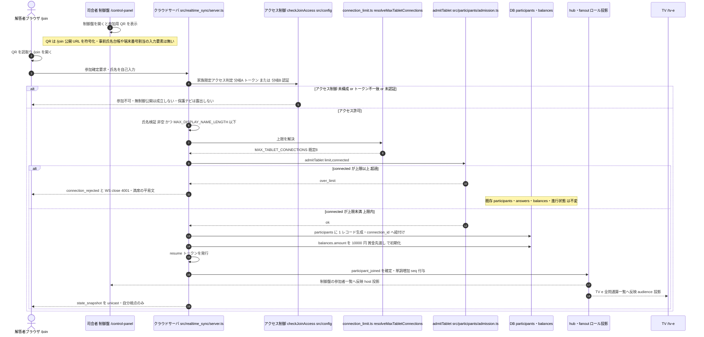
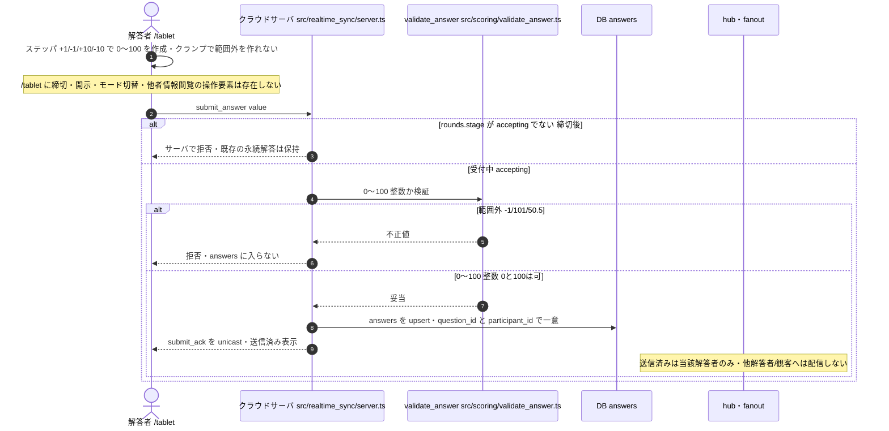
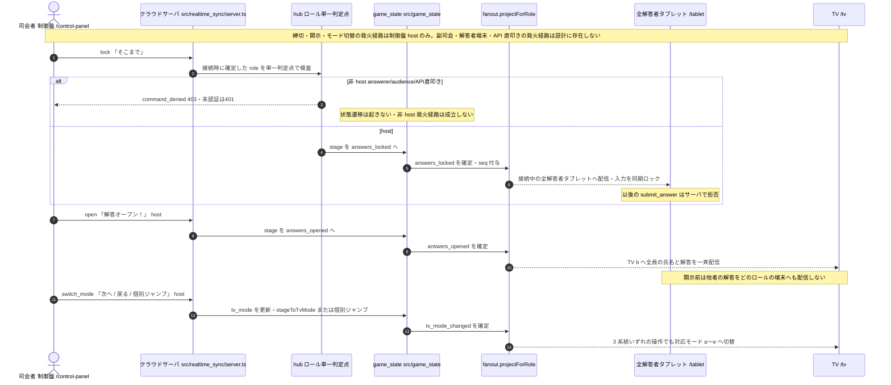
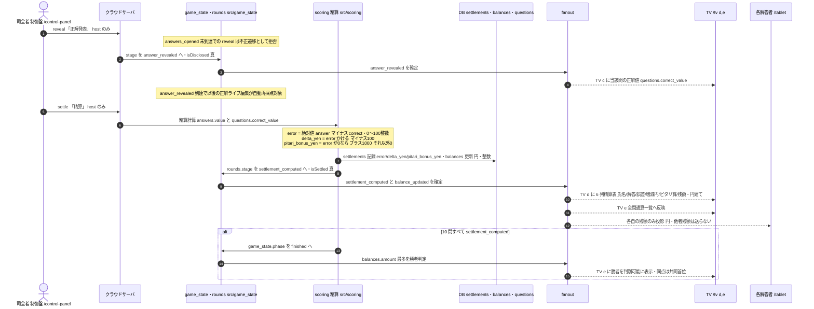
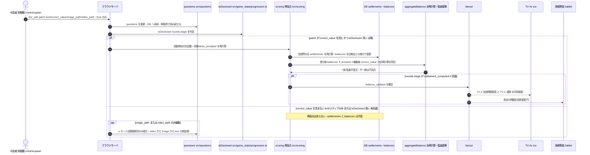
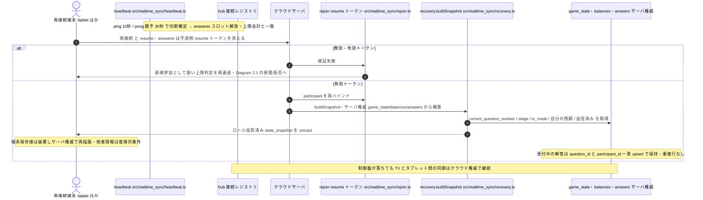

---
codd:
  node_id: detailed_design:sequence-flows
  type: design
  depends_on:
  - id: design:operational-behavior-model
    relation: depends_on
    semantic: technical
  - id: design:realtime-sync-design
    relation: depends_on
    semantic: technical
  depended_by:
  - id: plan:implementation-plan
    relation: depends_on
    semantic: technical
  - id: test:test-strategy
    relation: depends_on
    semantic: verification
  conventions:
  - targets:
    - module:realtime_sync
    - module:control_panel
    reason: 締切・開示・モード切替は制御盤発火→サーバ→全端末同期のシーケンスで表し、司会者以外の発火経路を描かない（論点7）。違反時リリース不可。
  - targets:
    - module:scoring
    - module:game_flow
    reason: 開示済み問題の正解ライブ編集→自動再採点→残額反映→TV d/e 更新の順序をシーケンスで確定する（E-3残）。違反時リリース不可。
  - targets:
    - module:participants
    reason: QR 読取→氏名自己入力→接続確立（上限内なら受理・超過なら拒否）のシーケンスを描く（論点9改・10）。違反時リリース不可。
  modules:
  - realtime_sync
  - game_flow
  - scoring
  - participants
  - tv_display
  - control_panel
  operation_flow:
    actors:
    - id: host
      label: 司会者（制御盤）
      surface: /control-panel
    - id: answerer
      label: 解答者（タブレット）
      surface: /tablet
    - id: audience
      label: 観客（TV）
      surface: /tv
    - id: system
      label: クラウドサーバ（realtime_sync 権威 / scoring / participants / game_state）
    operations:
    - id: op_display_join_qr
      actor: host
      verb: display
      target: join_qr
      trigger: 司会者が制御盤を開くと参加用 QR が表示される
      route: /control-panel
      ui_pattern: qr_display
      preconditions:
      - PUBLIC_BASE_URL が設定済み
      measurement_source: resolvePublicBaseUrl() と（分岐A時）JOIN_ACCESS_TOKEN
      readback: QR 読取りでクラウド公開の /join へ到達する
      visible_to:
      - host
      forbidden_actors:
      - answerer
      - audience
      expected_outcomes:
      - 制御盤に /join 公開 URL を符号化した QR が表示される
      - QR 提示面に事前氏名台帳・端末番号割当の入力要素が存在しない
      dod_obligations:
      - id: dod_qr_encodes_public_join_url
        text: 制御盤に表示される QR がクラウド公開の /join URL を符号化し、読取りで /join へ到達する
      - id: dod_qr_no_seat_ledger
        text: QR 提示面に事前氏名台帳・端末番号割当の入力要素が存在しない
    - id: op_guard_family_access
      actor: system
      verb: guard
      target: join_access
      trigger: 解答者が /join へ到達し参加確定を試行
      route: /join
      measurement_source: 提示トークン（分岐A）またはセッション認証状態（分岐B）と src/config のアクセス制御設定
      preconditions:
      - 参加アクセス制御が URL 秘匿トークンまたは認証のいずれかで構成されている
      durable_state: なし（アクセス判定は設定と提示情報から導出）
      consumer_surfaces:
      - join_page
      expected_outcomes:
      - 分岐A では秘匿トークン一致のときのみ /join 参加が許可される
      - 分岐B では認証済のときのみ許可され、ログイン→リダイレクト→描画のフローを備える
      - どちらの制御も未構成なら参加を許可しない（無制御公開は成立しない）
      - 受入は src/config の上限解決点と role 判定を必ず経由する
      boundary_cases:
      - アクセス制御未構成 → 参加不可（無認証の無制限公開はリリース不可構成）
      - 分岐A トークン不一致 → 参加不可
      - 分岐B 未認証 → /join は保護ナビを露出せずログインへ誘導
      dod_obligations:
      - id: dod_access_no_open_public
        text: URL 秘匿トークンも認証も未構成の場合に /join の参加確定が許可されず、無制御公開が構成上も実行上も成立しない
      - id: dod_access_single_resolution
        text: 分岐 A/B いずれでも参加受入が src/config の上限解決点と role 判定の単一経路を経由する
      - id: dod_access_no_protected_nav
        text: 未認証・未参加の /join に制御盤操作等の保護ナビが露出しない
    - id: op_establish_connection
      actor: system
      verb: accept
      target: websocket_session
      trigger: 端末が公開 URL をブラウザで開き WebSocket 接続してロールを申告する
      route: /control-panel | /tv | /tablet | /join
      preconditions:
      - WebSocket 待受はクラウドサーバのみに存在する
      measurement_source: 接続時のロール申告と（answerer は）resume トークン
      durable_state: hub のロール別接続レジストリ（host/answerer/audience）
      readback: 接続直後にロール投影済み state_snapshot を unicast で返す
      expected_outcomes:
      - セッションにロール（host/answerer/audience）が確定する
      - 制御盤ブラウザは待受ソケットを持たず配信はクラウド権威から届く
      dod_obligations:
      - id: dod_conn_cloud_authority
        text: WebSocket の待受はクラウドサーバ側のみに存在し、制御盤ブラウザは待受ソケットを開かない
      - id: dod_conn_role_scoped_session
        text: 接続確立時にセッションのロールが確定し、以後の配信投影と権限判定がそのロールを単一判定点として参照する
    - id: op_join_game
      actor: answerer
      verb: join
      target: game_session
      trigger: 制御盤の QR を読取り /join で氏名を自己入力して参加確定
      route: /join
      ui_pattern: qr_scan_then_name_input
      preconditions:
      - 家族限定アクセス制御を通過している（分岐A トークン一致 または 分岐B 認証済）
      - answerer 接続数が MAX_TABLET_CONNECTIONS 未満
      - 氏名が非空かつ MAX_DISPLAY_NAME_LENGTH 以下
      measurement_source: 解答者の自己入力氏名
      durable_state: participants テーブル（id / name / joined_at / connection_id）＋ balances
        行の初期化（amount = 10000）
      readback: 制御盤の参加者一覧と TV(e) 全問通算一覧に反映
      visible_to:
      - host
      - audience
      forbidden_actors: []
      expected_outcomes:
      - 自己入力した氏名で participants に 1 人 1 レコードが作られ connection_id へ紐付く
      - 当該参加者の balances.amount が 10000 円（賞金先渡し）で初期化される
      - 参加が制御盤の参加者一覧と TV(e) に反映される
      - 端末番号の固定割当や事前氏名台帳を用いずに参加が成立する
      boundary_cases:
      - 空・空白のみの氏名 → UI とサーバの双方で拒否
      - MAX_DISPLAY_NAME_LENGTH 超過の氏名 → UI とサーバの双方で拒否
      - 同名の別人 → それぞれ別の participants レコード（氏名は一意キーでない）
      - 同一端末の resume なし再 /join → 新規参加として上限判定を再通過
      dod_obligations:
      - id: dod_join_self_name
        text: 参加者が自己入力した氏名が participants に永続し、制御盤の参加者一覧に表示される
      - id: dod_join_no_seat_fixed
        text: 端末番号の固定割当や事前氏名台帳の UI/API を用いずに参加が成立する
      - id: dod_join_one_device
        text: 参加確定 1 回につき connection_id へ紐づく participants レコードが 1 件だけ生成される
      - id: dod_join_reflected
        text: 参加確定が制御盤の参加者一覧と TV(e) の全問通算一覧へ反映される
      - id: dod_join_name_validation
        text: 空・空白のみ・上限長超過の氏名は /join の UI とサーバの双方で拒否され participants に入らない
      - id: dod_settle_initial_grant
        text: ゲーム開始時に各プレイヤーの balances.amount が 10000 円で初期化されている
    - id: op_enforce_connection_limit
      actor: system
      verb: reject
      target: tablet_connection
      trigger: answerer 接続数が MAX_TABLET_CONNECTIONS に達した状態での新規参加確定の試行
      route: /join
      measurement_source: 現在の answerer 接続数と src/config の MAX_TABLET_CONNECTIONS 解決値
      threshold: MAX_TABLET_CONNECTIONS（既定 8）
      preconditions:
      - connected_answerers >= MAX_TABLET_CONNECTIONS
      durable_state: 既存接続・participants・answers・balances は不変
      consumer_surfaces:
      - join_page
      expected_outcomes:
      - admitTablet が over_limit を返し参加が成立しない
      - realtime_sync が connection_rejected とともに WS close(4001) で断る
      - 既存の接続と保持データ（participants/answers/balances/進行状態）は影響を受けない
      - host/audience 接続はタブレット上限に数えない別チャネルとして扱う
      - /join に満席の平易文が表示され設定キー名・接続数会計は露出しない
      boundary_cases:
      - 既定 8: 8 台目は許可・9 台目は拒否
      - 設定 16: 16 台目は許可・17 台目は拒否
      - 設定 32: 32 台目は許可・33 台目は拒否
      - 切断でスロット解放後は同数まで再受入可
      dod_obligations:
      - id: dod_limit_default_eight
        text: 設定未指定時に 8 台まで接続でき 9 台目が拒否される
      - id: dod_limit_config_follows
        text: MAX_TABLET_CONNECTIONS を 16/32 へ設定変更するとコード改修なしに上限がその値へ追随する
      - id: dod_limit_no_hardcode
        text: 上限判定は src/config の解決値を参照し、判定コードに数値リテラル 8 のハードコードが存在しない
      - id: dod_limit_existing_unaffected
        text: 上限拒否の発生時に既存接続のセッション・回答・残額・進行状態が変化しない
      - id: dod_limit_join_full_copy
        text: /join の満席表示が job-to-be-done 平易文で、設定キー名・接続数会計・ロール識別子を露出しない
    - id: op_submit_answer
      actor: answerer
      verb: submit
      target: answer
      trigger: タブレット入力画面で +1/-1/+10/-10 のステッパで 0〜100 の数値を作り「送信」を押下
      route: /tablet
      ui_pattern: stepper_plus_minus_then_submit
      forbidden_actors:
      - host
      - audience
      preconditions:
      - 参加確定済み（participants に自分のレコードが存在）
      - 当該問の rounds.stage が accepting（受付中）
      measurement_source: 解答者がステッパで作成した 0〜100 整数
      durable_state: answers（question_id + participant_id で一意・value は 0〜100 整数）
      readback: 送信後 submit_ack が当該解答者へ unicast され送信済み表示になる（再接続後の state_snapshot にも反映）
      from_state: accepting
      to_state: accepting
      visible_to:
      - answerer
      expected_outcomes:
      - 0〜100 整数の解答が answers に upsert される
      - 送信済み状態が当該解答者にのみ表示され他者・観客へは配信されない
      - 締切（answers_locked）後の submit_answer はサーバで拒否される
      boundary_cases:
      - 値 0 / 100 は送信可
      - 値 -1 / 101 / 50.5 は UI とサーバの双方で拒否
      - 締切後の送信 → サーバで拒否（既存の永続解答は保持）
      - ステッパはクランプにより 0 未満・100 超の値を作れない
      dod_obligations:
      - id: dod_submit_stepper_only
        text: 解答者の入力導線が +1/-1/+10/-10 と「送信」のみで構成され、締切・開示・モード切替・他者情報閲覧の操作要素が /tablet
          に存在しない
      - id: dod_submit_range_guard
        text: 送信値は 0〜100 整数のみ UI とサーバ双方で受理され -1/101/50.5 は answers に入らない
      - id: dod_submit_accepting_only
        text: 受付中のみ送信でき answers_locked 到達後の submit_answer はサーバで拒否される
      - id: dod_submit_upsert_once
        text: 同一 question_id + participant_id の解答が upsert され重複行を作らない
      - id: dod_submit_own_ack_only
        text: 送信後 submit_ack が当該解答者のみへ返り、他解答者・観客へ解答が配信されない
    - id: op_propagate_deadline
      actor: host
      verb: lock
      target: answerer_tablets
      trigger: 制御盤で「そこまで」を押下
      route: /control-panel
      forbidden_actors:
      - answerer
      - audience
      from_state: accepting
      to_state: answers_locked
      durable_state: game_state.stage = answers_locked
      consumer_surfaces:
      - answerer_tablets
      expected_outcomes:
      - answers_locked が接続中の全解答者タブレットへ配信され入力が同期ロックされる
      - 締切後のタブレットからの submit_answer はサーバで拒否される
      dod_obligations:
      - id: dod_deadline_host_only
        text: 締切コマンドは role host のみ発動でき answerer/audience からの締切コマンドは command_denied(403)
          で拒否される
      - id: dod_deadline_sync_lock
        text: 締切の配信で接続中の全解答者タブレットが締切表示へ同期し以後の送信が拒否される
    - id: op_propagate_disclosure
      actor: host
      verb: open
      target: tv_and_endpoints
      trigger: 制御盤で「解答オープン！」を押下
      route: /control-panel
      forbidden_actors:
      - answerer
      - audience
      from_state: answers_locked
      to_state: answers_opened
      durable_state: game_state.stage = answers_opened
      visible_to:
      - audience
      consumer_surfaces:
      - tv_mode_b
      expected_outcomes:
      - 開示前は他者の解答がどのロールの端末へも配信されない
      - 開示後 TV(b) へ全員の氏名と解答が一斉配信される
      dod_obligations:
      - id: dod_disclosure_hidden_before
        text: answers_opened 未配信の間は解答者・観客のいずれの端末へも他者の解答が配信されない
      - id: dod_disclosure_reveals_on_tv
        text: answers_opened の配信で TV(b) が全員の氏名と解答を表示する
    - id: op_reveal_answer
      actor: host
      verb: reveal
      target: tv_and_endpoints
      trigger: 制御盤で「正解発表」を押下
      route: /control-panel
      forbidden_actors:
      - answerer
      - audience
      from_state: answers_opened
      to_state: answer_revealed
      durable_state: game_state.stage = answer_revealed（rounds.stage）
      visible_to:
      - audience
      consumer_surfaces:
      - tv_mode_c
      measurement_source: 当該問 questions.correct_value
      expected_outcomes:
      - TV(c) に当該問の正解値が表示される
      - answer_revealed 到達で当該問が isDisclosed 真となり以後の正解ライブ編集が自動再採点対象になる
      boundary_cases:
      - answers_opened 未到達での reveal は不正遷移として拒否
      dod_obligations:
      - id: dod_reveal_host_only
        text: 正解発表は role host のみ発動でき answerer/audience からは command_denied(403) で拒否される
      - id: dod_reveal_marks_disclosed
        text: answer_revealed 到達で当該問が isDisclosed 真となり以後の correct_value 編集が再採点対象になる
      - id: dod_reveal_tv_c
        text: 正解発表の配信で TV(c) が当該問の正解値を表示する
    - id: op_compute_settlement
      actor: host
      verb: settle
      target: balances
      trigger: 制御盤で「精算」を押下し得点精算を実行
      route: /control-panel
      forbidden_actors:
      - answerer
      - audience
      from_state: answer_revealed
      to_state: settlement_computed
      measurement_source: answers.value と questions.correct_value
      durable_state: settlements（error / delta_yen / pitari_bonus_yen）＋ balances（円・整数）＋
        rounds.stage = settlement_computed
      consumer_surfaces:
      - tv_mode_d
      - tv_mode_e
      visible_to:
      - audience
      expected_outcomes:
      - 誤差 = 絶対値(answer - correct) が 0〜100 整数で settlements に記録される
      - 増減円 = 誤差 × -100（整数円）で delta_yen が記録され balances が更新される
      - 誤差 0 のピタリ賞 +1000 円が pitari_bonus_yen に記録され balances へ加算される
      - TV(d) に 6 列精算表（氏名/解答/誤差/増減円/ピタリ賞/残額）が円建てで表示される
      boundary_cases:
      - 誤差 0 は +1000（丁度）
      - 誤差 1 は -100 のみ（直上・不連続）
      dod_obligations:
      - id: dod_settle_delta
        text: 誤差 5 の精算後に当該プレイヤーの balances.amount が精算前より 500 円少ない
      - id: dod_settle_pitari_add
        text: 誤差 0 のプレイヤーの pitari_bonus_yen が +1000 で balances に反映される（拠出配分側は F-02
          未確定として fixme）
      - id: dod_settle_currency_yen
        text: settlements と balances と API 応答と d の 6 列表が円建てで表され point/pt/点 の語が存在しない
      - id: dod_settle_integer_only
        text: error / delta_yen / pitari_bonus_yen / amount がすべて整数で小数値を持たない
      - id: dod_settle_host_only
        text: 得点精算は role host のみ発動でき answerer からの精算コマンドは 401/403 で拒否される
    - id: op_propagate_mode_switch
      actor: host
      verb: switch
      target: tv_display
      trigger: 制御盤の「次へ」「戻る」または各モード個別ジャンプ
      route: /control-panel
      ui_pattern: next_back_jump
      forbidden_actors:
      - answerer
      - audience
      durable_state: game_state.tv_mode
      consumer_surfaces:
      - tv_mode_a
      - tv_mode_b
      - tv_mode_c
      - tv_mode_d
      - tv_mode_e
      expected_outcomes:
      - 3 系統いずれの操作でも tv_mode_changed が配信され接続中の TV が対応モードへ切り替わる
      dod_obligations:
      - id: dod_mode_switch_host_only
        text: モード切替は role host のみ発動でき answerer/audience からのモード切替は command_denied(403)
          で拒否される
      - id: dod_mode_switch_sync_tv
        text: 次へ・戻る・個別ジャンプの 3 系統いずれでも tv_mode_changed が配信され接続中の TV が対応モードへ切り替わる
    - id: op_switch_tv_mode
      actor: host
      verb: switch
      target: tv_mode
      trigger: 制御盤の「次へ」「戻る」または各モード個別ジャンプで a モードへ切替
      route: /control-panel
      ui_pattern: next_back_jump
      forbidden_actors:
      - answerer
      - audience
      measurement_source: questions.video_path / image_path / text（当該問）
      durable_state: game_state.tv_mode
      consumer_surfaces:
      - tv_mode_a
      expected_outcomes:
      - a モードは動画→画像→テキストの 3 段で出題面を解決する
      - メディアパスのライブ編集後は次の a モード描画に反映される
      boundary_cases:
      - 動画パス有 → 動画（画像有無に関わらず動画優先）
      - 動画無・画像有 → 画像
      - 双方無 → テキスト
      dod_obligations:
      - id: dod_tv_a_fallback
        text: a モードが video_path→image_path→text の優先順で出題面を解決する
      - id: dod_tv_a_reflects_live_edit
        text: メディアパスのライブ編集後に a モードを再描画すると解決される出題面が編集後の規定順に従う
      - id: dod_tv_a_no_path_leak
        text: a モードの表示に生のファイルパス文字列や fallback 等の内部語が露出しない
    - id: op_live_edit_correct
      actor: host
      verb: edit
      target: question_or_correct_value
      trigger: 制御盤のライブ編集 UI で問題文・正解値・画像/動画パスを更新
      route: /control-panel
      ui_pattern: inline_edit_then_save
      forbidden_actors:
      - answerer
      - audience
      preconditions:
      - 対象問が questions に存在する
      durable_state: questions テーブル更新（text / image_path / video_path / correct_value）
      readback: DB 再取得で編集後の値を返す
      visible_to:
      - host
      expected_outcomes:
      - 問題文・正解・メディアパスを進行中に編集でき questions に永続する
      - 画像/動画パスの編集は a モードの出題面解決に反映される
      - correct_value の編集かつ開示済み（c 以降）のときのみ自動再採点を誘発する
      boundary_cases:
      - text のみ編集 → 再採点は走らない
      - image_path/video_path のみ編集 → 再採点は走らない・a モード解決のみ変化
      - correct_value 編集かつ c 未到達 → 再採点は走らない
      - correct_value 編集かつ c 以降 → 再採点が走る
      dod_obligations:
      - id: dod_edit_persist
        text: 進行中に編集した問題文と正解値が questions に永続し再取得で読み戻せる
      - id: dod_edit_media_persist
        text: 進行中に編集した image_path/video_path が questions に永続し再取得で読み戻せる
      - id: dod_edit_media_face_follows
        text: 動画パスを付与/除去すると当該問の a モード出題面が規定順（video→image→text）で切り替わる
      - id: dod_edit_correct_range_guard
        text: 正解値の編集も 0〜100 整数のみ受理し範囲外はサーバと DB CHECK で拒否される
      - id: dod_edit_host_only
        text: ライブ編集は role host のみ発動でき answerer からの編集コマンドは 401/403 で拒否される
    - id: op_auto_rescore
      actor: system
      verb: rescore
      target: balances
      trigger: 開示済み（rounds.stage が answer_revealed 以降）の問題で司会者が correct_value をライブ編集
      preconditions:
      - 当該問の rounds.stage が answer_revealed 以降（isDisclosed 真）
      - ライブ編集の patch が correctValue を含む
      measurement_source: 編集後 questions.correct_value と既存 answers.value
      durable_state: settlements 再計算 ＋ balances 差分更新
      consumer_surfaces:
      - tv_mode_d
      - tv_mode_e
      from_state: answer_revealed
      to_state: answer_revealed
      expected_outcomes:
      - 正解訂正で当該問の全 settlements（誤差・delta_yen・pitari）が再計算される
      - balances が旧拠出との差分で更新される
      - rounds.stage が settlement_computed の問は TV d/e が同時更新される
      boundary_cases:
      - c 到達問の correct_value 訂正 → 再採点が走る
      - c 未到達（isDisclosed 偽）の correct_value 編集 → 再採点は走らない（境界外）
      - text/メディアのみ編集 → 再採点は走らない（correct_value 不変）
      dod_obligations:
      - id: dod_rescore_after_c
        text: rounds.stage が answer_revealed 以降で正解を直すと settlements と balances が再計算され各人の残額へ即時反映される
      - id: dod_rescore_no_before_c
        text: rounds.stage が answer_revealed 未満の正解編集では settlements と balances が変化しない
      - id: dod_rescore_only_on_correct_value
        text: text または image_path/video_path のみの編集では再採点が走らず balances が不変である
      - id: dod_rescore_d_sync
        text: rounds.stage が settlement_computed の問の正解訂正で balances 差分が再計算され TV の d
          と e が同時更新される
      - id: dod_rescore_matches_full_recompute
        text: 差分更新後の balances が answers と correct_value からの全再計算と一致する
    - id: op_undo
      actor: host
      verb: undo
      target: last_progression
      trigger: 制御盤で「取消」を押下
      route: /control-panel
      forbidden_actors:
      - answerer
      - audience
      durable_state: trigger_undone イベント（巻き戻し範囲は F-03 未確定・発明しない）
      consumer_surfaces:
      - control_panel
      - tv_display
      - answerer_tablets
      expected_outcomes:
      - trigger_undone が配信され直近の対象操作が取り消される
      - 発動権限は制御盤（host）のみで初版から存置される
      boundary_cases:
      - 巻き戻し範囲（直近のみ / 任意問題再開示 / d 到達問の残額差分巻き戻し）は F-03 未確定
      dod_obligations:
      - id: dod_undo_host_only
        text: 取消は role host のみ発動でき answerer/audience からは command_denied(403) で拒否される（巻き戻し挙動詳細は
          F-03/F028、E2E は test.fixme）
    - id: op_broadcast_state_transition
      actor: system
      verb: broadcast
      target: connected_endpoints
      trigger: ドメインイベント（answers_locked/answers_opened/answer_revealed/settlement_computed/tv_mode_changed/balance_updated/participant_joined/trigger_undone）の確定
      measurement_source: game_state と balances の確定済み遷移
      durable_state: 各イベントに単調増加の seq を付与
      consumer_surfaces:
      - control_panel
      - tv_display
      - answerer_tablets
      readback: 遅参・再接続端末は state_snapshot で最新へ整合
      visible_to:
      - host
      - answerer
      - audience
      threshold: 状態遷移の全端末反映 p95 <= 2000ms（暫定ゲート・F-04）
      expected_outcomes:
      - 該当ロールの接続中全端末へロール投影済みイベントが配信される
      - 配信はロール投影を通し、可視範囲外の情報は当該ロールへ送られない
      dod_obligations:
      - id: dod_broadcast_all_role_endpoints
        text: 状態遷移イベントが当該ロールの接続中全端末へ配信される
      - id: dod_broadcast_role_projection
        text: 配信ペイロードはロール投影を経由し、解答者端末へ他者の解答・残額・得点が配信されない
      - id: dod_broadcast_latency_gate
        text: 状態遷移の全端末反映が p95 <= 2000ms を満たす
    - id: op_recover_on_reconnect
      actor: system
      verb: recover
      target: reconnecting_endpoint
      trigger: 回線断後の端末が再接続し（answerer は resume トークンを添えて）resume する
      route: /control-panel | /tv | /tablet
      measurement_source: サーバ権威の game_state（current_question_number/stage/tv_mode）と
        balances と answers
      durable_state: 端末側は状態を保持せずサーバ権威から再構成する
      readback: ロール投影済み state_snapshot を返し以後の live 配信へ合流させる
      expected_outcomes:
      - 再接続端末が現在問題番号・進行段階・TV モードへ復帰する
      - 解答者は自分の残額と送信済み状態へ復帰し他者情報は復帰対象外
      - 復帰値の権威はサーバの game_state と balances でありクライアント保存値に依存しない
      boundary_cases:
      - 制御盤が落ちても TV/タブレット間の配信はクラウド権威で継続する
      - 無効・失効トークンの再接続は新規参加として扱い上限判定を再度通す
      dod_obligations:
      - id: dod_reconnect_progression
        text: 再接続端末が現在問題番号・進行段階・TV モードへ復帰する
      - id: dod_reconnect_own_balance
        text: 再接続した解答者が自分の残額と送信済み状態へ復帰し、他者の解答・残額は復帰対象に含まれない
      - id: dod_reconnect_server_authority
        text: 復帰値がサーバの game_state と balances から供給され、クライアント保存値に依存しない
      - id: dod_reconnect_control_panel_resilient
        text: 制御盤の切断中も TV とタブレットの同期がクラウド権威経由で継続する
    - id: op_preserve_answer_across_reconnect
      actor: system
      verb: preserve
      target: answer
      trigger: 受付中に送信済みの解答を持つ端末が切断・再接続する
      measurement_source: answers テーブル（question_id + participant_id の一意キー）
      preconditions:
      - 当該問の game_state.stage が accepting のとき submit は upsert される
      durable_state: answers（question_id + participant_id で一意）
      readback: 再接続後の state_snapshot が送信済み状態を反映する
      from_state: accepting
      to_state: accepting
      expected_outcomes:
      - 受付中に永続した解答が切断・再接続を跨いで保持される
      - 再接続後の再送で同一問・同一参加者の解答が重複永続化されない
      boundary_cases:
      - ack 前切断で resume 再送 → upsert により重複なく保持
      - 締切後の resume 再送 → 拒否されるが既存の永続解答は保持
      dod_obligations:
      - id: dod_answer_preserved_across_reconnect
        text: 受付中に送信済みの解答が接続断・再接続後も answers に保持され送信済み表示へ復帰する
      - id: dod_answer_no_duplicate
        text: 再接続後の再送で同一 question_id + participant_id の解答行が重複せず一意に保たれる
    - id: op_determine_winner
      actor: system
      verb: determine
      target: winner
      trigger: 10 問目の得点精算が完了
      preconditions:
      - 10 問すべての rounds.stage が settlement_computed
      measurement_source: 全問通算の balances.amount
      consumer_surfaces:
      - tv_mode_e
      from_state: settlement_computed
      to_state: game_finished
      durable_state: game_state.phase = finished
      expected_outcomes:
      - balances.amount 最多のプレイヤーが e モードで勝者として判別可能に表示される
      boundary_cases:
      - 残額同点は複数の共同首位を勝者として提示（同点優先順位は確定要件に無く発明しない・F-06）
      dod_obligations:
      - id: dod_winner_most_balance
        text: 10 問終了時に balances.amount 最多のプレイヤーが e モードで勝者として判別できる
---

# 主要シーケンス（参加・回答・締切・開示・正解発表・精算・再採点・モード切替／Mermaid sequence）

## 1. Overview

本書は `save-money-switcher`（クラウド WEB アプリ版『賞金先渡しクイズ SAVE MONEY』を家族で遊ぶ操作盤）における **主要シーケンスの詳細設計** であり、二つの親設計 —— `design:operational-behavior-model`（運用挙動モデル：actor/action/state/outcome）と `design:realtime-sync-design`（WebSocket 同期・接続管理・状態整合）—— を技術的真実源として統合し、**参加・回答・締切・開示・正解発表・精算・再採点・モード切替・再接続** の各フローを、モジュール横断の **相互作用順序（sequence contract）** として Mermaid sequence 図で確定する。ここに記す確定順序・不変条件・発火経路に反する成果物は **リリース不可（release-blocking）** として扱う。

### 1.1 本書の権威範囲と非範囲

本書が単一の真実源として所有するのは、**「誰が・どの導線で発火し・サーバが何をどの順で処理し・どのイベントがどのロールへ投影配信され・どの状態へ遷移するか」という時系列順序** である。各モジュールの内部実装（スコア計算式・WS トランスポート機構・DB 物理スキーマ・QR/氏名検証の内部ロジック・出題面解決の内部分岐）は各兄弟設計が所有し、本書はそれらの **呼び出し順序と分岐順序** のみを確定する（§3 で単一所有者を明示）。したがって、本書のシーケンスの一段を別モジュールで再実装したり、別の発火経路（非 host 起点）から再現したりすることは **ドリフト違反** である。

### 1.2 リリースブロッキング規約と本書での具体化

| # | 対象 | 不変条件（要旨） | 本書での具体化箇所 |
|---|---|---|---|
| SEQ-1 | `module:realtime_sync` / `module:control_panel` | 締切・開示・モード切替は **制御盤（host）発火 → サーバ → 全端末同期** のシーケンスで表し、**司会者以外の発火経路を描かない**（論点7） | §2.3（Diagram 3）・§3・OBM `op_propagate_deadline`／`op_propagate_disclosure`／`op_propagate_mode_switch` |
| SEQ-2 | `module:scoring` / `module:game_flow` | **開示済み問題の正解ライブ編集 → 自動再採点 → 残額反映 → TV d/e 更新** の順序をシーケンスで確定（E-3残） | §2.5（Diagram 5）・§3・OBM `op_reveal_answer`／`op_live_edit_correct`／`op_auto_rescore` |
| SEQ-3 | `module:participants` | **QR 読取 → 氏名自己入力 → 接続確立（上限内なら受理・超過なら拒否）** のシーケンスを描く（論点9改・10） | §2.1（Diagram 1）・§3・OBM `op_display_join_qr`／`op_guard_family_access`／`op_join_game`／`op_enforce_connection_limit` |

上位から継承する不変条件も本書のシーケンスで統合担保する：**ホスト PC をサーバにしない**（WS 待受はクラウド権威のみ・全図の `S`）、**host-only 進行トリガー**（非 host は `command_denied` 403／未認証 401・Diagram 3）、**ロール投影による他者情報の非配信**（`projectForRole` を必ず経由・全 fan-out 段）、**円建て固定**（`point`/`pt`/`点` 禁止・Diagram 4/5）、**0〜100 整数の多層防衛**（UI＋サーバ＋DB `CHECK`・Diagram 2）、**家族限定アクセス制御**（無制御公開不可・Diagram 1）、**接続上限の外出し**（既定 8・設定 16/32 追随・Diagram 1）。

### 1.3 実装・ツールチェーン前提（scaffold 固定・釈義不可）

- **実装言語 = TypeScript のみ。** 本書のファイルパス（`src/realtime_sync/server.ts`・`src/game_state/progression.ts` 等）・ドメイン型・モジュール構成・依存管理・ツールチェーン参照はすべて TypeScript 慣行のみを用い、他言語の拡張子・マニフェスト・ツールは例示・フォールバックとしても登場させない。WebSocket サーバ実装は Node 上の軽量ライブラリ **`ws`**、クライアントはブラウザ標準 `WebSocket`、ブラウザ検証は **Playwright をライブラリ import** で駆動する。
- **テストランナー = Vitest（固定・release-blocking のグラウンドトゥルース）。** 本書のテスト例は Vitest 自身の宣言 API（`import { describe, it, expect } from "vitest";`）で記述する。「ランタイム依存を最小化する」方針は **出荷コードのランタイム依存**（`ws` 等）にのみ及び、テストランナーには及ばない。依存数の哲学を根拠に別フレームワークや Node 組み込み `node:test` を用いてはならない。verify が実際に走らせるのは Vitest である。
- **モジュール解決 = NodeNext/Node16。** すべての相対 import は **出力される `.js` ファイル名を明示した拡張子** を伴う（`import { isDisclosed } from "./progression.js";`。`"./progression"`・`"./progression.ts"` は不可）。default/namespace import・re-export（`export { stageToTvMode } from "./tv_mode.js";`）・type-only import（`import type { Stage } from "./progression.js";`）も同一規約。拡張子欠落は TS2835 でコンパイル不能。
- **レイアウト契約（output-path fence 強制）。** ソースは **必ず `src/` 配下**、テストは **必ず `tests/` 配下**（`test/`・`spec/`・`specs/` を発明しない。サブディレクトリ `tests/game_state/` 等は可）。`package.json`・`package-lock.json`・`tsconfig.json`・`vitest.config.ts` は harness scaffold 所有につき、本書はこれらを成果物として出力・宣言しない。

### 1.4 アクター・ロール・サーフェス対応（可視ラベル）

内部ロール識別子 → 可視ラベルを全サーフェス共通で固定し、シーケンスが駆動する可視コピーには **可視ラベル** のみを用いる（内部識別子・内部イベント名 `answers_locked` 等・設定キー名 `MAX_TABLET_CONNECTIONS`・実装根拠・環境前提を露出させない）。金額は全経路で **円**。

| 内部識別子 | 可視ラベル | 主サーフェス | シーケンス上の役割 |
|---|---|---|---|
| `role: host` | **司会者** | `/control-panel` | 締切・開示・正解発表・精算・モード切替・取消・入稿・ライブ編集・QR 提示の **唯一の発火起点** |
| `role: answerer` | **解答者** | `/join`→`/tablet` | 参加・数値入力・送信のみ（入力専用・受動同期先） |
| （TV 視聴者） | **観客** | `/tv` | 受動表示（a〜e）のみ・発火不可 |
| `system` | （非可視） | クラウド権威 | WS 権威・採点・配信・ロール投影・整合復帰 |

---

## 2. Mermaid Diagrams

以下の 6 本の sequence 図が本システムの主要フローの順序契約である。各図の直後の散文で、正準所有・再利用/import 期待・実装境界を明示する。

### 2.1 参加シーケンス（QR→氏名自己入力→接続確立→上限内受理／超過拒否・SEQ-3）



**所有境界と実装帰結**: 参加の受理/拒否分岐は本図が確定する唯一の順序契約である。上限値の解決は `src/config/connection_limit.ts` の `resolveMaxTabletConnections()` **単一解決点** のみが行い（数値リテラル `8` を判定コードに撒かない）、受入可否は純関数 `admitTablet`（`src/participants/admission.ts`）が返す。氏名の自己入力・非空・上限長検証は `module:participants` が所有し、端末番号の固定割当や事前氏名台帳（恒久台帳）を用いない。アクセス制御は `checkJoinAccess`（`src/config`）が **未構成時 `granted: false`** を返し、無制御公開を構成上も実行時も成立させない。`participant_joined` の配信は必ず `fanout.projectForRole` を経由し、制御盤・TV(e) へロール投影して届く。同名の別人はそれぞれ別 `participants` レコード（氏名は一意キーでなく identity は `participants.id`）。切断でスロット解放後は同数まで再受入可。

### 2.2 回答シーケンス（ステッパ→送信→upsert→submit_ack unicast）



**所有境界と実装帰結**: 解答者の到達可能な操作は本図の `submit_answer`（＋前段の参加）のみで、`/tablet` は入力専用最小 UI とする（`dod_submit_stepper_only`）。0〜100 整数の防衛は **UI（ステッパのクランプ）→ サーバ（`validate_answer`・`src/scoring/`）→ DB（`CHECK(0<=value<=100)`）** の多層で、`validate_answer` の実装は `module:scoring` が単一所有する。`answers` は `question_id + participant_id` 一意キーで **upsert**（重複行を作らない）。`submit_ack` は当該解答者へ unicast のみで、`projectForRole`（`src/realtime_sync/fanout.ts`）が他者・観客への解答配信を構造的に禁じる。締切後の送信はサーバで拒否されるが、既存の永続解答は保持される。

### 2.3 締切・開示・モード切替シーケンス（制御盤発火→サーバ→全端末同期・SEQ-1）



**所有境界と実装帰結**: 本図は SEQ-1 を確定する。締切・開示・モード切替の **発火起点は `/control-panel`（host）だけ** であり、非 host の発火経路（有効な状態遷移に至る経路）は一切描かない。非 host コマンドは `hub` の **ロール単一判定点**（接続確立 `op_establish_connection` で確定した role 属性を全 host コマンドが参照）が `command_denied`（403／未認証 401）で拒否し、状態遷移は起きない —— この拒否分岐は「非 host からは遷移が成立しない」ことを示すためのガードであり、正当な発火経路ではない。副司会ロールは発明しない。状態遷移の適用は `module:game_flow`／`src/game_state/`（`stageToTvMode` 単一所有）が、配信投影は `src/realtime_sync/fanout.ts`（`projectForRole` 単一所有）が担う。開示前の他者解答は全ロールへ非配信。反映ゲートは **p95 ≤ 2,000ms**（F-04 暫定）。

### 2.4 正解発表・精算シーケンス（reveal→settle→残額更新→TV d/e→勝者判別）



**所有境界と実装帰結**: 精算 outcome は要件裁可の確定値どおりに固定する —— 賞金先渡し **10,000 円**、誤差 `error = |answer − correct|`（0〜100 整数）、増減円 `delta_yen = error × −100`、**ピタリ賞加算側 `+1,000 円`（誤差 0）**、10 問終了で **残額最多勝ち**。計算式そのものは `module:scoring`（`src/scoring/`）が単一所有し、本図はその **呼び出し順序**（reveal → settle → settlements/balances 永続 → 配信）を確定する。誤差 0 と誤差 1 の間には不連続（+1000 と −100）がある。ピタリ賞の **拠出（減算）側と配分**は F-02 未確定につき発明せず、現段階は拠出減算 0（加算側のみ反映）。金額は全経路で **円**（`point`/`pt`/`点` 禁止）、`error/delta_yen/pitari_bonus_yen/amount` はすべて整数。各解答者へは `projectForRole` が自分の残額のみを投影する。

### 2.5 正解ライブ編集→自動再採点シーケンス（開示済みのみ→残額反映→TV d/e 更新・SEQ-2）



**所有境界と実装帰結**: 本図は SEQ-2 を確定する。**自動再採点が走る ⇔（patch に `correct_value` を含む）∧（`isDisclosed(rounds.stage)` が真＝c 以降）** の 2 条件の論理積を、実装が省略できない機械可検の契約とする。開示済み問題の正解ライブ編集 → 自動再採点 → 残額反映 → TV d/e 更新という **順序**を本図が唯一確定する。段階判定 `isDisclosed`／`isSettled` は `src/game_state/progression.ts` が **単一所有**し、`module:scoring` と `module:realtime_sync` はこれを import して再利用する（再実装しない）。差分更新は最適化に過ぎず、正しさの基準は `aggregateBalance` による全再計算で、両者の **一致**が監査不変式（`dod_rescore_matches_full_recompute`）。`text`・画像・動画パスのみの編集や c 未到達の正解編集では再採点は走らず `balances` 不変。メディアパス編集は a モード出題面解決（`video→image→text`）のみ変化させ、これは `src/questions/`／`src/media/`（`resolveQuestionFace` 単一所有）が担う。

### 2.6 再接続整合シーケンス（切断→resume→state_snapshot 復帰→回答保持）



**所有境界と実装帰結**: 切断検知（`heartbeat.ts`）→ スロット解放 → 再接続 → `state_snapshot` 復帰の順序を本図が確定する。復帰値の権威は **サーバ側 `game_state`／`balances`／`answers`** のみで、クライアント保存値に依存しない（`dod_reconnect_server_authority`）。`buildSnapshot`（`src/realtime_sync/recovery.ts`）は単一所有で、必ず `projectForRole` を通して他者情報を除外する。受付中に永続した解答は一意 upsert で切断・再接続を跨いで保持され、ack 前切断からの resume 再送でも重複行を作らない。無効・失効トークンは新規参加として扱い、Diagram 2.1 の上限判定を再通過する。制御盤切断中も TV/タブレット間の同期はクラウド権威で継続する（`dod_reconnect_control_panel_resilient`）。

### Operational Behavior Model

以下の単一 YAML ブロックが、本主要シーケンスの運用挙動について実装計画と E2E 生成が共有する権威的出典である。CoDD がこれをメタデータへ lift する。親設計の `operation_flow` と ID・`dod_*` を一致させ（`op_join_game`／`op_enforce_connection_limit`／`op_auto_rescore` 等）、シーケンス固有の順序契約を各操作へ紐付ける。未確定は `boundary_cases` または §5 のフラグへ回し、発明しない。

```yaml
operation_flow:
  actors:
    - id: host
      label: 司会者（制御盤）
      surface: /control-panel
    - id: answerer
      label: 解答者（タブレット）
      surface: /tablet
    - id: audience
      label: 観客（TV）
      surface: /tv
    - id: system
      label: クラウドサーバ（realtime_sync 権威 / scoring / participants / game_state）
  operations:
    - id: op_display_join_qr
      actor: host
      verb: display
      target: join_qr
      trigger: 司会者が制御盤を開くと参加用 QR が表示される
      route: /control-panel
      ui_pattern: qr_display
      preconditions:
        - PUBLIC_BASE_URL が設定済み
      measurement_source: resolvePublicBaseUrl() と（分岐A時）JOIN_ACCESS_TOKEN
      readback: QR 読取りでクラウド公開の /join へ到達する
      visible_to: [host]
      forbidden_actors: [answerer, audience]
      expected_outcomes:
        - 制御盤に /join 公開 URL を符号化した QR が表示される
        - QR 提示面に事前氏名台帳・端末番号割当の入力要素が存在しない
      dod_obligations:
        - id: dod_qr_encodes_public_join_url
          text: 制御盤に表示される QR がクラウド公開の /join URL を符号化し、読取りで /join へ到達する
        - id: dod_qr_no_seat_ledger
          text: QR 提示面に事前氏名台帳・端末番号割当の入力要素が存在しない
    - id: op_guard_family_access
      actor: system
      verb: guard
      target: join_access
      trigger: 解答者が /join へ到達し参加確定を試行
      route: /join
      measurement_source: 提示トークン（分岐A）またはセッション認証状態（分岐B）と src/config のアクセス制御設定
      preconditions:
        - 参加アクセス制御が URL 秘匿トークンまたは認証のいずれかで構成されている
      durable_state: なし（アクセス判定は設定と提示情報から導出）
      consumer_surfaces: [join_page]
      expected_outcomes:
        - 分岐A では秘匿トークン一致のときのみ /join 参加が許可される
        - 分岐B では認証済のときのみ許可され、ログイン→リダイレクト→描画のフローを備える
        - どちらの制御も未構成なら参加を許可しない（無制御公開は成立しない）
        - 受入は src/config の上限解決点と role 判定を必ず経由する
      boundary_cases:
        - アクセス制御未構成 → 参加不可（無認証の無制限公開はリリース不可構成）
        - 分岐A トークン不一致 → 参加不可
        - 分岐B 未認証 → /join は保護ナビを露出せずログインへ誘導
      dod_obligations:
        - id: dod_access_no_open_public
          text: URL 秘匿トークンも認証も未構成の場合に /join の参加確定が許可されず、無制御公開が構成上も実行上も成立しない
        - id: dod_access_single_resolution
          text: 分岐 A/B いずれでも参加受入が src/config の上限解決点と role 判定の単一経路を経由する
        - id: dod_access_no_protected_nav
          text: 未認証・未参加の /join に制御盤操作等の保護ナビが露出しない
    - id: op_establish_connection
      actor: system
      verb: accept
      target: websocket_session
      trigger: 端末が公開 URL をブラウザで開き WebSocket 接続してロールを申告する
      route: /control-panel | /tv | /tablet | /join
      preconditions:
        - WebSocket 待受はクラウドサーバのみに存在する
      measurement_source: 接続時のロール申告と（answerer は）resume トークン
      durable_state: hub のロール別接続レジストリ（host/answerer/audience）
      readback: 接続直後にロール投影済み state_snapshot を unicast で返す
      expected_outcomes:
        - セッションにロール（host/answerer/audience）が確定する
        - 制御盤ブラウザは待受ソケットを持たず配信はクラウド権威から届く
      dod_obligations:
        - id: dod_conn_cloud_authority
          text: WebSocket の待受はクラウドサーバ側のみに存在し、制御盤ブラウザは待受ソケットを開かない
        - id: dod_conn_role_scoped_session
          text: 接続確立時にセッションのロールが確定し、以後の配信投影と権限判定がそのロールを単一判定点として参照する
    - id: op_join_game
      actor: answerer
      verb: join
      target: game_session
      trigger: 制御盤の QR を読取り /join で氏名を自己入力して参加確定
      route: /join
      ui_pattern: qr_scan_then_name_input
      preconditions:
        - 家族限定アクセス制御を通過している（分岐A トークン一致 または 分岐B 認証済）
        - answerer 接続数が MAX_TABLET_CONNECTIONS 未満
        - 氏名が非空かつ MAX_DISPLAY_NAME_LENGTH 以下
      measurement_source: 解答者の自己入力氏名
      durable_state: participants テーブル（id / name / joined_at / connection_id）＋ balances 行の初期化（amount = 10000）
      readback: 制御盤の参加者一覧と TV(e) 全問通算一覧に反映
      visible_to: [host, audience]
      forbidden_actors: []
      expected_outcomes:
        - 自己入力した氏名で participants に 1 人 1 レコードが作られ connection_id へ紐付く
        - 当該参加者の balances.amount が 10000 円（賞金先渡し）で初期化される
        - 参加が制御盤の参加者一覧と TV(e) に反映される
        - 端末番号の固定割当や事前氏名台帳を用いずに参加が成立する
      boundary_cases:
        - 空・空白のみの氏名 → UI とサーバの双方で拒否
        - MAX_DISPLAY_NAME_LENGTH 超過の氏名 → UI とサーバの双方で拒否
        - 同名の別人 → それぞれ別の participants レコード（氏名は一意キーでない）
        - 同一端末の resume なし再 /join → 新規参加として上限判定を再通過
      dod_obligations:
        - id: dod_join_self_name
          text: 参加者が自己入力した氏名が participants に永続し、制御盤の参加者一覧に表示される
        - id: dod_join_no_seat_fixed
          text: 端末番号の固定割当や事前氏名台帳の UI/API を用いずに参加が成立する
        - id: dod_join_one_device
          text: 参加確定 1 回につき connection_id へ紐づく participants レコードが 1 件だけ生成される
        - id: dod_join_reflected
          text: 参加確定が制御盤の参加者一覧と TV(e) の全問通算一覧へ反映される
        - id: dod_join_name_validation
          text: 空・空白のみ・上限長超過の氏名は /join の UI とサーバの双方で拒否され participants に入らない
        - id: dod_settle_initial_grant
          text: ゲーム開始時に各プレイヤーの balances.amount が 10000 円で初期化されている
    - id: op_enforce_connection_limit
      actor: system
      verb: reject
      target: tablet_connection
      trigger: answerer 接続数が MAX_TABLET_CONNECTIONS に達した状態での新規参加確定の試行
      route: /join
      measurement_source: 現在の answerer 接続数と src/config の MAX_TABLET_CONNECTIONS 解決値
      threshold: MAX_TABLET_CONNECTIONS（既定 8）
      preconditions:
        - connected_answerers >= MAX_TABLET_CONNECTIONS
      durable_state: 既存接続・participants・answers・balances は不変
      consumer_surfaces: [join_page]
      expected_outcomes:
        - admitTablet が over_limit を返し参加が成立しない
        - realtime_sync が connection_rejected とともに WS close(4001) で断る
        - 既存の接続と保持データ（participants/answers/balances/進行状態）は影響を受けない
        - host/audience 接続はタブレット上限に数えない別チャネルとして扱う
        - /join に満席の平易文が表示され設定キー名・接続数会計は露出しない
      boundary_cases:
        - 既定 8: 8 台目は許可・9 台目は拒否
        - 設定 16: 16 台目は許可・17 台目は拒否
        - 設定 32: 32 台目は許可・33 台目は拒否
        - 切断でスロット解放後は同数まで再受入可
      dod_obligations:
        - id: dod_limit_default_eight
          text: 設定未指定時に 8 台まで接続でき 9 台目が拒否される
        - id: dod_limit_config_follows
          text: MAX_TABLET_CONNECTIONS を 16/32 へ設定変更するとコード改修なしに上限がその値へ追随する
        - id: dod_limit_no_hardcode
          text: 上限判定は src/config の解決値を参照し、判定コードに数値リテラル 8 のハードコードが存在しない
        - id: dod_limit_existing_unaffected
          text: 上限拒否の発生時に既存接続のセッション・回答・残額・進行状態が変化しない
        - id: dod_limit_join_full_copy
          text: /join の満席表示が job-to-be-done 平易文で、設定キー名・接続数会計・ロール識別子を露出しない
    - id: op_submit_answer
      actor: answerer
      verb: submit
      target: answer
      trigger: タブレット入力画面で +1/-1/+10/-10 のステッパで 0〜100 の数値を作り「送信」を押下
      route: /tablet
      ui_pattern: stepper_plus_minus_then_submit
      forbidden_actors: [host, audience]
      preconditions:
        - 参加確定済み（participants に自分のレコードが存在）
        - 当該問の rounds.stage が accepting（受付中）
      measurement_source: 解答者がステッパで作成した 0〜100 整数
      durable_state: answers（question_id + participant_id で一意・value は 0〜100 整数）
      readback: 送信後 submit_ack が当該解答者へ unicast され送信済み表示になる（再接続後の state_snapshot にも反映）
      from_state: accepting
      to_state: accepting
      visible_to: [answerer]
      expected_outcomes:
        - 0〜100 整数の解答が answers に upsert される
        - 送信済み状態が当該解答者にのみ表示され他者・観客へは配信されない
        - 締切（answers_locked）後の submit_answer はサーバで拒否される
      boundary_cases:
        - 値 0 / 100 は送信可
        - 値 -1 / 101 / 50.5 は UI とサーバの双方で拒否
        - 締切後の送信 → サーバで拒否（既存の永続解答は保持）
        - ステッパはクランプにより 0 未満・100 超の値を作れない
      dod_obligations:
        - id: dod_submit_stepper_only
          text: 解答者の入力導線が +1/-1/+10/-10 と「送信」のみで構成され、締切・開示・モード切替・他者情報閲覧の操作要素が /tablet に存在しない
        - id: dod_submit_range_guard
          text: 送信値は 0〜100 整数のみ UI とサーバ双方で受理され -1/101/50.5 は answers に入らない
        - id: dod_submit_accepting_only
          text: 受付中のみ送信でき answers_locked 到達後の submit_answer はサーバで拒否される
        - id: dod_submit_upsert_once
          text: 同一 question_id + participant_id の解答が upsert され重複行を作らない
        - id: dod_submit_own_ack_only
          text: 送信後 submit_ack が当該解答者のみへ返り、他解答者・観客へ解答が配信されない
    - id: op_propagate_deadline
      actor: host
      verb: lock
      target: answerer_tablets
      trigger: 制御盤で「そこまで」を押下
      route: /control-panel
      forbidden_actors: [answerer, audience]
      from_state: accepting
      to_state: answers_locked
      durable_state: game_state.stage = answers_locked
      consumer_surfaces: [answerer_tablets]
      expected_outcomes:
        - answers_locked が接続中の全解答者タブレットへ配信され入力が同期ロックされる
        - 締切後のタブレットからの submit_answer はサーバで拒否される
      dod_obligations:
        - id: dod_deadline_host_only
          text: 締切コマンドは role host のみ発動でき answerer/audience からの締切コマンドは command_denied(403) で拒否される
        - id: dod_deadline_sync_lock
          text: 締切の配信で接続中の全解答者タブレットが締切表示へ同期し以後の送信が拒否される
    - id: op_propagate_disclosure
      actor: host
      verb: open
      target: tv_and_endpoints
      trigger: 制御盤で「解答オープン！」を押下
      route: /control-panel
      forbidden_actors: [answerer, audience]
      from_state: answers_locked
      to_state: answers_opened
      durable_state: game_state.stage = answers_opened
      visible_to: [audience]
      consumer_surfaces: [tv_mode_b]
      expected_outcomes:
        - 開示前は他者の解答がどのロールの端末へも配信されない
        - 開示後 TV(b) へ全員の氏名と解答が一斉配信される
      dod_obligations:
        - id: dod_disclosure_hidden_before
          text: answers_opened 未配信の間は解答者・観客のいずれの端末へも他者の解答が配信されない
        - id: dod_disclosure_reveals_on_tv
          text: answers_opened の配信で TV(b) が全員の氏名と解答を表示する
    - id: op_reveal_answer
      actor: host
      verb: reveal
      target: tv_and_endpoints
      trigger: 制御盤で「正解発表」を押下
      route: /control-panel
      forbidden_actors: [answerer, audience]
      from_state: answers_opened
      to_state: answer_revealed
      durable_state: game_state.stage = answer_revealed（rounds.stage）
      visible_to: [audience]
      consumer_surfaces: [tv_mode_c]
      measurement_source: 当該問 questions.correct_value
      expected_outcomes:
        - TV(c) に当該問の正解値が表示される
        - answer_revealed 到達で当該問が isDisclosed 真となり以後の正解ライブ編集が自動再採点対象になる
      boundary_cases:
        - answers_opened 未到達での reveal は不正遷移として拒否
      dod_obligations:
        - id: dod_reveal_host_only
          text: 正解発表は role host のみ発動でき answerer/audience からは command_denied(403) で拒否される
        - id: dod_reveal_marks_disclosed
          text: answer_revealed 到達で当該問が isDisclosed 真となり以後の correct_value 編集が再採点対象になる
        - id: dod_reveal_tv_c
          text: 正解発表の配信で TV(c) が当該問の正解値を表示する
    - id: op_compute_settlement
      actor: host
      verb: settle
      target: balances
      trigger: 制御盤で「精算」を押下し得点精算を実行
      route: /control-panel
      forbidden_actors: [answerer, audience]
      from_state: answer_revealed
      to_state: settlement_computed
      measurement_source: answers.value と questions.correct_value
      durable_state: settlements（error / delta_yen / pitari_bonus_yen）＋ balances（円・整数）＋ rounds.stage = settlement_computed
      consumer_surfaces: [tv_mode_d, tv_mode_e]
      visible_to: [audience]
      expected_outcomes:
        - 誤差 = 絶対値(answer - correct) が 0〜100 整数で settlements に記録される
        - 増減円 = 誤差 × -100（整数円）で delta_yen が記録され balances が更新される
        - 誤差 0 のピタリ賞 +1000 円が pitari_bonus_yen に記録され balances へ加算される
        - TV(d) に 6 列精算表（氏名/解答/誤差/増減円/ピタリ賞/残額）が円建てで表示される
      boundary_cases:
        - 誤差 0 は +1000（丁度）
        - 誤差 1 は -100 のみ（直上・不連続）
      dod_obligations:
        - id: dod_settle_delta
          text: 誤差 5 の精算後に当該プレイヤーの balances.amount が精算前より 500 円少ない
        - id: dod_settle_pitari_add
          text: 誤差 0 のプレイヤーの pitari_bonus_yen が +1000 で balances に反映される（拠出配分側は F-02 未確定として fixme）
        - id: dod_settle_currency_yen
          text: settlements と balances と API 応答と d の 6 列表が円建てで表され point/pt/点 の語が存在しない
        - id: dod_settle_integer_only
          text: error / delta_yen / pitari_bonus_yen / amount がすべて整数で小数値を持たない
        - id: dod_settle_host_only
          text: 得点精算は role host のみ発動でき answerer からの精算コマンドは 401/403 で拒否される
    - id: op_propagate_mode_switch
      actor: host
      verb: switch
      target: tv_display
      trigger: 制御盤の「次へ」「戻る」または各モード個別ジャンプ
      route: /control-panel
      ui_pattern: next_back_jump
      forbidden_actors: [answerer, audience]
      durable_state: game_state.tv_mode
      consumer_surfaces: [tv_mode_a, tv_mode_b, tv_mode_c, tv_mode_d, tv_mode_e]
      expected_outcomes:
        - 3 系統いずれの操作でも tv_mode_changed が配信され接続中の TV が対応モードへ切り替わる
      dod_obligations:
        - id: dod_mode_switch_host_only
          text: モード切替は role host のみ発動でき answerer/audience からのモード切替は command_denied(403) で拒否される
        - id: dod_mode_switch_sync_tv
          text: 次へ・戻る・個別ジャンプの 3 系統いずれでも tv_mode_changed が配信され接続中の TV が対応モードへ切り替わる
    - id: op_switch_tv_mode
      actor: host
      verb: switch
      target: tv_mode
      trigger: 制御盤の「次へ」「戻る」または各モード個別ジャンプで a モードへ切替
      route: /control-panel
      ui_pattern: next_back_jump
      forbidden_actors: [answerer, audience]
      measurement_source: questions.video_path / image_path / text（当該問）
      durable_state: game_state.tv_mode
      consumer_surfaces: [tv_mode_a]
      expected_outcomes:
        - a モードは動画→画像→テキストの 3 段で出題面を解決する
        - メディアパスのライブ編集後は次の a モード描画に反映される
      boundary_cases:
        - 動画パス有 → 動画（画像有無に関わらず動画優先）
        - 動画無・画像有 → 画像
        - 双方無 → テキスト
      dod_obligations:
        - id: dod_tv_a_fallback
          text: a モードが video_path→image_path→text の優先順で出題面を解決する
        - id: dod_tv_a_reflects_live_edit
          text: メディアパスのライブ編集後に a モードを再描画すると解決される出題面が編集後の規定順に従う
        - id: dod_tv_a_no_path_leak
          text: a モードの表示に生のファイルパス文字列や fallback 等の内部語が露出しない
    - id: op_live_edit_correct
      actor: host
      verb: edit
      target: question_or_correct_value
      trigger: 制御盤のライブ編集 UI で問題文・正解値・画像/動画パスを更新
      route: /control-panel
      ui_pattern: inline_edit_then_save
      forbidden_actors: [answerer, audience]
      preconditions:
        - 対象問が questions に存在する
      durable_state: questions テーブル更新（text / image_path / video_path / correct_value）
      readback: DB 再取得で編集後の値を返す
      visible_to: [host]
      expected_outcomes:
        - 問題文・正解・メディアパスを進行中に編集でき questions に永続する
        - 画像/動画パスの編集は a モードの出題面解決に反映される
        - correct_value の編集かつ開示済み（c 以降）のときのみ自動再採点を誘発する
      boundary_cases:
        - text のみ編集 → 再採点は走らない
        - image_path/video_path のみ編集 → 再採点は走らない・a モード解決のみ変化
        - correct_value 編集かつ c 未到達 → 再採点は走らない
        - correct_value 編集かつ c 以降 → 再採点が走る
      dod_obligations:
        - id: dod_edit_persist
          text: 進行中に編集した問題文と正解値が questions に永続し再取得で読み戻せる
        - id: dod_edit_media_persist
          text: 進行中に編集した image_path/video_path が questions に永続し再取得で読み戻せる
        - id: dod_edit_media_face_follows
          text: 動画パスを付与/除去すると当該問の a モード出題面が規定順（video→image→text）で切り替わる
        - id: dod_edit_correct_range_guard
          text: 正解値の編集も 0〜100 整数のみ受理し範囲外はサーバと DB CHECK で拒否される
        - id: dod_edit_host_only
          text: ライブ編集は role host のみ発動でき answerer からの編集コマンドは 401/403 で拒否される
    - id: op_auto_rescore
      actor: system
      verb: rescore
      target: balances
      trigger: 開示済み（rounds.stage が answer_revealed 以降）の問題で司会者が correct_value をライブ編集
      preconditions:
        - 当該問の rounds.stage が answer_revealed 以降（isDisclosed 真）
        - ライブ編集の patch が correctValue を含む
      measurement_source: 編集後 questions.correct_value と既存 answers.value
      durable_state: settlements 再計算 ＋ balances 差分更新
      consumer_surfaces: [tv_mode_d, tv_mode_e]
      from_state: answer_revealed
      to_state: answer_revealed
      expected_outcomes:
        - 正解訂正で当該問の全 settlements（誤差・delta_yen・pitari）が再計算される
        - balances が旧拠出との差分で更新される
        - rounds.stage が settlement_computed の問は TV d/e が同時更新される
      boundary_cases:
        - c 到達問の correct_value 訂正 → 再採点が走る
        - c 未到達（isDisclosed 偽）の correct_value 編集 → 再採点は走らない（境界外）
        - text/メディアのみ編集 → 再採点は走らない（correct_value 不変）
      dod_obligations:
        - id: dod_rescore_after_c
          text: rounds.stage が answer_revealed 以降で正解を直すと settlements と balances が再計算され各人の残額へ即時反映される
        - id: dod_rescore_no_before_c
          text: rounds.stage が answer_revealed 未満の正解編集では settlements と balances が変化しない
        - id: dod_rescore_only_on_correct_value
          text: text または image_path/video_path のみの編集では再採点が走らず balances が不変である
        - id: dod_rescore_d_sync
          text: rounds.stage が settlement_computed の問の正解訂正で balances 差分が再計算され TV の d と e が同時更新される
        - id: dod_rescore_matches_full_recompute
          text: 差分更新後の balances が answers と correct_value からの全再計算と一致する
    - id: op_undo
      actor: host
      verb: undo
      target: last_progression
      trigger: 制御盤で「取消」を押下
      route: /control-panel
      forbidden_actors: [answerer, audience]
      durable_state: trigger_undone イベント（巻き戻し範囲は F-03 未確定・発明しない）
      consumer_surfaces: [control_panel, tv_display, answerer_tablets]
      expected_outcomes:
        - trigger_undone が配信され直近の対象操作が取り消される
        - 発動権限は制御盤（host）のみで初版から存置される
      boundary_cases:
        - 巻き戻し範囲（直近のみ / 任意問題再開示 / d 到達問の残額差分巻き戻し）は F-03 未確定
      dod_obligations:
        - id: dod_undo_host_only
          text: 取消は role host のみ発動でき answerer/audience からは command_denied(403) で拒否される（巻き戻し挙動詳細は F-03/F028、E2E は test.fixme）
    - id: op_broadcast_state_transition
      actor: system
      verb: broadcast
      target: connected_endpoints
      trigger: ドメインイベント（answers_locked/answers_opened/answer_revealed/settlement_computed/tv_mode_changed/balance_updated/participant_joined/trigger_undone）の確定
      measurement_source: game_state と balances の確定済み遷移
      durable_state: 各イベントに単調増加の seq を付与
      consumer_surfaces: [control_panel, tv_display, answerer_tablets]
      readback: 遅参・再接続端末は state_snapshot で最新へ整合
      visible_to: [host, answerer, audience]
      threshold: 状態遷移の全端末反映 p95 <= 2000ms（暫定ゲート・F-04）
      expected_outcomes:
        - 該当ロールの接続中全端末へロール投影済みイベントが配信される
        - 配信はロール投影を通し、可視範囲外の情報は当該ロールへ送られない
      dod_obligations:
        - id: dod_broadcast_all_role_endpoints
          text: 状態遷移イベントが当該ロールの接続中全端末へ配信される
        - id: dod_broadcast_role_projection
          text: 配信ペイロードはロール投影を経由し、解答者端末へ他者の解答・残額・得点が配信されない
        - id: dod_broadcast_latency_gate
          text: 状態遷移の全端末反映が p95 <= 2000ms を満たす
    - id: op_recover_on_reconnect
      actor: system
      verb: recover
      target: reconnecting_endpoint
      trigger: 回線断後の端末が再接続し（answerer は resume トークンを添えて）resume する
      route: /control-panel | /tv | /tablet
      measurement_source: サーバ権威の game_state（current_question_number/stage/tv_mode）と balances と answers
      durable_state: 端末側は状態を保持せずサーバ権威から再構成する
      readback: ロール投影済み state_snapshot を返し以後の live 配信へ合流させる
      expected_outcomes:
        - 再接続端末が現在問題番号・進行段階・TV モードへ復帰する
        - 解答者は自分の残額と送信済み状態へ復帰し他者情報は復帰対象外
        - 復帰値の権威はサーバの game_state と balances でありクライアント保存値に依存しない
      boundary_cases:
        - 制御盤が落ちても TV/タブレット間の配信はクラウド権威で継続する
        - 無効・失効トークンの再接続は新規参加として扱い上限判定を再度通す
      dod_obligations:
        - id: dod_reconnect_progression
          text: 再接続端末が現在問題番号・進行段階・TV モードへ復帰する
        - id: dod_reconnect_own_balance
          text: 再接続した解答者が自分の残額と送信済み状態へ復帰し、他者の解答・残額は復帰対象に含まれない
        - id: dod_reconnect_server_authority
          text: 復帰値がサーバの game_state と balances から供給され、クライアント保存値に依存しない
        - id: dod_reconnect_control_panel_resilient
          text: 制御盤の切断中も TV とタブレットの同期がクラウド権威経由で継続する
    - id: op_preserve_answer_across_reconnect
      actor: system
      verb: preserve
      target: answer
      trigger: 受付中に送信済みの解答を持つ端末が切断・再接続する
      measurement_source: answers テーブル（question_id + participant_id の一意キー）
      preconditions:
        - 当該問の game_state.stage が accepting のとき submit は upsert される
      durable_state: answers（question_id + participant_id で一意）
      readback: 再接続後の state_snapshot が送信済み状態を反映する
      from_state: accepting
      to_state: accepting
      expected_outcomes:
        - 受付中に永続した解答が切断・再接続を跨いで保持される
        - 再接続後の再送で同一問・同一参加者の解答が重複永続化されない
      boundary_cases:
        - ack 前切断で resume 再送 → upsert により重複なく保持
        - 締切後の resume 再送 → 拒否されるが既存の永続解答は保持
      dod_obligations:
        - id: dod_answer_preserved_across_reconnect
          text: 受付中に送信済みの解答が接続断・再接続後も answers に保持され送信済み表示へ復帰する
        - id: dod_answer_no_duplicate
          text: 再接続後の再送で同一 question_id + participant_id の解答行が重複せず一意に保たれる
    - id: op_determine_winner
      actor: system
      verb: determine
      target: winner
      trigger: 10 問目の得点精算が完了
      preconditions:
        - 10 問すべての rounds.stage が settlement_computed
      measurement_source: 全問通算の balances.amount
      consumer_surfaces: [tv_mode_e]
      from_state: settlement_computed
      to_state: game_finished
      durable_state: game_state.phase = finished
      expected_outcomes:
        - balances.amount 最多のプレイヤーが e モードで勝者として判別可能に表示される
      boundary_cases:
        - 残額同点は複数の共同首位を勝者として提示（同点優先順位は確定要件に無く発明しない・F-06）
      dod_obligations:
        - id: dod_winner_most_balance
          text: 10 問終了時に balances.amount 最多のプレイヤーが e モードで勝者として判別できる
```

---

## 3. Ownership Boundaries

### 3.1 順序契約と実装所有の分離

本書は **モジュール横断の相互作用順序（sequence contract）の単一所有者** であり、各シーケンス段の内部ロジックは所有しない。順序を別モジュールで再実装したり、非 host 起点から状態遷移へ至る別経路を追加したりすることは、SEQ-1〜SEQ-3 のドリフト違反として **リリース不可** となる。

| 関数 / 型 / 責務 | 単一所有者（ファイル・モジュール） | 本配列文書の関係 |
|---|---|---|
| WS 待受・接続確立・ロール確定 | `src/realtime_sync/server.ts`＋`hub.ts`（module:realtime_sync） | 全図の `S`／`HUB`。呼び出し順序を規定・実装は所有しない |
| ロール投影 `projectForRole` | `src/realtime_sync/fanout.ts` | 全 fan-out 段が必ず経由する順序を規定 |
| 状態スナップショット `buildSnapshot` | `src/realtime_sync/recovery.ts` | Diagram 2.6 の再接続復帰順序を規定 |
| 切断検知・スロット解放 | `src/realtime_sync/heartbeat.ts`／`rejoin.ts` | Diagram 2.6 の ping/pong→解放→resume 順序を規定 |
| 上限解決 `resolveMaxTabletConnections` | `src/config/connection_limit.ts` | Diagram 2.1 の受理判定前の解決順序を規定・既定 8 の唯一の宣言点 |
| 上限判定 `admitTablet` | `src/participants/admission.ts` | Diagram 2.1 の受理/拒否分岐順序を規定 |
| 段階判定 `isDisclosed`／`isSettled`・`stageToTvMode` | `src/game_state/progression.ts`／`tv_mode.ts`（module:game_flow） | Diagram 2.3/2.5 の再採点誘発・モード切替の判定を規定。scoring/realtime_sync は import して再利用（再実装禁止） |
| 精算計算・全再計算 `aggregateBalance` | `src/scoring/`（module:scoring） | Diagram 2.4/2.5 の計算呼び出し順序を規定・式は所有しない |
| 解答検証 `validate_answer` | `src/scoring/validate_answer.ts` | Diagram 2.2 の送信受理前の検証順序を規定 |
| 参加登録・氏名検証・アクセス制御 | `src/participants/`・`src/config`（`checkJoinAccess`） | Diagram 2.1 の参加確定順序を規定 |
| 入稿・出題面解決 `resolveQuestionFace`・ライブ編集永続 | `src/questions/`・`src/media/` | Diagram 2.5 の a モード解決とライブ編集順序を規定 |
| 進行制御コマンド発火（可視トリガー UI） | `src/control_panel/`（module:control_panel） | 全 host 操作の **唯一の発火起点** として順序を規定 |

### 3.2 発火経路の唯一性（SEQ-1）

締切・開示・正解発表・精算・モード切替・取消・入稿・ライブ編集の発火起点は `/control-panel`（`role: host`）に一意化される。`hub` が接続確立時に確定した role 属性を **単一判定点** として全 host コマンドに適用し、非 host は `command_denied`（403／未認証 401）で拒否する。副司会という別ロールを発明せず、解答者端末・観客端末に当該操作要素を置かず、API 直叩きも同一判定点で弾く。本書のシーケンスは非 host からの正当な発火経路を一切描かない。

### 3.3 配信投影の唯一性（プライバシー・SEQ-1 継承）

すべての状態遷移配信は `fanout.projectForRole` を必ず経由し、解答者端末へ他者の解答・残額・得点を投影しない。開示前（`answers_opened` 未配信）の他者解答はどのロールへも送らない。この可視境界は **トランスポート層で構造的に強制** され、クライアント側改竄でも他者情報を得られない。金額を含むイベントは `currency: "円"` を保持し、`point`/`pt`/`点` を封筒・表示のいずれにも含めない。

---

## 4. Implementation Implications

### 4.1 モジュール配置・指定子・成果物境界

- **格納先**: 進行段階・TV モード判定は `src/game_state/`、同期・接続・投影・復帰は `src/realtime_sync/`、採点・検証・再採点は `src/scoring/`、参加・上限判定は `src/participants/`、入稿・メディア・ライブ編集は `src/questions/`／`src/media/`、設定単一解決点は `src/config/`、進行制御 UI は `src/control_panel/`。ソースは必ず `src/` 配下、テストは必ず `tests/` 配下（`test/`・`spec/`・`specs/` を発明しない）。
- **モジュール指定子**: 全相対 import は `.js` 拡張子を明示（type-only import・re-export も同一）。段階判定型の共有例:

```typescript
// src/game_state/progression.ts
export type Stage =
  | "accepting" | "answers_locked" | "answers_opened"
  | "answer_revealed" | "settlement_computed";

const DISCLOSED: readonly Stage[] = ["answer_revealed", "settlement_computed"];
export function isDisclosed(stage: Stage): boolean { return DISCLOSED.includes(stage); }
export function isSettled(stage: Stage): boolean { return stage === "settlement_computed"; }
```

```typescript
// src/scoring/rescore.ts（再採点の誘発判定は game_state を import して再利用する）
import { isDisclosed, isSettled } from "../game_state/progression.js";
import type { Stage } from "../game_state/progression.js";

export function shouldRescore(stage: Stage, patchHasCorrectValue: boolean): boolean {
  return patchHasCorrectValue && isDisclosed(stage); // SEQ-2 の 2 条件の論理積
}
```

- **成果物境界**: `package.json`・`package-lock.json`・`tsconfig.json`・`vitest.config.ts` は harness scaffold 所有につき本書は出力・宣言しない。

### 4.2 アクター向けサーフェス／コピー義務（シーケンスが駆動する可視状態）

| サーフェス | ルート | 主対象 | シーケンスが駆動する可視状態 | 必須の可視コピー意図 | 禁止コピー／禁止ナビ |
|---|---|---|---|---|---|
| 制御盤 | `/control-panel` | 司会者 | 参加者一覧・接続数把握・全 host トリガー・配信エコー | 「そこまで」「解答オープン！」「正解発表」「精算」「次へ/戻る」等の司会者向け操作語 | 内部 role 識別子・内部イベント名・設定キー名・`point`/`pt`/`点`・テスト/デモ表記 |
| 参加受付 | `/join` | 解答者 | 氏名入力・満席時の参加拒否 | 「お名前を入力してください」「参加する」・満席時「ただいま満席のため参加できません」 | 保護された制御盤ナビ・設定キー名・接続数会計・role 識別子・`point`/`pt`/`点` |
| タブレット | `/tablet` | 解答者 | 受付中/締切/送信済み・自分の残額（円）・再接続復帰 | 「受付中」「締切」「送信済み」「あなたの残額 ◯◯円」 | 他者の解答/残額/得点・司会者操作語・内部イベント名・`point`/`pt`/`点` |
| TV | `/tv` | 観客 | 配信モード a〜e の受動表示 | a 出題面／b 氏名＋解答／c 正解値／d 6 列表（円）／e 通算＋勝者判別 | 入力・操作要素・生パス文字列・`fallback` 等の内部語・`point`/`pt`/`点` |

**エントリ／事前認証面**: `/join` および分岐 B 未認証時の到達点は、アクセス状態に整合しない保護ナビ（制御盤操作等）を露出しない。分岐 B 導入時は「ログイン → 正しいリダイレクト → `/join` 氏名入力描画」のフローを備える。

### 4.3 非機能・SLA・整合ゲート

- **健全性ベースライン**: 全 HTTP 応答は **`< 500`**。上限拒否・アクセス拒否・締切後送信・非 host コマンドは 5xx ではなく業務ステータス（`connection_rejected`／`command_denied`／満席平易文）で表す。
- **同期反映**: 状態遷移の全端末反映 **p95 ≤ 2,000ms**（F-04 暫定ゲート）、入稿（10 問）**p95 ≤ 1,000ms**。切断検知は ping 15 秒／pong 猶予 30 秒。
- **接続数**: 既定 8、設定で 16／32 まで（コード改修なしに追随）。
- **起動シーケンス（検証環境）**: `npm ci` → `npm run build` → `npm run start`（クラウド WEB アプリ＋WebSocket ゆえサーバ常駐必須）。`/healthz` が `< 500` を返すまで **最大 60 秒**ポーリングしてから試験開始。`E2E_BASE_URL`（WS 昇格可能オリジン）・`PUBLIC_BASE_URL`・`MAX_TABLET_CONNECTIONS`・アクセス制御設定を検証環境値で注入。

### 4.4 テスト戦略との整合（Vitest / レイアウト / モジュール指定子）

- ユニットは `tests/game_state/*.test.ts`・`tests/scoring/*.test.ts`・`tests/realtime_sync/*.test.ts` 等。E2E は API/WS 統合 `tests/e2e/*.spec.ts`、ブラウザ `tests/e2e/*.browser.spec.ts`（Playwright を **ライブラリ import** で駆動・宣言/検証は Vitest）、共有ヘルパは `tests/e2e/helpers/`（`.js` 参照）。Vitest 以外（`node:test` 等）をランナーに用いない。

```typescript
// tests/scoring/rescore.test.ts
import { describe, it, expect } from "vitest";
import { shouldRescore } from "../../src/scoring/rescore.js";

describe("SEQ-2 再採点誘発の順序契約", () => {
  it("correct_value を含み c 以降なら再採点が走る", () => {
    expect(shouldRescore("answer_revealed", true)).toBe(true);
    expect(shouldRescore("settlement_computed", true)).toBe(true);
  });
  it("c 未到達 または correct_value を含まない編集では走らない", () => {
    expect(shouldRescore("answers_opened", true)).toBe(false); // c 未到達
    expect(shouldRescore("answer_revealed", false)).toBe(false); // text/メディアのみ
  });
});
```

- **MECE 運用義務の網羅**: 本書の各操作は 7 軸で網羅する —— happy path（`op_join_game`／`op_submit_answer`／`op_compute_settlement`）、persistence/readback（`dod_edit_persist`／`dod_answer_preserved_across_reconnect`）、permission boundary（`dod_*_host_only`／`dod_submit_stepper_only`）、terminal-state guard（`dod_submit_accepting_only`／`dod_rescore_no_before_c`）、cross-actor reflection（`dod_join_reflected`／`dod_disclosure_reveals_on_tv`／`dod_broadcast_role_projection`）、derived-state/read-model chain（`dod_tv_a_fallback`／`dod_rescore_matches_full_recompute`／`dod_winner_most_balance`）、threshold/boundary（`dod_limit_default_eight`／`dod_submit_range_guard`／`dod_broadcast_latency_gate`）。

---

## 5. Open Questions

壁打ち（要件定義）フェーズはクローズ済で殿判断待ちの論点は残っていない。以下はシーケンスに関して実装組み立てフェーズで MAS が決める選定、推測実装せず殿判断を仰ぐ点、検証ゲートで暫定運用中のフラグである。いずれも「推奨なし」「要検討」「TBD」の空白は残さず、確定した制約・既定機構・暫定ゲート値を明記する。

### 5.1 実装組み立てフェーズの選定（MAS 決定・殿判断不要）

| 項目 | 決定/既定 | 制約・選定軸 |
|---|---|---|
| host 操作の判定点 | 接続確立時に確定した `role` を全 host コマンドの単一判定点として参照 | 副司会ロールを発明せず、非 host は 403／未認証 401（Diagram 2.3・`dod_*_host_only`） |
| TV モードと段階の駆動 | 段階遷移（lock/open/reveal/settle）が既定 TV モード（a/b/c/d）を駆動、`switch_mode` で e を含め自由 navigation | `stageToTvMode` を単一化し、e は通算閲覧としてモード切替から到達（`dod_mode_switch_sync_tv`） |
| 再採点の実行方式 | 実行時は差分更新、正しさの基準は全再計算 | 差分後 `balances` が `aggregateBalance` と一致する監査不変式（Diagram 2.5・`dod_rescore_matches_full_recompute`） |
| ステッパ UI のクランプ | `+1/−1/+10/−10` は 0〜100 でクランプ、送信時にサーバ再検証 | UI・サーバの二重防衛（`dod_submit_range_guard`）。0/100 可、-1/101/50.5 不可 |
| 再接続の権威 | サーバ権威 `game_state`／`balances`／`answers` から `buildSnapshot` で再構成 | クライアント保存値に依存しない（Diagram 2.6・`dod_reconnect_server_authority`） |

### 5.2 F028 エスカレーション（推測実装しない）

- **取消操作の巻き戻し範囲（論点 7・F-03）**: `trigger_undone` が `settlement_computed` を 1 段戻すのか、任意問題を再開示（`answer_revealed` へ戻し再採点）するのか、d 到達問の残額差分をどこまで巻き戻すのかは曖昧につき推測実装せず、選択肢を添えて F028 で殿判断を仰ぐ。**発動権限＝制御盤（host）のみ・初版から存置**は確定ゆえ実装・検証し（`dod_undo_host_only`）、巻き戻しの状態遷移詳細は E2E で `test.fixme()`。
- **ピタリ賞の拠出配分（B・F-02）**: Diagram 2.4/2.5 の **加算側 +1,000 円は確定・実装必須**。拠出（減算）側と配分（総額 1,000 か各人からか、複数同時ピタリの扱い）が未確定な間は拠出減算を 0 とし、確定後に `settlements` へ負の拠出行を追加する拡張余地を残す。挙動詳細は E2E で `test.fixme()`。
- **同名参加者の識別表示（論点9改の周辺）**: 「同名の別人」を許容する（氏名は一意キーでなく identity は `participants.id`）方針は確定だが、TV(e)・制御盤一覧で同名を区別する付記（連番・参加順）は要件に無いため発明しない。必要と判明した場合は選択肢を添えて F028。

### 5.3 検証ゲートで暫定運用中のフラグ（設計義務の欠落・発明せず flag）

- **F-01（残額の下限・脱落）**: 確定要件は「誤差 × −100 円」「賞金先渡し 10,000 円」のみで、`balances.amount` の 0 下限や全額喪失での脱落は確定要件に無い。下限を課さず負残高も表現可能とする。下限／脱落を導入する実装が現れた場合にフラグ。
- **F-04（同期レイテンシ SLA）**: 設計に固定 SLA が無いため、状態遷移の全端末反映は **p95 ≤ 2,000ms**、入稿は **p95 ≤ 1,000ms** を暫定テストゲートとし、SLA 確定時に更新する（`dod_broadcast_latency_gate`）。
- **F-05（家族限定アクセス制御）**: 分岐 A（`JOIN_ACCESS_TOKEN`）が設定されていればトークン一致判定を検証、分岐 B（認証）が実装されていれば `/join` 到達前のログイン→リダイレクト→氏名入力描画フローを検証、いずれも未実装なら該当ブラウザテストを `test.fixme()`。ただし `checkJoinAccess` の **未構成時 `granted: false`**（無制御公開を成立させない）は値に依らず検証必須。無制御公開のまま出荷はリリース不可。
- **F-06（残額同点時の勝者優先順位）**: 「残額最多勝ち」は確定だが、同点時の優先順位（先着・問別勝率等）は確定要件に無い。`determineWinners` は同点を **複数の共同首位** として返し、優先順位を発明しない。導入する実装が現れた場合にフラグ。
- **F-06'（動画コーデック/配信方式）**: 動画の実体は問題ファイル記載＋所定フォルダ事前配置で確定だが、TV a モードで確実に再生できるコンテナ/コーデックの具体制約は本設計に固定値が無い。実装時は `<video>` が本番ブラウザで再生可能な形式を選定軸とし、再生不可形式の混入は入稿検証の拡張対象としてフラグする（現時点ではパス存在検証までを義務とする）。
