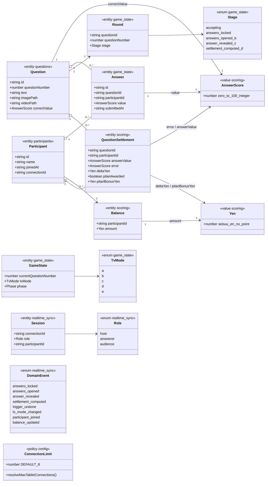
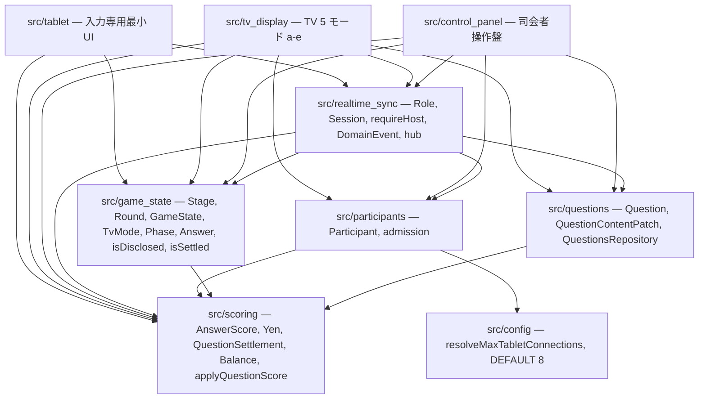
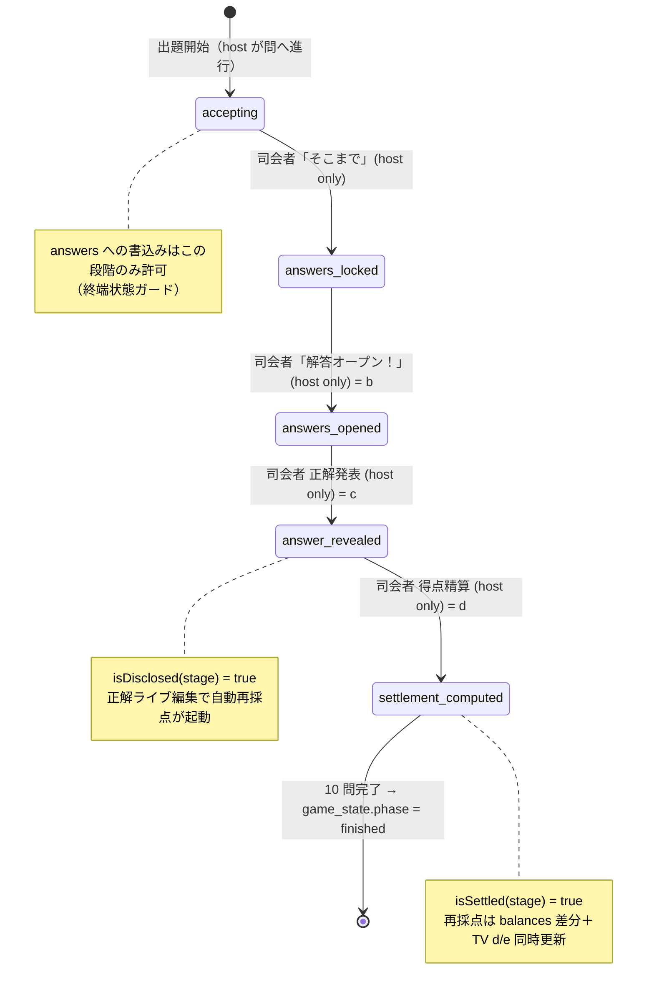

---
codd:
  node_id: detailed_design:shared-domain-model
  type: design
  depends_on:
  - id: design:data-model-design
    relation: depends_on
    semantic: technical
  - id: design:system-design
    relation: constrained_by
    semantic: governance
  depended_by:
  - id: test:test-strategy
    relation: depends_on
    semantic: verification
  conventions:
  - targets:
    - module:scoring
    - module:questions
    reason: 回答・誤差・残額は 0〜100 整数／整数円、金額は円建てで表現し、ポイント型・小数型を共有ドメインに持たせない（論点G・B）。違反時リリース不可。
  - targets:
    - role:host
    - role:answerer
    reason: 司会者・解答者・観客のロールと権限境界を型・所有境界として明示し、実装がロール境界を曖昧化できないこと（論点7・第三要件）。違反時リリース不可。
  modules:
  - questions
  - media
  - scoring
  - game_flow
  - participants
  - config
  operation_flow:
    actors:
    - id: host
      label: 司会者（制御盤）
      surface: /control-panel
    - id: answerer
      label: 解答者（タブレット）
      surface: /tablet
    - id: audience
      label: 観客（TV）
      surface: /tv
    - id: system
      label: クラウドサーバ（realtime_sync）
    operations:
    - id: op_load_questions
      actor: host
      verb: load
      target: question_set
      trigger: 制御盤で事前問題ファイルの読込を実行
      route: /control-panel
      preconditions:
      - ゲーム未開始またはライブ編集フェーズ
      measurement_source: 事前問題ファイル
      durable_state: questions（text / image_path / video_path / correct_value）
      readback: ランタイム出題は questions テーブルから供給（ファイル再読込に依存しない）
      expected_outcomes:
      - 各問が Question 型（correctValue は AnswerScore）で questions に登録される
      - image_path / video_path は string|null（NULL 許容）で保持される
      dod_obligations:
      - id: dod_load_persist
        text: 読み込んだ全問が questions に登録され、再取得で登録時と同一の text と correct_value を返す
      - id: dod_load_runtime_from_db
        text: 出題面の解決元は questions テーブルであり、問題ファイルの再読込に依存しない
      - id: dod_dm_question_type_owner
        text: Question 型は src/questions/question.ts のみが定義し、correctValue の静的型が AnswerScore
          で 0〜100 整数以外は assertAnswerScore が拒否する
    - id: op_join_game
      actor: answerer
      verb: join
      target: game_session
      trigger: 制御盤の QR を読取り /join で氏名を自己入力して参加確定
      route: /join
      ui_pattern: qr_scan_then_name_input
      preconditions:
      - 接続数が MAX_TABLET_CONNECTIONS 未満
      durable_state: participants（name / connection_id）＋ balances 行の初期化
      readback: 制御盤の参加者一覧と TV e モードに反映
      visible_to:
      - host
      - audience
      forbidden_actors: []
      expected_outcomes:
      - 自己入力氏名で Participant が 1 人 1 レコード作られる
      - 当該参加者の Balance.amount が INITIAL_GRANT(10000 円) で初期化される
      dod_obligations:
      - id: dod_join_self_name
        text: 参加者が自己入力した氏名が participants に永続し制御盤の参加者一覧に表示される
      - id: dod_join_no_seat_fixed
        text: 端末番号の固定割当や事前氏名台帳の列/API を用いずに参加が成立する
      - id: dod_join_one_device
        text: connection_id は一意で 1 人 1 台が担保される
      - id: dod_dm_balance_yen_type
        text: 初期化された Balance.amount の型は Yen で値は整数 10000 であり point/pt/点 語を含まない
    - id: op_submit_answer
      actor: answerer
      verb: submit
      target: answer
      trigger: タブレットの 4 ボタン（+1/-1/+10/-10）で値を作り送信
      route: /tablet
      ui_pattern: four_button_stepper
      measurement_source: タブレット数値入力
      preconditions:
      - 当該問の rounds.stage が accepting
      from_state: accepting
      to_state: accepting
      durable_state: answers（value / submitted_at）
      readback: 送信済み表示と自分の残額のみ（他者情報は不可視）
      expected_outcomes:
      - 0〜100 の整数のみ answer_submitted として永続化される
      boundary_cases:
      - 0 は受理
      - 100 は受理
      - -1 は UI とサーバの双方で拒否
      - 101 は UI とサーバの双方で拒否
      - 50.5 は UI とサーバの双方で拒否
      dod_obligations:
      - id: dod_submit_persist
        text: 受付中に送信した 0〜100 整数の解答が answers に永続化され再表示できる
      - id: dod_submit_range_dual_guard
        text: 負値・小数・100 超・非数値は UI とサーバの双方で拒否され answers に入らない
      - id: dod_submit_one_row_per_player
        text: 同一問への再送信は unique(question_id, participant_id) により 1 行を更新する
      - id: dod_dm_answer_score_owner
        text: Answer.value は src/scoring/answer_score.ts の AnswerScore 型で、UI とサーバの検証がともに同一の
          assertAnswerScore を経由し独自レンジ判定を再実装しない
    - id: op_lock_answers
      actor: host
      verb: lock
      target: answers
      trigger: 制御盤で「そこまで」を押下
      route: /control-panel
      forbidden_actors:
      - answerer
      from_state: accepting
      to_state: answers_locked
      durable_state: rounds.stage = answers_locked
      consumer_surfaces:
      - answerer_tablets
      expected_outcomes:
      - 全解答者タブレットの入力がロックされる
      - 締切後の answers への書込みは拒否される
      dod_obligations:
      - id: dod_lock_host_only
        text: 締切は role host のみ発動でき answerer からの締切コマンドは 401/403 で拒否される
      - id: dod_lock_blocks_submit
        text: rounds.stage が answers_locked 以降のとき answers への挿入/更新が拒否される
      - id: dod_dm_require_host_single_guard
        text: 締切コマンドは requireHost(session) を通過した経路のみが実行でき、非 host は ForbiddenRoleError
          から 401/403 へ写像される
    - id: op_open_answers
      actor: host
      verb: open
      target: answers
      trigger: 制御盤で「解答オープン！」を押下
      route: /control-panel
      forbidden_actors:
      - answerer
      from_state: answers_locked
      to_state: answers_opened
      durable_state: rounds.stage = answers_opened
      visible_to:
      - audience
      consumer_surfaces:
      - tv_mode_b
      expected_outcomes:
      - 開示前は他者解答が全端末向け読みモデルに含まれない
      - 開示後 TV(b) に氏名（Participant.name）と解答（Answer.value）が一斉表示される
      dod_obligations:
      - id: dod_open_hidden_before
        text: rounds.stage が answers_opened 未満の間はどの端末向け読みモデルにも他者の解答が含まれない
      - id: dod_open_reveals_on_tv
        text: 開示後に TV(b) が全員の氏名と解答を表示する
      - id: dod_dm_tablet_readmodel_self_only
        text: タブレット向け読みモデル型は自分の Answer と Balance のみを持ち他者の Answer/Balance/QuestionSettlement
          のフィールドを型として含まない
    - id: op_reveal_correct
      actor: host
      verb: reveal
      target: correct_value
      trigger: 制御盤で正解発表を実行
      route: /control-panel
      forbidden_actors:
      - answerer
      from_state: answers_opened
      to_state: answer_revealed
      durable_state: rounds.stage = answer_revealed
      consumer_surfaces:
      - tv_mode_c
      expected_outcomes:
      - TV(c) に questions.correct_value が提示される
      - 以降の正解ライブ編集は自動再採点の対象となる
      dod_obligations:
      - id: dod_reveal_marks_disclosed
        text: 正解発表の実行で当該問の rounds.stage が answer_revealed（開示済み c 以降）として記録される
      - id: dod_dm_is_disclosed_owner
        text: 開示済み判定は src/game_state/progression.ts の isDisclosed のみを用い answer_revealed
          と settlement_computed で真を返す
    - id: op_compute_settlement
      actor: host
      verb: settle
      target: balances
      trigger: 制御盤で得点精算を実行
      route: /control-panel
      from_state: answer_revealed
      to_state: settlement_computed
      measurement_source: answers.value と questions.correct_value
      durable_state: settlements（error / delta_yen / pitari_bonus_yen）＋ balances（円・整数）＋
        rounds.stage = settlement_computed
      consumer_surfaces:
      - tv_mode_d
      - tv_mode_e
      expected_outcomes:
      - 誤差 = 絶対値(answer - correct) が 0〜100 整数（AnswerScore）で記録される
      - 増減円 = 誤差 × -100（Yen）で delta_yen が記録され balances が更新される
      - 誤差 0 のピタリ賞 +1000 円（Yen）が pitari_bonus_yen に記録され balances へ加算される
      boundary_cases:
      - 誤差 0 は +1000（丁度）
      - 誤差 1 は -100 のみ（直上）
      dod_obligations:
      - id: dod_settle_initial_grant
        text: ゲーム開始時に各プレイヤーの Balance.amount が 10000 円で初期化されている
      - id: dod_settle_delta
        text: 誤差 5 の精算後に当該プレイヤーの Balance.amount が精算前より 500 円少ない
      - id: dod_settle_pitari_add
        text: 誤差 0 のプレイヤーの pitari_bonus_yen が +1000 で balances に反映される（拠出配分側は F-02
          未確定として fixme）
      - id: dod_settle_currency_yen
        text: settlements と balances と API 応答と d の 6 列表が円建てで表され point/pt/点 の語が存在しない
      - id: dod_settle_integer_only
        text: error / delta_yen / pitari_bonus_yen / amount がすべて整数で小数値を持たない
      - id: dod_dm_yen_type_convergence
        text: delta_yen と pitari_bonus_yen と amount の静的型がすべて src/scoring/yen.ts の
          Yen であり ScoreResult.currency が "円" リテラルに固定される
    - id: op_live_edit_correct
      actor: host
      verb: edit
      target: question_or_correct_value
      trigger: 制御盤のライブ編集 UI で問題または正解を更新
      route: /control-panel
      forbidden_actors:
      - answerer
      durable_state: questions 更新（text / image_path / video_path / correct_value）
      readback: DB 再取得で編集後の値を返す
      expected_outcomes:
      - 問題・正解の双方を進行中に編集でき questions に永続する
      dod_obligations:
      - id: dod_edit_persist
        text: 進行中に編集した問題文と正解値が questions に永続し再取得で読み戻せる
      - id: dod_dm_patch_type_owner
        text: 編集入力は QuestionContentPatch 型で text/imagePath/videoPath/correctValue
          のみを許し、正解は AnswerScore として検証される
    - id: op_auto_rescore
      actor: system
      verb: rescore
      target: balances
      trigger: 開示済み（rounds.stage が answer_revealed 以降）の問題で正解をライブ編集
      preconditions:
      - 当該問の rounds.stage が answer_revealed 以降
      measurement_source: 編集後 questions.correct_value と既存 answers.value
      from_state: answer_revealed
      to_state: answer_revealed
      durable_state: settlements 再計算 ＋ balances 差分更新
      consumer_surfaces:
      - tv_mode_d
      - tv_mode_e
      expected_outcomes:
      - 正解訂正で当該問の全 settlements（誤差・delta_yen・pitari）が再計算される
      - balances が旧拠出との差分で更新される
      - rounds.stage が settlement_computed の問は TV d/e が同時更新される
      boundary_cases:
      - c 到達問の正解訂正 → 再採点が走る
      - c 未到達（isDisclosed 偽）の正解編集 → 再採点は走らない（境界外）
      dod_obligations:
      - id: dod_rescore_after_c
        text: rounds.stage が answer_revealed 以降で正解を直すと settlements と balances が再計算され各人の残額へ即時反映される
      - id: dod_rescore_no_before_c
        text: rounds.stage が answer_revealed 未満の正解編集では settlements と balances が変化しない
      - id: dod_rescore_d_sync
        text: rounds.stage が settlement_computed の問の正解訂正で balances 差分が再計算され TV の d
          と e が同時更新される
      - id: dod_rescore_matches_full_recompute
        text: 差分更新後の balances が answers と correct_value からの全再計算と一致する
      - id: dod_dm_rescore_uses_pure_scoring
        text: 再採点は src/scoring/apply_question_score.ts の applyQuestionScore を用い、game_state
          側が isDisclosed/isSettled で範囲を決めスコアリングは値のみ計算する
    - id: op_undo_trigger
      actor: host
      verb: undo
      target: last_trigger
      trigger: 制御盤で取消を実行
      route: /control-panel
      forbidden_actors:
      - answerer
      durable_state: trigger_undone イベント
      expected_outcomes:
      - 直近の対象操作が取り消される
      boundary_cases:
      - 取消の具体挙動（直近のみか任意問題再開示か）は未確定（F-03・fixme）
      dod_obligations:
      - id: dod_undo_host_only
        text: 取消は role host のみ発動でき answerer からの取消コマンドは 401/403 で拒否される
      - id: dod_dm_undo_event_owner
        text: trigger_undone は src/realtime_sync/events.ts の DomainEvent ユニオンの一員として単一発行者から配信される
    - id: op_switch_tv_mode
      actor: host
      verb: switch
      target: tv_mode
      trigger: 制御盤の「次へ」「戻る」または各モード個別ジャンプ
      route: /control-panel
      ui_pattern: next_back_jump
      durable_state: game_state.tv_mode
      consumer_surfaces:
      - tv_mode_a
      - tv_mode_b
      - tv_mode_c
      - tv_mode_d
      - tv_mode_e
      expected_outcomes:
      - 3 系統の操作で TV の表示モードが対応して切り替わる
      - a モードは動画→画像→テキストの 3 段で出題面を解決する
      boundary_cases:
      - 動画パス有 → 動画
      - 動画無・画像有 → 画像
      - 双方無 → テキスト
      dod_obligations:
      - id: dod_tv_three_switch_systems
        text: 次へ・戻る・個別ジャンプの 3 系統いずれでも TV の表示モードが対応値へ切り替わる
      - id: dod_tv_a_fallback
        text: a モードが動画・画像・テキストの優先順で出題面を解決する
      - id: dod_dm_tvmode_type_owner
        text: TvMode 列挙は src/game_state/game_state.ts のみが定義し a/b/c/d/e 以外の値を型として許さない
    - id: op_enforce_connection_limit
      actor: system
      verb: reject
      target: tablet_connection
      trigger: 接続数が MAX_TABLET_CONNECTIONS に達した状態での新規接続試行
      measurement_source: 現在接続数と config の MAX_TABLET_CONNECTIONS 解決値
      threshold: MAX_TABLET_CONNECTIONS（既定 8）
      preconditions:
      - connected >= MAX_TABLET_CONNECTIONS
      durable_state: 既存接続は不変
      expected_outcomes:
      - 上限超過の接続は断られる
      - 既存接続は影響を受けない
      boundary_cases:
      - 既定 8: 8 台目は接続可・9 台目は拒否
      - 設定 16: 16 台目は接続可・17 台目は拒否
      - 設定 32: 32 台目は接続可・33 台目は拒否
      dod_obligations:
      - id: dod_limit_default_eight
        text: 設定未指定時に 8 台まで接続でき 9 台目が拒否される
      - id: dod_limit_config_follows
        text: MAX_TABLET_CONNECTIONS を 16/32 へ設定変更するとコード改修なしに上限がその値へ追随する
      - id: dod_limit_no_hardcode
        text: 上限判定は config の解決値を参照し判定経路に数値リテラル 8 が存在しない
      - id: dod_dm_limit_resolver_owner
        text: 上限は src/config/connection_limit.ts の resolveMaxTabletConnections が唯一解決し
          DEFAULT_MAX_TABLET_CONNECTIONS のみが既定 8 を保持する
    - id: op_determine_winner
      actor: system
      verb: determine
      target: winner
      trigger: 10 問目の得点精算が完了
      preconditions:
      - 10 問すべての rounds.stage が settlement_computed
      measurement_source: 全問通算の balances.amount
      from_state: settlement_computed
      to_state: game_finished
      durable_state: game_state.phase = finished
      consumer_surfaces:
      - tv_mode_e
      expected_outcomes:
      - balances.amount 最多のプレイヤーが e モードで勝者として判別可能に表示される
      dod_obligations:
      - id: dod_winner_most_balance
        text: 10 問終了時に balances.amount 最多のプレイヤーが e モードで勝者として判別できる
      - id: dod_dm_phase_finished_owner
        text: 終了状態は Phase="finished"（src/game_state/game_state.ts）で表され勝者判定は Balance.amount(Yen)
          の比較のみで決まる
---

# 共有ドメインモデル（型・用語・所有境界／Mermaid クラス図）

## 1. Overview

### 1.1 本書の位置づけとスコープ

本書は `save-money-switcher`（フジテレビ『賞金先渡しクイズ SAVE MONEY』方式を家族で遊ぶクイズ操作盤）の **共有ドメインモデル** を確定する詳細設計書である。上位の `design:system-design`（クラウド WEB アプリ・アーキテクチャ／`constrained_by`・governance）と `design:data-model-design`（永続テーブル・派生連鎖／`depends_on`・technical）を唯一の真実源とし、両書が定めた概念を **実装が共有する TypeScript の型・用語・所有境界** として一段具体化する。

役割分担を明確にする：`design:data-model-design` は DB テーブル（`questions`/`answers`/`participants`/`rounds`/`game_state`/`settlements`/`balances`/`config`）と永続整合を所有し、`design:system-design` はトポロジ・モジュール配置・不変条件を所有する。**本書はメモリ上のドメイン型（値型・エンティティ型・列挙・ロール・ドメインイベント）とその正準的な単一所有者を所有する。** 型の物理格納（`src/scoring/yen.ts` 等）と、どのモジュールが定義しどのモジュールが import だけをするかの境界を確定し、同一概念の二重定義（reimplementation drift）を封じることが本書の中核目的である。

ここに記す 🟦 確定値・不変条件・単一所有割当に反する成果物は **リリース不可（release-blocking）** として扱う。

### 1.2 単一所有原則（reimplementation drift 防止）

- **1 概念 = 1 正準型 = 1 所有ファイル**。同じドメイン概念（金額・回答値・進行段階・ロール等）に対し、正準名と正準型を **唯一のファイル** に置く。他モジュールはそれを `import` するだけで、再定義・再宣言・平行実装を禁止する。
- 例として「金額」は `Yen`（`src/scoring/yen.ts`）が唯一の型であり、`tv_display`・`control_panel`・`participants` は独自の `number` 金額を宣言せず `Yen` を import する。「回答値」は `AnswerScore`（`src/scoring/answer_score.ts`）が唯一で、`questions.correctValue` も `answers.value` も同型を参照する。
- 用語も一意化する（project_lexicon の設計原則「同一ドメイン概念には docs/code/config/CLI 横断で単一の正準名」）。ロール `host`/`answerer`/`audience`、ドメインイベント `answers_locked` 等は本書の正準名を全レイヤの正準とする。

### 1.3 リリースブロッキング規約と準拠マップ

| 規約 | 対象 | 不変条件（要旨） | 本書での準拠箇所 |
|---|---|---|---|
| **非交渉 1** | `module:scoring`, `module:questions` | 回答・誤差・残額は 0〜100 整数／整数円、金額は円建てで表現し、**ポイント型・小数型を共有ドメインに持たせない**（論点 G・B）。違反時リリース不可 | §2.1・§3.3・§4.1・§4.2 |
| **非交渉 2** | `role:host`, `role:answerer` | 司会者・解答者・観客のロールと権限境界を **型・所有境界として明示** し、実装がロール境界を曖昧化できない（論点 7・第三要件）。違反時リリース不可 | §2.1・§3.2・§3.5・§4.1 |
| INV-1（継承） | `module:realtime_sync` | クラウド WebSocket が単一権威。ホスト PC をサーバにしない。ドメインイベントの単一発行者 | §2.2・§3.4 |
| INV-2（継承） | `module:questions` | 問題は DB 登録・DB 供給、ライブ編集で DB 更新 | §3.1（`Question` 所有） |
| INV-3（継承） | `module:config` | 接続上限はハードコード禁止・設定解決 | §3.1・§4.1（`resolveMaxTabletConnections`） |
| INV-4（継承） | `module:participants` | 家族限定アクセス制御を設計責務として保持。無制御公開はリリース不可 | §4.5・§5.3 |
| INV-5（継承） | `role:host`/`role:answerer` | ロール境界・権限差を全体へ反映。締切・開示・取消は host のみ | §3.2・§3.5 |
| INV-6（継承） | `module:scoring`/`module:tablet` | 0〜100 整数のみ受理、UI＋サーバ二重防衛 | §3.3・§4.1・§4.4 |
| INV-7（継承） | `module:scoring`/`module:tv_display` | 円建て固定・`point`/`pt`/`点` 置換禁止 | §3.3・§4.1 |

### 1.4 ツールチェーン・レイアウト・モジュール指定子前提（scaffold 固定・釈義不可）

- **実装言語 = TypeScript のみ。** 本書のドメイン型・ファイルパス・依存参照はすべて TypeScript 慣行のみを用いる。他言語の拡張子・マニフェスト・ツールは例示・フォールバックとしても登場させない。
- **テストランナー = Vitest（固定・release-blocking のグラウンドトゥルース）。** 共有型の不変条件受け入れは Vitest 自身の宣言 API（`import { describe, it, expect } from "vitest";`）で記述する。「ランタイム依存を最小化する」方針は **出荷コードのランタイム依存** にのみ及び、テストランナーには及ばない。依存数の哲学を根拠に別フレームワークや Node 組み込み `node:test` を用いてはならない。
- **モジュール解決 = NodeNext/Node16。** すべての相対 import は **出力される `.js` ファイル名を明示した拡張子** を伴う（`import type { AnswerScore } from "../scoring/answer_score.js";`。`"./x"`・`"./x.ts"` は不可）。type-only import・re-export・default/namespace import も同一規約。拡張子欠落は TS2835 でコンパイル不能であり、独立生成された型ファイルが相互参照できなくなる。
- **レイアウト契約（output-path fence 強制）。** 共有ドメイン型・リポジトリ・純関数は **必ず `src/` 配下**、テストは **必ず `tests/` 配下**（`test/`・`spec/`・`specs/` を発明しない。サブディレクトリ `tests/scoring/` 等は可）。`package.json`・`package-lock.json`・`tsconfig.json`・`vitest.config.ts` は harness scaffold 所有につき、本書はこれらを成果物として出力・宣言しない。

### 1.5 用語正準化（ロール内部識別子 → 可視ラベル・円建て）

内部識別子と可視ラベルの正準対応を本書が確定し、可視コピーには **可視ラベル** のみを用いる（内部識別子を露出させない）。

| 内部識別子（`role`） | 可視ラベル | データが供給するサーフェス |
|---|---|---|
| `host` | **司会者** | `/control-panel` |
| `answerer` | **解答者** | `/tablet`・`/join` |
| `audience` | **観客** | `/tv` |

- 金額は表示・内部表現とも **「円」** で表す。`point`/`pt`/`点` の語を型・派生・表示のどこにも出さない（§3.3 で型レベルに固定）。
- 氏名は解答者の自己入力値（`participants.name`）を正準とし、「端末 1」「席番号」等の内部割当ラベルへ置換しない（座席固定を持たない）。

---

## 2. Mermaid Diagrams

### 2.1 共有ドメインクラス図（型・フィールド・所有）



このクラス図が **共有ドメインの正準構造** である。ステレオタイプ `<<value·scoring>>` 等は所有モジュールを示し、正確な所有ファイルは §3.1 の表が与える。ダイアグラム上の表示制約回避のため以下を prose で補う：`AnswerScore` は **0〜100 の整数**、`Yen` は **小数・ポイントを持たない整数円**、`imagePath`/`videoPath`/`Session.participantId` は **`string | null`（NULL 許容）** である（正確な型は §4.1 の TypeScript 定義が持つ）。定数は所有ファイル内に固定する：`INITIAL_GRANT = 10000`・`YEN_PER_ERROR = -100`・`PITARI_BONUS = 1000`・`CURRENCY = "円"`（`src/scoring/yen.ts`）、`DEFAULT_MAX_TABLET_CONNECTIONS = 8`（`src/config/connection_limit.ts`）。

**所有と再利用の含意**：`AnswerScore` と `Yen` は葉（依存を持たない基盤値型）であり、`questions`・`game_state`・`scoring` の各エンティティがこれらへ矢印を向ける（= import する）。逆向きの依存は存在しない。`Balance.amount` と `QuestionSettlement.deltaYen/pitariBonusYen` が `Yen` を指すことは、**金額を扱う全経路が同一の整数円型に収束する** ことを型で保証し、非交渉規約 1 を満たす。`Session --> Role`・`Answer --> AnswerScore` により、**ロール境界と回答レンジがエンティティの型シグネチャに刻まれ、実装が曖昧化できない**（非交渉規約 2・INV-6）。

### 2.2 モジュール所有と import 方向（非循環）



矢印 `X --> Y` は「X が Y を import する（X が Y に依存する）」を意味する。**基盤層 `{scoring, config}` → 型層 `{questions, game_state, participants}` → 配信層 `{realtime_sync}` → 表示層 `{control_panel, tv_display, tablet}`** の一方向 DAG であり、循環は存在しない。この方向性が単一所有を成立させる：スコアリング純関数（`applyQuestionScore`）は `game_state` に依存しないため、**進行段階の判定（`isDisclosed`/`isSettled`）は `game_state` 側のオーケストレーションが担い、`scoring` は値だけを計算する**。再採点範囲の判定と得点計算が別モジュールに分かれることで、片方の変更が他方を汚染しない。`realtime_sync` はエンティティ型を import してイベントペイロードを型付けるが、型層は `realtime_sync` を import しない（`Role`/`Session` は `realtime_sync` が所有し、参加受入 `participants/admission` は接続数のみを扱い `config` に依存する）ため、`participants` ⇄ `realtime_sync` の循環は生じない。

### 2.3 進行段階 Stage の状態機（共有列挙と述語の所有）



`Stage` 列挙とその述語 `isDisclosed`/`isSettled` は **`src/game_state/progression.ts` が唯一の所有者** であり、「開示済み（c 以降）か」「精算済み（d 到達）か」の判定を他モジュールが再実装してはならない。この状態機は 2 つの型的責務を固定する：(1) **書込み許可境界** — `answers` への挿入/更新は `stage = accepting` のときのみ許可（`answers_locked` 以降は終端状態ガードでサーバ拒否）。(2) **再採点範囲** — `isDisclosed` が真の問のみ正解ライブ編集が自動再採点対象、`isSettled` が真の問は差分再計算と TV d/e 同時更新を伴う。すべての前進遷移は `role: host` のみ発火でき（§3.2）、この host 限定は状態機のガードとして型（`Session.role`）で強制される。

---

## 3. Ownership Boundaries

### 3.1 共有型 → 単一所有者 → 消費者マトリクス

各行の「正準所有ファイル」が唯一の定義点であり、「消費者」は import のみを行う。消費者側での再定義・平行宣言はリリース不可。

| 共有型 / 記号 | 正準所有ファイル（`src/`） | 消費者（import のみ） |
|---|---|---|
| `AnswerScore`, `ANSWER_MIN=0`, `ANSWER_MAX=100`, `isAnswerScore`, `assertAnswerScore` | `src/scoring/answer_score.ts` | questions（`correctValue`）, game_state（`Answer.value`）, scoring, tablet（UI 二重防衛の型） |
| `Yen`, `CURRENCY="円"`, `INITIAL_GRANT=10000`, `YEN_PER_ERROR=-100`, `PITARI_BONUS=1000`, `assertYen` | `src/scoring/yen.ts` | scoring, tv_display（d/e 表示）, control_panel, participants（初期残額） |
| `Question`, `QuestionContentPatch`, `QuestionsRepository` | `src/questions/question.ts`, `src/questions/questions_repository.ts` | control_panel（ライブ編集）, tv_display（a 出題面）, realtime_sync |
| `Participant` | `src/participants/participant.ts` | control_panel（参加者一覧）, tv_display（e）, realtime_sync（`participant_joined`） |
| `Answer` | `src/game_state/answer.ts` | scoring（精算入力）, tablet（自分の送信済み）, control_panel |
| `Stage`, `Round`, `isDisclosed`, `isSettled` | `src/game_state/progression.ts` | scoring 呼出元（再採点範囲）, realtime_sync, control_panel |
| `TvMode`, `GameState`, `Phase` | `src/game_state/game_state.ts` | tv_display（5 モード）, control_panel（MC 切替）, realtime_sync |
| `QuestionSettlement` | `src/scoring/settlement.ts` | tv_display（d の 6 列表）, control_panel |
| `Balance` | `src/scoring/balance.ts` | tablet（自分の残額のみ）, tv_display（d/e）, scoring |
| `ScoreInput`, `ScoreResult`, `applyQuestionScore` | `src/scoring/apply_question_score.ts` | game_state（精算・再採点オーケストレーション） |
| `Role`, `Session`, `requireHost`, `isHost`, `ForbiddenRoleError`, `ROLE_LABELS` | `src/realtime_sync/session.ts` | control_panel（操作可否）, realtime_sync/server（コマンド境界）, 全 HTTP/WS ガード |
| `DomainEvent`（ユニオン） | `src/realtime_sync/events.ts` | control_panel, tv_display, tablet, hub |
| `ConfigSource`, `resolveMaxTabletConnections`, `DEFAULT_MAX_TABLET_CONNECTIONS=8` | `src/config/connection_limit.ts` | participants/admission（上限判定） |

### 3.2 ロール・権限境界の型化（非交渉規約 2 / INV-5）

**規約への準拠を明言する**：司会者・解答者・観客のロールと権限差を、コメントや UI の慣習ではなく **型と単一所有ガード** で表現する。

- `Role = "host" | "answerer" | "audience"` を `src/realtime_sync/session.ts` が唯一所有する。全接続は `Session` を持ち、`Session.role` が権限判定の単一データ源である。
- 進行段階を前進させる書込み（`answers_locked`/`answers_opened`/`answer_revealed`/`settlement_computed`）・`trigger_undone` の発火・`game_state.tv_mode` の切替・問題/正解のライブ編集は、**`requireHost(session)` を通過した経路のみが実行できる**。`requireHost` は非 host に対し `ForbiddenRoleError` を投げ、HTTP/WS 層がこれを **401/403** に写像する。ガードは 1 箇所（`session.ts`）に集約し、各コマンドハンドラで再実装しない。
- `role: answerer` からの締切・開示・取消コマンドは型・ガードの双方で拒否される。非 host の UI（`/tablet`・`/tv`）には該当操作要素を置かない（§3.5）。`answers` への書込みは `answerer` が自分の 1 レコードに対し、かつ `stage = accepting` の間だけ許可する。

### 3.3 円建て・0〜100 整数の型固定（非交渉規約 1 / INV-6・INV-7）

**規約への準拠を明言する**：回答・誤差・残額を 0〜100 整数／整数円で、金額を円建てで表し、**ポイント型・小数型を共有ドメインに一切持たせない**。

- 「回答値」の唯一の型は `AnswerScore`（0〜100 整数）で、`Question.correctValue`・`Answer.value`・`QuestionSettlement.answerValue`・`QuestionSettlement.error` がすべて同型。`assertAnswerScore` が負値・小数・100 超・非数値を実行時に拒否し、UI（`src/tablet/`）とサーバ（`src/scoring/`）の **二重防衛の型的裏付け** となる（DB CHECK が三層目・`design:data-model-design` §2.4）。
- 「金額」の唯一の型は `Yen`（整数円）で、`Balance.amount`・`QuestionSettlement.deltaYen`・`QuestionSettlement.pitariBonusYen`・`ScoreResult.amount` がすべて同型。`assertYen` が小数を拒否する。`CURRENCY = "円"` を単一定義とし、`ScoreResult.currency: "円"` を戻り値型に固定する。**共有ドメインに `Point`/`Pt`/`Score点` 等の型・フィールドを定義しない**（存在すればリリース不可）。
- 増減円は `error * YEN_PER_ERROR`（= 誤差 × −100）、ピタリ賞は誤差 0 のとき `PITARI_BONUS`（+1000）を加算し、`amount = INITIAL_GRANT(10000) + Σ deltaYen + Σ pitariBonusYen` を不変式とする。すべて整数演算で、途中の小数化を型と `assertYen` の双方で排除する。

### 3.4 ドメインイベントの単一発行者（INV-1）

`DomainEvent` ユニオンは `src/realtime_sync/events.ts` が唯一所有し、`answers_locked`/`answers_opened`/`answer_revealed`/`settlement_computed`/`trigger_undone`/`tv_mode_changed`/`participant_joined`/`balance_updated` を含む。クラウド WebSocket 権威（`src/realtime_sync/server.ts` + `hub.ts`）が **唯一の発行者** であり、制御盤ブラウザやタブレットがイベントを直接発行しない（ホスト PC をサーバにしない・INV-1）。イベント名は snake_case（`domain_event` 語彙）を正準とし、TypeScript 側では discriminated union の `type` フィールドに同一文字列を用いて、名称の再定義・ゆらぎを封じる。

### 3.5 アクター向けサーフェス／コピー義務

共有ドメインが供給する型がどのサーフェスに、どの可視ラベルで露出してよいかを固定する。可視コピーは §1.5 の可視ラベルを用い、内部識別子（`host`/`answerer`）・実装根拠・環境前提・権限境界の説明を露出させない。

| サーフェス | ルート | 主対象 | 供給してよい共有型 | 禁止 | 必須コピー意図 / 禁止コピー |
|---|---|---|---|---|---|
| 制御盤 | `/control-panel` | 司会者 | 全エンティティ・`Session`（自ロール）・`DomainEvent` | 解答者の入力操作面 | 「そこまで」「解答オープン！」「正解発表」等の司会者向け操作語／内部 role 識別子・`point`/`pt`/`点` |
| TV | `/tv` | 観客 | `TvMode`・`Participant.name`・`Answer.value`・`Question.correctValue`・`QuestionSettlement`・`Balance` | いかなる入力要素 | d の 6 列（氏名/解答/誤差/増減円/ピタリ賞/残額）を **円** 表記／実装ノート・`point`/`pt`/`点` |
| タブレット | `/tablet` | 解答者 | 自分の `Answer`・自分の `Balance`・現在 `questionNumber` | **他者の** `Answer`/`Balance`/`QuestionSettlement`・出題内容・全体一覧 | 問題番号・数値入力・送信済み・自分の残額（**円**）／他者情報・司会者操作語・`point`/`pt`/`点` |
| 参加受付 | `/join` | 解答者 | 氏名入力（→`Participant.name`） | 事前氏名台帳／座席固定割当、保護された制御盤ナビ | 「お名前を入力してください」等の参加導線／ロール解決済みの曖昧な保護ナビ・環境前提 |

- **氏名は自己入力値をそのまま提示**（`participants.name`）。「端末 1」「席番号」等へ置換しない。
- **クロスアクター非露出は読みモデルの型で担保**：`/tablet` へ供給する型は当該解答者自身の `Answer` と `Balance` のみ。他者の `Answer`/`Balance`/`QuestionSettlement` を含むタブレット向け読みモデル型を定義しない。他者解答は `stage`（b 実行）到達前はどの端末向け読みモデル型にも含めない。
- **エントリ／事前認証サーフェス**（`/join`）はアクセス状態に整合しない保護ナビ（制御盤操作）を露出しない。

### Operational Behavior Model

以下の単一 YAML ブロックが、共有ドメインモデルが供給する型・所有・権限・派生連鎖に関する運用挙動の権威的出典であり、CoDD がドキュメントメタデータへ lift して実装計画と E2E 生成が共有する。上位 2 書と operation ID を一致させ、本書は各操作へ **共有型・単一所有・ロール境界・円建て/整数** の観点の `dod_obligations`（`dod_dm_*`）を追加する。MECE 軸（happy path／永続・readback／権限境界／終端状態ガード／クロスアクター反映／派生読みモデル連鎖／閾値・境界）を横断して列挙し、未確定は `boundary_cases` または §5 のフラグへ回して発明しない。

```yaml
operation_flow:
  actors:
    - id: host
      label: 司会者（制御盤）
      surface: /control-panel
    - id: answerer
      label: 解答者（タブレット）
      surface: /tablet
    - id: audience
      label: 観客（TV）
      surface: /tv
    - id: system
      label: クラウドサーバ（realtime_sync）
  operations:
    - id: op_load_questions
      actor: host
      verb: load
      target: question_set
      trigger: 制御盤で事前問題ファイルの読込を実行
      route: /control-panel
      preconditions:
        - ゲーム未開始またはライブ編集フェーズ
      measurement_source: 事前問題ファイル
      durable_state: questions（text / image_path / video_path / correct_value）
      readback: ランタイム出題は questions テーブルから供給（ファイル再読込に依存しない）
      expected_outcomes:
        - 各問が Question 型（correctValue は AnswerScore）で questions に登録される
        - image_path / video_path は string|null（NULL 許容）で保持される
      dod_obligations:
        - id: dod_load_persist
          text: 読み込んだ全問が questions に登録され、再取得で登録時と同一の text と correct_value を返す
        - id: dod_load_runtime_from_db
          text: 出題面の解決元は questions テーブルであり、問題ファイルの再読込に依存しない
        - id: dod_dm_question_type_owner
          text: Question 型は src/questions/question.ts のみが定義し、correctValue の静的型が AnswerScore で 0〜100 整数以外は assertAnswerScore が拒否する
    - id: op_join_game
      actor: answerer
      verb: join
      target: game_session
      trigger: 制御盤の QR を読取り /join で氏名を自己入力して参加確定
      route: /join
      ui_pattern: qr_scan_then_name_input
      preconditions:
        - 接続数が MAX_TABLET_CONNECTIONS 未満
      durable_state: participants（name / connection_id）＋ balances 行の初期化
      readback: 制御盤の参加者一覧と TV e モードに反映
      visible_to: [host, audience]
      forbidden_actors: []
      expected_outcomes:
        - 自己入力氏名で Participant が 1 人 1 レコード作られる
        - 当該参加者の Balance.amount が INITIAL_GRANT(10000 円) で初期化される
      dod_obligations:
        - id: dod_join_self_name
          text: 参加者が自己入力した氏名が participants に永続し制御盤の参加者一覧に表示される
        - id: dod_join_no_seat_fixed
          text: 端末番号の固定割当や事前氏名台帳の列/API を用いずに参加が成立する
        - id: dod_join_one_device
          text: connection_id は一意で 1 人 1 台が担保される
        - id: dod_dm_balance_yen_type
          text: 初期化された Balance.amount の型は Yen で値は整数 10000 であり point/pt/点 語を含まない
    - id: op_submit_answer
      actor: answerer
      verb: submit
      target: answer
      trigger: タブレットの 4 ボタン（+1/-1/+10/-10）で値を作り送信
      route: /tablet
      ui_pattern: four_button_stepper
      measurement_source: タブレット数値入力
      preconditions:
        - 当該問の rounds.stage が accepting
      from_state: accepting
      to_state: accepting
      durable_state: answers（value / submitted_at）
      readback: 送信済み表示と自分の残額のみ（他者情報は不可視）
      expected_outcomes:
        - 0〜100 の整数のみ answer_submitted として永続化される
      boundary_cases:
        - 0 は受理
        - 100 は受理
        - -1 は UI とサーバの双方で拒否
        - 101 は UI とサーバの双方で拒否
        - 50.5 は UI とサーバの双方で拒否
      dod_obligations:
        - id: dod_submit_persist
          text: 受付中に送信した 0〜100 整数の解答が answers に永続化され再表示できる
        - id: dod_submit_range_dual_guard
          text: 負値・小数・100 超・非数値は UI とサーバの双方で拒否され answers に入らない
        - id: dod_submit_one_row_per_player
          text: 同一問への再送信は unique(question_id, participant_id) により 1 行を更新する
        - id: dod_dm_answer_score_owner
          text: Answer.value は src/scoring/answer_score.ts の AnswerScore 型で、UI とサーバの検証がともに同一の assertAnswerScore を経由し独自レンジ判定を再実装しない
    - id: op_lock_answers
      actor: host
      verb: lock
      target: answers
      trigger: 制御盤で「そこまで」を押下
      route: /control-panel
      forbidden_actors: [answerer]
      from_state: accepting
      to_state: answers_locked
      durable_state: rounds.stage = answers_locked
      consumer_surfaces: [answerer_tablets]
      expected_outcomes:
        - 全解答者タブレットの入力がロックされる
        - 締切後の answers への書込みは拒否される
      dod_obligations:
        - id: dod_lock_host_only
          text: 締切は role host のみ発動でき answerer からの締切コマンドは 401/403 で拒否される
        - id: dod_lock_blocks_submit
          text: rounds.stage が answers_locked 以降のとき answers への挿入/更新が拒否される
        - id: dod_dm_require_host_single_guard
          text: 締切コマンドは requireHost(session) を通過した経路のみが実行でき、非 host は ForbiddenRoleError から 401/403 へ写像される
    - id: op_open_answers
      actor: host
      verb: open
      target: answers
      trigger: 制御盤で「解答オープン！」を押下
      route: /control-panel
      forbidden_actors: [answerer]
      from_state: answers_locked
      to_state: answers_opened
      durable_state: rounds.stage = answers_opened
      visible_to: [audience]
      consumer_surfaces: [tv_mode_b]
      expected_outcomes:
        - 開示前は他者解答が全端末向け読みモデルに含まれない
        - 開示後 TV(b) に氏名（Participant.name）と解答（Answer.value）が一斉表示される
      dod_obligations:
        - id: dod_open_hidden_before
          text: rounds.stage が answers_opened 未満の間はどの端末向け読みモデルにも他者の解答が含まれない
        - id: dod_open_reveals_on_tv
          text: 開示後に TV(b) が全員の氏名と解答を表示する
        - id: dod_dm_tablet_readmodel_self_only
          text: タブレット向け読みモデル型は自分の Answer と Balance のみを持ち他者の Answer/Balance/QuestionSettlement のフィールドを型として含まない
    - id: op_reveal_correct
      actor: host
      verb: reveal
      target: correct_value
      trigger: 制御盤で正解発表を実行
      route: /control-panel
      forbidden_actors: [answerer]
      from_state: answers_opened
      to_state: answer_revealed
      durable_state: rounds.stage = answer_revealed
      consumer_surfaces: [tv_mode_c]
      expected_outcomes:
        - TV(c) に questions.correct_value が提示される
        - 以降の正解ライブ編集は自動再採点の対象となる
      dod_obligations:
        - id: dod_reveal_marks_disclosed
          text: 正解発表の実行で当該問の rounds.stage が answer_revealed（開示済み c 以降）として記録される
        - id: dod_dm_is_disclosed_owner
          text: 開示済み判定は src/game_state/progression.ts の isDisclosed のみを用い answer_revealed と settlement_computed で真を返す
    - id: op_compute_settlement
      actor: host
      verb: settle
      target: balances
      trigger: 制御盤で得点精算を実行
      route: /control-panel
      from_state: answer_revealed
      to_state: settlement_computed
      measurement_source: answers.value と questions.correct_value
      durable_state: settlements（error / delta_yen / pitari_bonus_yen）＋ balances（円・整数）＋ rounds.stage = settlement_computed
      consumer_surfaces: [tv_mode_d, tv_mode_e]
      expected_outcomes:
        - 誤差 = 絶対値(answer - correct) が 0〜100 整数（AnswerScore）で記録される
        - 増減円 = 誤差 × -100（Yen）で delta_yen が記録され balances が更新される
        - 誤差 0 のピタリ賞 +1000 円（Yen）が pitari_bonus_yen に記録され balances へ加算される
      boundary_cases:
        - 誤差 0 は +1000（丁度）
        - 誤差 1 は -100 のみ（直上）
      dod_obligations:
        - id: dod_settle_initial_grant
          text: ゲーム開始時に各プレイヤーの Balance.amount が 10000 円で初期化されている
        - id: dod_settle_delta
          text: 誤差 5 の精算後に当該プレイヤーの Balance.amount が精算前より 500 円少ない
        - id: dod_settle_pitari_add
          text: 誤差 0 のプレイヤーの pitari_bonus_yen が +1000 で balances に反映される（拠出配分側は F-02 未確定として fixme）
        - id: dod_settle_currency_yen
          text: settlements と balances と API 応答と d の 6 列表が円建てで表され point/pt/点 の語が存在しない
        - id: dod_settle_integer_only
          text: error / delta_yen / pitari_bonus_yen / amount がすべて整数で小数値を持たない
        - id: dod_dm_yen_type_convergence
          text: delta_yen と pitari_bonus_yen と amount の静的型がすべて src/scoring/yen.ts の Yen であり ScoreResult.currency が "円" リテラルに固定される
    - id: op_live_edit_correct
      actor: host
      verb: edit
      target: question_or_correct_value
      trigger: 制御盤のライブ編集 UI で問題または正解を更新
      route: /control-panel
      forbidden_actors: [answerer]
      durable_state: questions 更新（text / image_path / video_path / correct_value）
      readback: DB 再取得で編集後の値を返す
      expected_outcomes:
        - 問題・正解の双方を進行中に編集でき questions に永続する
      dod_obligations:
        - id: dod_edit_persist
          text: 進行中に編集した問題文と正解値が questions に永続し再取得で読み戻せる
        - id: dod_dm_patch_type_owner
          text: 編集入力は QuestionContentPatch 型で text/imagePath/videoPath/correctValue のみを許し、正解は AnswerScore として検証される
    - id: op_auto_rescore
      actor: system
      verb: rescore
      target: balances
      trigger: 開示済み（rounds.stage が answer_revealed 以降）の問題で正解をライブ編集
      preconditions:
        - 当該問の rounds.stage が answer_revealed 以降
      measurement_source: 編集後 questions.correct_value と既存 answers.value
      from_state: answer_revealed
      to_state: answer_revealed
      durable_state: settlements 再計算 ＋ balances 差分更新
      consumer_surfaces: [tv_mode_d, tv_mode_e]
      expected_outcomes:
        - 正解訂正で当該問の全 settlements（誤差・delta_yen・pitari）が再計算される
        - balances が旧拠出との差分で更新される
        - rounds.stage が settlement_computed の問は TV d/e が同時更新される
      boundary_cases:
        - c 到達問の正解訂正 → 再採点が走る
        - c 未到達（isDisclosed 偽）の正解編集 → 再採点は走らない（境界外）
      dod_obligations:
        - id: dod_rescore_after_c
          text: rounds.stage が answer_revealed 以降で正解を直すと settlements と balances が再計算され各人の残額へ即時反映される
        - id: dod_rescore_no_before_c
          text: rounds.stage が answer_revealed 未満の正解編集では settlements と balances が変化しない
        - id: dod_rescore_d_sync
          text: rounds.stage が settlement_computed の問の正解訂正で balances 差分が再計算され TV の d と e が同時更新される
        - id: dod_rescore_matches_full_recompute
          text: 差分更新後の balances が answers と correct_value からの全再計算と一致する
        - id: dod_dm_rescore_uses_pure_scoring
          text: 再採点は src/scoring/apply_question_score.ts の applyQuestionScore を用い、game_state 側が isDisclosed/isSettled で範囲を決めスコアリングは値のみ計算する
    - id: op_undo_trigger
      actor: host
      verb: undo
      target: last_trigger
      trigger: 制御盤で取消を実行
      route: /control-panel
      forbidden_actors: [answerer]
      durable_state: trigger_undone イベント
      expected_outcomes:
        - 直近の対象操作が取り消される
      boundary_cases:
        - 取消の具体挙動（直近のみか任意問題再開示か）は未確定（F-03・fixme）
      dod_obligations:
        - id: dod_undo_host_only
          text: 取消は role host のみ発動でき answerer からの取消コマンドは 401/403 で拒否される
        - id: dod_dm_undo_event_owner
          text: trigger_undone は src/realtime_sync/events.ts の DomainEvent ユニオンの一員として単一発行者から配信される
    - id: op_switch_tv_mode
      actor: host
      verb: switch
      target: tv_mode
      trigger: 制御盤の「次へ」「戻る」または各モード個別ジャンプ
      route: /control-panel
      ui_pattern: next_back_jump
      durable_state: game_state.tv_mode
      consumer_surfaces: [tv_mode_a, tv_mode_b, tv_mode_c, tv_mode_d, tv_mode_e]
      expected_outcomes:
        - 3 系統の操作で TV の表示モードが対応して切り替わる
        - a モードは動画→画像→テキストの 3 段で出題面を解決する
      boundary_cases:
        - 動画パス有 → 動画
        - 動画無・画像有 → 画像
        - 双方無 → テキスト
      dod_obligations:
        - id: dod_tv_three_switch_systems
          text: 次へ・戻る・個別ジャンプの 3 系統いずれでも TV の表示モードが対応値へ切り替わる
        - id: dod_tv_a_fallback
          text: a モードが動画・画像・テキストの優先順で出題面を解決する
        - id: dod_dm_tvmode_type_owner
          text: TvMode 列挙は src/game_state/game_state.ts のみが定義し a/b/c/d/e 以外の値を型として許さない
    - id: op_enforce_connection_limit
      actor: system
      verb: reject
      target: tablet_connection
      trigger: 接続数が MAX_TABLET_CONNECTIONS に達した状態での新規接続試行
      measurement_source: 現在接続数と config の MAX_TABLET_CONNECTIONS 解決値
      threshold: MAX_TABLET_CONNECTIONS（既定 8）
      preconditions:
        - connected >= MAX_TABLET_CONNECTIONS
      durable_state: 既存接続は不変
      expected_outcomes:
        - 上限超過の接続は断られる
        - 既存接続は影響を受けない
      boundary_cases:
        - 既定 8: 8 台目は接続可・9 台目は拒否
        - 設定 16: 16 台目は接続可・17 台目は拒否
        - 設定 32: 32 台目は接続可・33 台目は拒否
      dod_obligations:
        - id: dod_limit_default_eight
          text: 設定未指定時に 8 台まで接続でき 9 台目が拒否される
        - id: dod_limit_config_follows
          text: MAX_TABLET_CONNECTIONS を 16/32 へ設定変更するとコード改修なしに上限がその値へ追随する
        - id: dod_limit_no_hardcode
          text: 上限判定は config の解決値を参照し判定経路に数値リテラル 8 が存在しない
        - id: dod_dm_limit_resolver_owner
          text: 上限は src/config/connection_limit.ts の resolveMaxTabletConnections が唯一解決し DEFAULT_MAX_TABLET_CONNECTIONS のみが既定 8 を保持する
    - id: op_determine_winner
      actor: system
      verb: determine
      target: winner
      trigger: 10 問目の得点精算が完了
      preconditions:
        - 10 問すべての rounds.stage が settlement_computed
      measurement_source: 全問通算の balances.amount
      from_state: settlement_computed
      to_state: game_finished
      durable_state: game_state.phase = finished
      consumer_surfaces: [tv_mode_e]
      expected_outcomes:
        - balances.amount 最多のプレイヤーが e モードで勝者として判別可能に表示される
      dod_obligations:
        - id: dod_winner_most_balance
          text: 10 問終了時に balances.amount 最多のプレイヤーが e モードで勝者として判別できる
        - id: dod_dm_phase_finished_owner
          text: 終了状態は Phase="finished"（src/game_state/game_state.ts）で表され勝者判定は Balance.amount(Yen) の比較のみで決まる
```

---

## 4. Implementation Implications

### 4.1 正準型定義ファイル（`src/` 配下・snake_case ファイル）

以下が各共有型の唯一の定義であり、他モジュールはこれらを import する。相対 import はすべて `.js` 拡張子を明示する。

```typescript
// src/scoring/answer_score.ts — 回答レンジの唯一の型（非交渉規約 1・INV-6）
export type AnswerScore = number; // 0..100 の整数
export const ANSWER_MIN = 0;
export const ANSWER_MAX = 100;

export function isAnswerScore(v: unknown): v is AnswerScore {
  return typeof v === "number" && Number.isInteger(v)
    && v >= ANSWER_MIN && v <= ANSWER_MAX;
}

export function assertAnswerScore(v: unknown): AnswerScore {
  if (!isAnswerScore(v)) {
    throw new RangeError("回答は 0〜100 の整数のみ");
  }
  return v;
}
```

```typescript
// src/scoring/yen.ts — 金額の唯一の型（非交渉規約 1・INV-7）。point/pt/点 を定義しない
export type Yen = number;                  // 整数円
export const CURRENCY = "円" as const;
export const INITIAL_GRANT: Yen = 10_000;  // 先渡し
export const YEN_PER_ERROR: Yen = -100;    // 誤差 1 あたり
export const PITARI_BONUS: Yen = 1_000;    // 誤差 0 の加算側

export function assertYen(v: number): Yen {
  if (!Number.isInteger(v)) {
    throw new TypeError("金額は整数円のみ（小数・point/pt/点 禁止）");
  }
  return v;
}
```

```typescript
// src/game_state/progression.ts — 進行段階の唯一の型と述語（DM-2・INV-5）
export type Stage =
  | "accepting"
  | "answers_locked"
  | "answers_opened"       // b
  | "answer_revealed"      // c
  | "settlement_computed"; // d

export interface Round {
  questionId: string;
  questionNumber: number;
  stage: Stage;
}

const DISCLOSED: readonly Stage[] = ["answer_revealed", "settlement_computed"];

export function isDisclosed(stage: Stage): boolean {
  return DISCLOSED.includes(stage);
}
export function isSettled(stage: Stage): boolean {
  return stage === "settlement_computed";
}
```

```typescript
// src/realtime_sync/session.ts — ロールと権限ガードの唯一の所有者（非交渉規約 2・INV-5）
export type Role = "host" | "answerer" | "audience";

export interface Session {
  connectionId: string;
  role: Role;
  participantId: string | null; // answerer のみ非 null
}

export const ROLE_LABELS: Record<Role, string> = {
  host: "司会者",
  answerer: "解答者",
  audience: "観客",
};

export class ForbiddenRoleError extends Error {
  constructor(readonly required: Role, readonly actual: Role) {
    super(`権限がありません（必要=${required} / 実際=${actual}）`);
    this.name = "ForbiddenRoleError";
  }
}

export function isHost(session: Session): boolean {
  return session.role === "host";
}

export function requireHost(session: Session): void {
  if (session.role !== "host") {
    throw new ForbiddenRoleError("host", session.role);
  }
}
```

`Question`（`src/questions/question.ts`）・`Participant`（`src/participants/participant.ts`）・`Answer`（`src/game_state/answer.ts`）・`GameState`/`TvMode`/`Phase`（`src/game_state/game_state.ts`）・`QuestionSettlement`（`src/scoring/settlement.ts`）・`Balance`（`src/scoring/balance.ts`）・`DomainEvent`（`src/realtime_sync/events.ts`）・`resolveMaxTabletConnections`（`src/config/connection_limit.ts`）も同様に各 1 ファイルで定義し、フィールド型は §2.1 のクラス図・§3.1 の表に一致させる（`Question.correctValue: AnswerScore`、`Answer.value: AnswerScore`、`Balance.amount: Yen`、`Session.role: Role` 等）。

### 4.2 純関数スコアリングと再採点の型連鎖

得点計算は `game_state` に依存しない純関数として `src/scoring/` に置き、`answers` ＋ `correct_value` から `settlements`・`balances` を導出可能にする。差分更新は最適化であり、監査時は全再計算と一致することを不変式とする（`dod_rescore_matches_full_recompute`）。

```typescript
// src/scoring/apply_question_score.ts
import { assertAnswerScore, type AnswerScore } from "./answer_score.js";
import { assertYen, YEN_PER_ERROR, PITARI_BONUS, CURRENCY, type Yen } from "./yen.js";

export interface ScoreInput { balance: Yen; answer: AnswerScore; correct: AnswerScore; }
export interface ScoreResult {
  error: AnswerScore;
  deltaYen: Yen;
  pitariBonusYen: Yen;
  amount: Yen;
  currency: typeof CURRENCY; // "円" に固定
}

export function applyQuestionScore(input: ScoreInput): ScoreResult {
  const answer = assertAnswerScore(input.answer);
  const correct = assertAnswerScore(input.correct);
  const error = assertAnswerScore(Math.abs(answer - correct));
  const deltaYen = assertYen(error * YEN_PER_ERROR);              // 誤差 × -100
  const pitariBonusYen = assertYen(error === 0 ? PITARI_BONUS : 0);
  const amount = assertYen(input.balance + deltaYen + pitariBonusYen);
  return { error, deltaYen, pitariBonusYen, amount, currency: CURRENCY };
}
```

再採点範囲の判定（`isDisclosed`/`isSettled`）は `game_state` 側のオーケストレーションが担い、この純関数を呼び出す（§2.2 の非循環方向）。`ScoreResult.currency` が `"円"` リテラル型に固定されることで、TV d/e や API 応答が `point`/`pt`/`点` を出す実装は型で弾かれる。

### 4.3 モジュール指定子・re-export・バレル

- 全相対 import は `.js` 拡張子明示（type-only・re-export・default/namespace も同一）。
- 各モジュールのバレル（`index.ts`）も `.js` で再輸出する。バレルは **再定義ではなく再輸出のみ** を行い、単一所有を保つ。

```typescript
// src/scoring/index.ts — 再輸出のみ（新たな型定義を置かない）
export { type AnswerScore, assertAnswerScore, isAnswerScore, ANSWER_MIN, ANSWER_MAX } from "./answer_score.js";
export { type Yen, assertYen, CURRENCY, INITIAL_GRANT, YEN_PER_ERROR, PITARI_BONUS } from "./yen.js";
export type { QuestionSettlement } from "./settlement.js";
export type { Balance } from "./balance.js";
export { applyQuestionScore, type ScoreInput, type ScoreResult } from "./apply_question_score.js";
```

### 4.4 Vitest による所有・不変条件の受け入れ（`tests/` 配下）

共有型の不変条件は Vitest ユニットで固定する。`node:test` 等は用いない。

```typescript
// tests/scoring/yen.test.ts — 円建て固定・整数のみ（非交渉規約 1）
import { describe, it, expect } from "vitest";
import { CURRENCY, assertYen } from "../../src/scoring/yen.js";
import { applyQuestionScore } from "../../src/scoring/apply_question_score.js";

describe("金額の共有型 Yen", () => {
  it("通貨語は 円 に固定される（point/pt/点 を出さない）", () => {
    expect(CURRENCY).toBe("円");
    const r = applyQuestionScore({ balance: 10_000, answer: 45, correct: 50 });
    expect(r.currency).toBe("円");
  });
  it("誤差 5 は -500 円・誤差 0 は +1000 円", () => {
    expect(applyQuestionScore({ balance: 10_000, answer: 45, correct: 50 }).amount).toBe(9_500);
    expect(applyQuestionScore({ balance: 10_000, answer: 50, correct: 50 }).amount).toBe(11_000);
  });
  it("小数の金額は拒否される", () => {
    expect(() => assertYen(100.5)).toThrow();
  });
});
```

```typescript
// tests/realtime_sync/session.test.ts — ロール境界の型化（非交渉規約 2）
import { describe, it, expect } from "vitest";
import { requireHost, ForbiddenRoleError, ROLE_LABELS, type Session } from "../../src/realtime_sync/session.js";

const session = (role: Session["role"]): Session => ({ connectionId: "c1", role, participantId: null });

describe("ロールと権限ガード", () => {
  it("host のみが進行コマンドを通過できる", () => {
    expect(() => requireHost(session("host"))).not.toThrow();
  });
  it("answerer の締切/取消コマンドは拒否（401/403 相当）", () => {
    expect(() => requireHost(session("answerer"))).toThrow(ForbiddenRoleError);
  });
  it("内部識別子には可視ラベルが対応する", () => {
    expect(ROLE_LABELS.host).toBe("司会者");
    expect(ROLE_LABELS.answerer).toBe("解答者");
    expect(ROLE_LABELS.audience).toBe("観客");
  });
});
```

```typescript
// tests/game_state/progression.test.ts — 再採点範囲述語の単一所有
import { describe, it, expect } from "vitest";
import { isDisclosed, isSettled } from "../../src/game_state/progression.js";

describe("進行段階の述語", () => {
  it("c 到達（answer_revealed 以降）を開示済みと判定", () => {
    expect(isDisclosed("answers_opened")).toBe(false);
    expect(isDisclosed("answer_revealed")).toBe(true);
    expect(isDisclosed("settlement_computed")).toBe(true);
  });
  it("d 到達は settlement_computed のみ", () => {
    expect(isSettled("answer_revealed")).toBe(false);
    expect(isSettled("settlement_computed")).toBe(true);
  });
});
```

### 4.5 非機能・プライバシー・アクセス制御の型的担保

- **アクセス制御（INV-5）**: 権限判定は `Session.role` を単一データ源とし、`requireHost` を単一ガードとする。共有ドメインは host 限定コマンドの型シグネチャに `Session` を要求し、無認可経路をコンパイル面から縮小する。
- **プライバシー（INV-4 継承）**: 共有ドメインが保持する個人データは `Participant.name`（自己入力）と当日の `Answer`・`Balance` に限る。恒久的な事前氏名台帳の型を定義せず、当日その場参加を前提とする。タブレット向け読みモデル型に他者情報のフィールドを持たせない。
- **同期反映（F-04 継承）**: 共有ドメイン自身は SLA を定めないが、`DomainEvent` の全端末反映は上位設計の **p95 ≤ 2,000ms** を暫定テストゲートとして扱い、SLA 確定時に更新する。
- **健全性（INV-1 継承）**: 型は特定 DB・特定ホストに依存しない純粋な TypeScript として定義し、クラウド WebSocket 権威（`realtime_sync`）のみが `DomainEvent` を発行する構造を崩さない（ホスト PC をサーバにしない）。

---

## 5. Open Questions

壁打ち（要件定義）フェーズはクローズ済で殿判断待ちの論点は残っていない。以下は共有ドメインモデルに関して実装組み立てフェーズで MAS が決める選定、推測実装せず殿判断を仰ぐ点、検証ゲートで暫定運用中のフラグである。いずれも「推奨なし」「要検討」「TBD」の空白は残さず、確定した制約・既定機構・暫定ゲート値を明記する。

### 5.1 型設計の選定（MAS 決定・殿判断不要）

| 項目 | 決定/既定 | 制約・選定軸 |
|---|---|---|
| `Yen`/`AnswerScore` の名目型化 | 既定は **プレーン別名（`type Yen = number`）＋ 全境界の `assertYen`/`assertAnswerScore`** を正準とする（`design:data-model-design` の定義と一致） | 名目ブランド（`number & { readonly __brand }`）はランタイム表現を変えずに `Yen` と `AnswerScore` の取り違えを型で防ぐ強化余地。導入時も定数リテラル代入が壊れない構成にするのが条件。上位書の別名定義と矛盾させない |
| `Role`/`Session` の所有 | **`src/realtime_sync/session.ts` を唯一所有者**とする（WS が接続をロール別に束ねる単一権威） | HTTP エンドポイントの host ガードも同一 `requireHost` を import。`participants` ⇄ `realtime_sync` の循環を作らないため `participants/admission` は接続数のみ扱い `config` に依存する |
| バレル（`index.ts`）採否 | 各モジュールに **再輸出のみのバレル** を置いてよい | バレルで新たな型を定義しない（単一所有維持）。相対 import は `.js` 明示 |
| ドメインイベントの表現 | `DomainEvent` を **discriminated union（`type` に snake_case イベント名）** とする | 名称は `domain_event` 語彙の snake_case を正準とし docs/code で一致させる |

### 5.2 F028 エスカレーション（推測実装しない・型は最小確定分のみ）

- **ピタリ賞の拠出配分（B・F-02）**: `QuestionSettlement.pitariBonusYen` の **加算側 +1,000 は確定・実装必須**。**拠出元と配分**（総額 1,000 か各人からか、複数同時ピタリの扱い）が未確定な間は拠出減算を 0 とし、確定後に負の拠出行を `settlements` へ追加できる型的拡張余地（`pitariBonusYen` は符号付き `Yen`）を残す。挙動詳細は E2E で `test.fixme()`。
- **取消操作の状態影響（論点 7・F-03）**: `trigger_undone` を受けて `Stage` を 1 段戻すのか任意問題を再開示（`answer_revealed` へ戻し再採点）するのかは未確定。共有ドメインは `trigger_undone` を `DomainEvent` の一員として型に持つが、**遷移規則は確定範囲（発動権限＝host のみ）だけを実装・検証** し、遷移の詳細は選択肢を添えて F028 で殿判断を仰ぐ（E2E は `test.fixme()`）。

### 5.3 検証ゲートで暫定運用中のフラグ（設計義務の欠落・発明せず flag）

- **F-01（残額の下限・脱落）**: 確定要件は「誤差 × −100 円」「先渡し 10,000 円」のみで、`Balance.amount` の 0 下限や全額喪失での脱落は確定要件に無い。共有型 `Yen` に下限制約を課さず負残高も表現可能とする。下限/脱落を導入する実装が現れた場合にフラグする。
- **F-04（同期レイテンシ SLA）**: 固定 SLA が無いため `DomainEvent` 全端末反映は **p95 ≤ 2,000ms** を暫定ゲートとして扱い、SLA 確定時に更新する。
- **F-05（家族限定アクセス制御）**: `participants` へ書き込める参加ベクタは QR が指すクラウド公開 URL（`/join`）。認証導入時は `Participant` 書込み前にログイン→リダイレクト→描画フローを検証し、未実装なら該当ブラウザテストを `test.fixme()`。無制御公開のまま出荷はリリース不可（INV-4 継承）。
