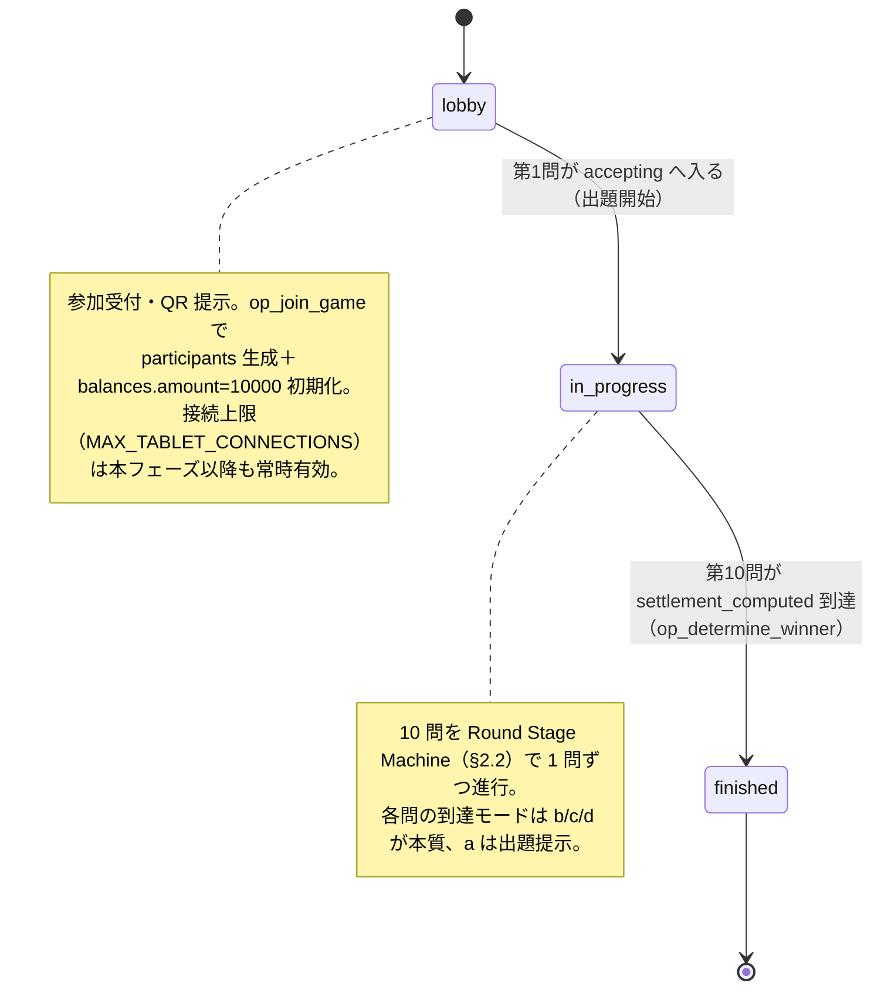
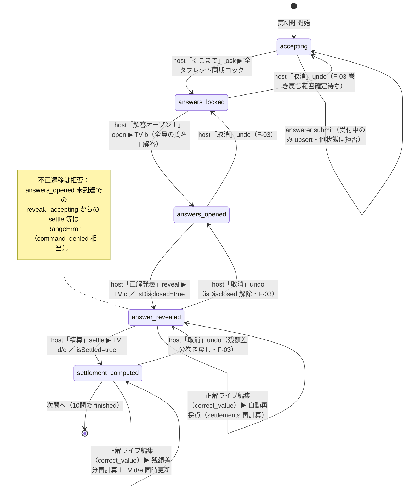
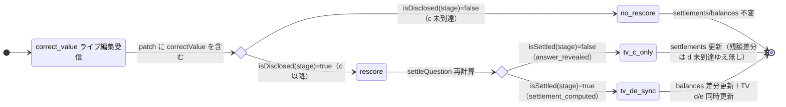
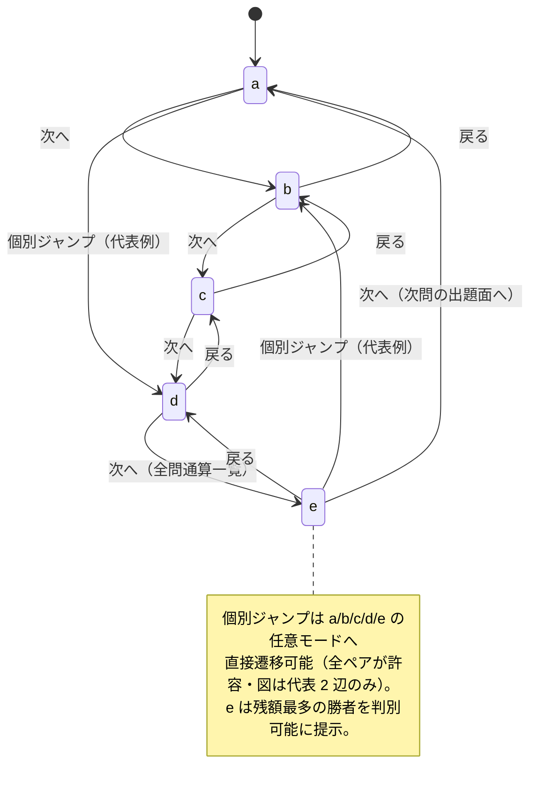
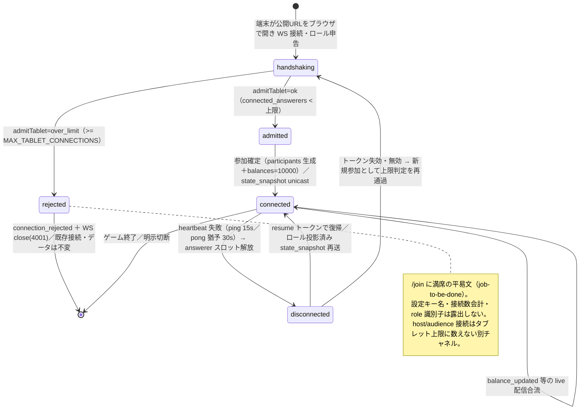

---
codd:
  node_id: detailed_design:state-machines
  type: design
  depends_on:
  - id: design:operational-behavior-model
    relation: depends_on
    semantic: technical
  - id: design:scoring-engine-design
    relation: depends_on
    semantic: technical
  depended_by:
  - id: plan:implementation-plan
    relation: depends_on
    semantic: technical
  - id: test:test-strategy
    relation: depends_on
    semantic: verification
  conventions:
  - targets:
    - module:game_flow
    - role:host
    reason: 受付中→締切→開示→正解発表→精算→一覧の遷移トリガーは司会者のみで、次へ/戻る/個別ジャンプの逆送り・ジャンプ経路も状態機に含める（論点7・N-3）。違反時リリース不可。
  - targets:
    - module:scoring
    - module:game_flow
    reason: c 到達後の正解編集で自動再採点、d 到達後は残額差分再計算と TV d/e 更新へ遷移することを状態機で規定する（E-3残）。違反時リリース不可。
  - targets:
    - module:participants
    - module:config
    reason: 接続ライフサイクルは上限（設定値）到達時に新規接続を拒否する遷移を持つこと（論点10）。違反時リリース不可。
  modules:
  - game_flow
  - scoring
  - participants
  - config
  operation_flow:
    actors:
    - id: host
      label: 司会者（制御盤）
      surface: /control-panel
    - id: answerer
      label: 解答者（タブレット）
      surface: /tablet
    - id: audience
      label: 観客（TV）
      surface: /tv
    - id: system
      label: クラウドサーバ（realtime_sync 権威 / scoring / participants / config）
    operations:
    - id: op_establish_connection
      actor: system
      verb: accept
      target: websocket_session
      trigger: 端末が公開 URL をブラウザで開き WebSocket 接続してロールを申告する
      route: /control-panel | /tv | /tablet | /join
      preconditions:
      - WebSocket 待受はクラウドサーバのみに存在する
      durable_state: hub のロール別接続レジストリ（host/answerer/audience）
      from_state: handshaking
      to_state: connected
      readback: 接続直後にロール投影済み state_snapshot を unicast で返す
      expected_outcomes:
      - セッションにロール（host/answerer/audience）が確定する
      - 制御盤ブラウザは待受ソケットを持たず配信はクラウド権威から届く
      dod_obligations:
      - id: dod_conn_cloud_authority
        text: WebSocket の待受はクラウドサーバ側のみに存在し、制御盤ブラウザは待受ソケットを開かない
      - id: dod_conn_role_scoped_session
        text: 接続確立時にセッションのロールが確定し、以後の配信投影と権限判定がそのロールを単一判定点として参照する
    - id: op_enforce_connection_limit
      actor: system
      verb: reject
      target: tablet_connection
      trigger: answerer 接続数が MAX_TABLET_CONNECTIONS に達した状態での新規参加確定の試行
      route: /join
      measurement_source: 現在の answerer 接続数と src/config の MAX_TABLET_CONNECTIONS 解決値
      threshold: MAX_TABLET_CONNECTIONS（既定 8）
      preconditions:
      - connected_answerers >= MAX_TABLET_CONNECTIONS
      from_state: handshaking
      to_state: rejected
      durable_state: 既存接続・participants・answers・balances は不変
      consumer_surfaces:
      - join_page
      expected_outcomes:
      - admitTablet が over_limit を返し参加が成立しない
      - realtime_sync が connection_rejected とともに WS close(4001) で断る
      - 既存の接続と保持データ（participants/answers/balances/進行状態）は影響を受けない
      - host/audience 接続はタブレット上限に数えない別チャネルとして扱う
      - /join に満席の平易文が表示され設定キー名・接続数会計は露出しない
      boundary_cases:
      - 既定 8: 8 台目は許可・9 台目は拒否
      - 設定 16: 16 台目は許可・17 台目は拒否
      - 設定 32: 32 台目は許可・33 台目は拒否
      - 切断でスロット解放後は同数まで再受入可
      dod_obligations:
      - id: dod_limit_default_eight
        text: 設定未指定時に 8 台まで接続でき 9 台目が拒否される
      - id: dod_limit_config_follows
        text: MAX_TABLET_CONNECTIONS を 16/32 へ設定変更するとコード改修なしに上限がその値へ追随する
      - id: dod_limit_no_hardcode
        text: 上限判定は src/config の解決値を参照し、判定コードに数値リテラル 8 のハードコードが存在しない
      - id: dod_limit_existing_unaffected
        text: 上限拒否の発生時に既存接続のセッション・回答・残額・進行状態が変化しない
      - id: dod_limit_join_full_copy
        text: /join の満席表示が job-to-be-done 平易文で、設定キー名・接続数会計・ロール識別子を露出しない
    - id: op_join_game
      actor: answerer
      verb: join
      target: game_session
      trigger: 制御盤の QR を読取り /join で氏名を自己入力して参加確定
      route: /join
      ui_pattern: qr_scan_then_name_input
      preconditions:
      - 家族限定アクセス制御を通過している（分岐A トークン一致 または 分岐B 認証済）
      - answerer 接続数が MAX_TABLET_CONNECTIONS 未満
      - 氏名が非空かつ MAX_DISPLAY_NAME_LENGTH 以下
      from_state: admitted
      to_state: connected
      durable_state: participants テーブル（id / name / joined_at / connection_id）＋ balances
        行の初期化（amount = 10000）
      readback: 制御盤の参加者一覧と TV(e) 全問通算一覧に反映
      visible_to:
      - host
      - audience
      forbidden_actors: []
      expected_outcomes:
      - 自己入力した氏名で participants に 1 人 1 レコードが作られ connection_id へ紐付く
      - 当該参加者の balances.amount が 10000 円（賞金先渡し）で初期化される
      - 参加が制御盤の参加者一覧と TV(e) に反映される
      - 端末番号の固定割当や事前氏名台帳を用いずに参加が成立する
      boundary_cases:
      - 空・空白のみの氏名 → UI とサーバの双方で拒否
      - MAX_DISPLAY_NAME_LENGTH 超過の氏名 → UI とサーバの双方で拒否
      - 同名の別人 → それぞれ別の participants レコード（氏名は一意キーでない）
      - 同一端末の resume なし再 /join → 新規参加として上限判定を再通過
      dod_obligations:
      - id: dod_join_self_name
        text: 参加者が自己入力した氏名が participants に永続し、制御盤の参加者一覧に表示される
      - id: dod_join_one_device
        text: 参加確定 1 回につき connection_id へ紐づく participants レコードが 1 件だけ生成される
      - id: dod_join_reflected
        text: 参加確定が制御盤の参加者一覧と TV(e) の全問通算一覧へ反映される
      - id: dod_join_name_validation
        text: 空・空白のみ・上限長超過の氏名は /join の UI とサーバの双方で拒否され participants に入らない
      - id: dod_settle_initial_grant
        text: ゲーム開始時に各プレイヤーの balances.amount が 10000 円で初期化されている
    - id: op_submit_answer
      actor: answerer
      verb: submit
      target: answer
      trigger: タブレット入力画面で +1/-1/+10/-10 のステッパで 0〜100 の数値を作り「送信」を押下
      route: /tablet
      ui_pattern: stepper_plus_minus_then_submit
      forbidden_actors:
      - host
      - audience
      preconditions:
      - 参加確定済み（participants に自分のレコードが存在）
      - 当該問の rounds.stage が accepting（受付中）
      measurement_source: 解答者がステッパで作成した 0〜100 整数
      durable_state: answers（question_id + participant_id で一意・value は 0〜100 整数）
      from_state: accepting
      to_state: accepting
      readback: 送信後 submit_ack が当該解答者へ unicast され送信済み表示になる
      visible_to:
      - answerer
      expected_outcomes:
      - 0〜100 整数の解答が answers に upsert される
      - 送信済み状態が当該解答者にのみ表示され他者・観客へは配信されない
      - 締切（answers_locked）後の submit_answer はサーバで拒否される
      boundary_cases:
      - 値 0 / 100 は送信可
      - 値 -1 / 101 / 50.5 は UI とサーバの双方で拒否
      - 締切後の送信 → サーバで拒否（既存の永続解答は保持）
      - ステッパはクランプにより 0 未満・100 超の値を作れない
      dod_obligations:
      - id: dod_submit_stepper_only
        text: 解答者の入力導線が +1/-1/+10/-10 と「送信」のみで構成され、締切・開示・モード切替・他者情報閲覧の操作要素が /tablet
          に存在しない
      - id: dod_submit_range_guard
        text: 送信値は 0〜100 整数のみ UI とサーバ双方で受理され -1/101/50.5 は answers に入らない
      - id: dod_submit_accepting_only
        text: 受付中のみ送信でき answers_locked 到達後の submit_answer はサーバで拒否される
      - id: dod_submit_upsert_once
        text: 同一 question_id + participant_id の解答が upsert され重複行を作らない
      - id: dod_submit_own_ack_only
        text: 送信後 submit_ack が当該解答者のみへ返り、他解答者・観客へ解答が配信されない
    - id: op_propagate_deadline
      actor: host
      verb: lock
      target: answerer_tablets
      trigger: 制御盤で「そこまで」を押下
      route: /control-panel
      forbidden_actors:
      - answerer
      - audience
      from_state: accepting
      to_state: answers_locked
      durable_state: rounds.stage = answers_locked
      consumer_surfaces:
      - answerer_tablets
      expected_outcomes:
      - answers_locked が接続中の全解答者タブレットへ配信され入力が同期ロックされる
      - 締切後のタブレットからの submit_answer はサーバで拒否される
      dod_obligations:
      - id: dod_deadline_host_only
        text: 締切コマンドは role host のみ発動でき answerer/audience からの締切コマンドは command_denied(403)
          で拒否される
      - id: dod_deadline_sync_lock
        text: 締切の配信で接続中の全解答者タブレットが締切表示へ同期し以後の送信が拒否される
    - id: op_propagate_disclosure
      actor: host
      verb: open
      target: tv_and_endpoints
      trigger: 制御盤で「解答オープン！」を押下
      route: /control-panel
      forbidden_actors:
      - answerer
      - audience
      from_state: answers_locked
      to_state: answers_opened
      durable_state: rounds.stage = answers_opened
      visible_to:
      - audience
      consumer_surfaces:
      - tv_mode_b
      expected_outcomes:
      - 開示前は他者の解答がどのロールの端末へも配信されない
      - 開示後 TV(b) へ全員の氏名と解答が一斉配信される
      dod_obligations:
      - id: dod_disclosure_hidden_before
        text: answers_opened 未配信の間は解答者・観客のいずれの端末へも他者の解答が配信されない
      - id: dod_disclosure_reveals_on_tv
        text: answers_opened の配信で TV(b) が全員の氏名と解答を表示する
    - id: op_reveal_answer
      actor: host
      verb: reveal
      target: tv_and_endpoints
      trigger: 制御盤で「正解発表」を押下
      route: /control-panel
      forbidden_actors:
      - answerer
      - audience
      from_state: answers_opened
      to_state: answer_revealed
      durable_state: rounds.stage = answer_revealed
      visible_to:
      - audience
      consumer_surfaces:
      - tv_mode_c
      measurement_source: 当該問 questions.correct_value
      expected_outcomes:
      - TV(c) に当該問の正解値が表示される
      - answer_revealed 到達で当該問が isDisclosed 真となり以後の正解ライブ編集が自動再採点対象になる
      boundary_cases:
      - answers_opened 未到達での reveal は不正遷移として拒否
      dod_obligations:
      - id: dod_reveal_host_only
        text: 正解発表は role host のみ発動でき answerer/audience からは command_denied(403) で拒否される
      - id: dod_reveal_marks_disclosed
        text: answer_revealed 到達で当該問が isDisclosed 真となり以後の correct_value 編集が再採点対象になる
      - id: dod_reveal_tv_c
        text: 正解発表の配信で TV(c) が当該問の正解値を表示する
    - id: op_compute_settlement
      actor: host
      verb: settle
      target: balances
      trigger: 制御盤で「精算」を押下し得点精算を実行
      route: /control-panel
      forbidden_actors:
      - answerer
      - audience
      from_state: answer_revealed
      to_state: settlement_computed
      measurement_source: answers.value と questions.correct_value
      durable_state: settlements（error / delta_yen / pitari_bonus_yen）＋ balances（円・整数）＋
        rounds.stage = settlement_computed
      consumer_surfaces:
      - tv_mode_d
      - tv_mode_e
      visible_to:
      - audience
      expected_outcomes:
      - 誤差 = 絶対値(answer - correct) が 0〜100 整数で settlements に記録される
      - 増減円 = 誤差 × -100（整数円）で delta_yen が記録され balances が更新される
      - 誤差 0 のピタリ賞 +1000 円が pitari_bonus_yen に記録され balances へ加算される
      - TV(d) に 6 列精算表（氏名/解答/誤差/増減円/ピタリ賞/残額）が円建てで表示される
      boundary_cases:
      - 誤差 0 は +1000（丁度）
      - 誤差 1 は -100 のみ（直上・不連続）
      dod_obligations:
      - id: dod_settle_delta
        text: 誤差 5 の精算後に当該プレイヤーの balances.amount が精算前より 500 円少ない
      - id: dod_settle_pitari_add
        text: 誤差 0 のプレイヤーの pitari_bonus_yen が +1000 で balances に反映される（拠出配分側は F-02
          未確定として fixme）
      - id: dod_settle_currency_yen
        text: settlements と balances と API 応答と d の 6 列表が円建てで表され point/pt/点 の語が存在しない
      - id: dod_settle_integer_only
        text: error / delta_yen / pitari_bonus_yen / amount がすべて整数で小数値を持たない
      - id: dod_settle_host_only
        text: 得点精算は role host のみ発動でき answerer からの精算コマンドは 401/403 で拒否される
    - id: op_live_edit_correct
      actor: host
      verb: edit
      target: question_or_correct_value
      trigger: 制御盤のライブ編集 UI で問題文・正解値・画像/動画パスを更新
      route: /control-panel
      ui_pattern: inline_edit_then_save
      forbidden_actors:
      - answerer
      - audience
      preconditions:
      - 対象問が questions に存在する
      durable_state: questions テーブル更新（text / image_path / video_path / correct_value）
      readback: DB 再取得で編集後の値を返す
      visible_to:
      - host
      expected_outcomes:
      - 問題文・正解・メディアパスを進行中に編集でき questions に永続する
      - 画像/動画パスの編集は a モードの出題面解決に反映される
      - correct_value の編集かつ開示済み（c 以降）のときのみ自動再採点を誘発する
      boundary_cases:
      - text のみ編集 → 再採点は走らない
      - image_path/video_path のみ編集 → 再採点は走らない・a モード解決のみ変化
      - correct_value 編集かつ c 未到達 → 再採点は走らない
      - correct_value 編集かつ c 以降 → 再採点が走る
      dod_obligations:
      - id: dod_edit_persist
        text: 進行中に編集した問題文と正解値が questions に永続し再取得で読み戻せる
      - id: dod_edit_correct_range_guard
        text: 正解値の編集も 0〜100 整数のみ受理し範囲外はサーバと DB CHECK で拒否される
      - id: dod_edit_host_only
        text: ライブ編集は role host のみ発動でき answerer からの編集コマンドは 401/403 で拒否される
    - id: op_auto_rescore
      actor: system
      verb: rescore
      target: balances
      trigger: 開示済み（rounds.stage が answer_revealed 以降）の問題で司会者が correct_value をライブ編集
      preconditions:
      - 当該問の rounds.stage が answer_revealed 以降（isDisclosed 真）
      - ライブ編集の patch が correctValue を含む
      measurement_source: 編集後 questions.correct_value と既存 answers.value
      durable_state: settlements 再計算 ＋ balances 差分更新
      consumer_surfaces:
      - tv_mode_d
      - tv_mode_e
      from_state: answer_revealed
      to_state: answer_revealed
      expected_outcomes:
      - 正解訂正で当該問の全 settlements（誤差・delta_yen・pitari）が再計算される
      - balances が旧拠出との差分で更新される
      - rounds.stage が settlement_computed の問は TV d/e が同時更新される
      boundary_cases:
      - c 到達問の correct_value 訂正 → 再採点が走る
      - c 未到達（isDisclosed 偽）の correct_value 編集 → 再採点は走らない（境界外）
      - text/メディアのみ編集 → 再採点は走らない（correct_value 不変）
      dod_obligations:
      - id: dod_rescore_after_c
        text: rounds.stage が answer_revealed 以降で正解を直すと settlements と balances が再計算され各人の残額へ即時反映される
      - id: dod_rescore_no_before_c
        text: rounds.stage が answer_revealed 未満の正解編集では settlements と balances が変化しない
      - id: dod_rescore_only_on_correct_value
        text: text または image_path/video_path のみの編集では再採点が走らず balances が不変である
      - id: dod_rescore_d_sync
        text: rounds.stage が settlement_computed の問の正解訂正で balances 差分が再計算され TV の d
          と e が同時更新される
      - id: dod_rescore_matches_full_recompute
        text: 差分更新後の balances が answers と correct_value からの全再計算と一致する
    - id: op_propagate_mode_switch
      actor: host
      verb: switch
      target: tv_display
      trigger: 制御盤の「次へ」「戻る」または各モード個別ジャンプ
      route: /control-panel
      ui_pattern: next_back_jump
      forbidden_actors:
      - answerer
      - audience
      durable_state: game_state.tv_mode
      consumer_surfaces:
      - tv_mode_a
      - tv_mode_b
      - tv_mode_c
      - tv_mode_d
      - tv_mode_e
      expected_outcomes:
      - 3 系統いずれの操作でも tv_mode_changed が配信され接続中の TV が対応モードへ切り替わる
      boundary_cases:
      - 次へ：a→b→c→d→e、e の次は次問の a
      - 戻る：逆順（表示ナビであり rounds.stage を巻き戻さない）
      - 個別ジャンプ：a〜e の任意モードへ直接
      dod_obligations:
      - id: dod_mode_switch_host_only
        text: モード切替は role host のみ発動でき answerer/audience からのモード切替は command_denied(403)
          で拒否される
      - id: dod_mode_switch_sync_tv
        text: 次へ・戻る・個別ジャンプの 3 系統いずれでも tv_mode_changed が配信され接続中の TV が対応モードへ切り替わる
    - id: op_undo
      actor: host
      verb: undo
      target: last_progression
      trigger: 制御盤で「取消」を押下
      route: /control-panel
      forbidden_actors:
      - answerer
      - audience
      durable_state: trigger_undone イベント（巻き戻し範囲は F-03 未確定・発明しない）
      consumer_surfaces:
      - control_panel
      - tv_display
      - answerer_tablets
      expected_outcomes:
      - trigger_undone が配信され直近の対象操作が取り消される
      - 発動権限は制御盤（host）のみで初版から存置される
      boundary_cases:
      - 巻き戻し先 topology（previousStage）は定義済・durable な settlements/balances 巻き戻しは F-03
        未確定
      - 任意問題再開示 / d 到達問の残額差分巻き戻しの可否は F-03 未確定
      dod_obligations:
      - id: dod_undo_host_only
        text: 取消は role host のみ発動でき answerer/audience からは command_denied(403) で拒否される（巻き戻し挙動詳細は
          F-03/F028、E2E は test.fixme）
    - id: op_determine_winner
      actor: system
      verb: determine
      target: winner
      trigger: 10 問目の得点精算が完了
      preconditions:
      - 10 問すべての rounds.stage が settlement_computed
      measurement_source: 全問通算の balances.amount
      consumer_surfaces:
      - tv_mode_e
      from_state: settlement_computed
      to_state: game_finished
      durable_state: game_state.phase = finished
      expected_outcomes:
      - balances.amount 最多のプレイヤーが e モードで勝者として判別可能に表示される
      boundary_cases:
      - 残額同点は複数の共同首位を勝者として提示（同点優先順位は確定要件に無く発明しない・F-06）
      dod_obligations:
      - id: dod_winner_most_balance
        text: 10 問終了時に balances.amount 最多のプレイヤーが e モードで勝者として判別できる
    - id: op_broadcast_state_transition
      actor: system
      verb: broadcast
      target: connected_endpoints
      trigger: ドメインイベント（answers_locked/answers_opened/answer_revealed/settlement_computed/tv_mode_changed/balance_updated/participant_joined/trigger_undone）の確定
      measurement_source: game_state と balances の確定済み遷移
      durable_state: 各イベントに単調増加の seq を付与
      consumer_surfaces:
      - control_panel
      - tv_display
      - answerer_tablets
      readback: 遅参・再接続端末は state_snapshot で最新へ整合
      visible_to:
      - host
      - answerer
      - audience
      threshold: 状態遷移の全端末反映 p95 <= 2000ms（暫定ゲート・F-04）
      expected_outcomes:
      - 該当ロールの接続中全端末へロール投影済みイベントが配信される
      - 配信はロール投影を通し、可視範囲外の情報は当該ロールへ送られない
      dod_obligations:
      - id: dod_broadcast_all_role_endpoints
        text: 状態遷移イベントが当該ロールの接続中全端末へ配信される
      - id: dod_broadcast_role_projection
        text: 配信ペイロードはロール投影を経由し、解答者端末へ他者の解答・残額・得点が配信されない
      - id: dod_broadcast_latency_gate
        text: 状態遷移の全端末反映が p95 <= 2000ms を満たす
    - id: op_recover_on_reconnect
      actor: system
      verb: recover
      target: reconnecting_endpoint
      trigger: 回線断後の端末が再接続し（answerer は resume トークンを添えて）resume する
      route: /control-panel | /tv | /tablet
      measurement_source: サーバ権威の game_state（current_question_number/stage/tv_mode）と
        balances と answers
      from_state: disconnected
      to_state: connected
      durable_state: 端末側は状態を保持せずサーバ権威から再構成する
      readback: ロール投影済み state_snapshot を返し以後の live 配信へ合流させる
      expected_outcomes:
      - 再接続端末が現在問題番号・進行段階・TV モードへ復帰する
      - 解答者は自分の残額と送信済み状態へ復帰し他者情報は復帰対象外
      - 復帰値の権威はサーバの game_state と balances でありクライアント保存値に依存しない
      boundary_cases:
      - 制御盤が落ちても TV/タブレット間の配信はクラウド権威で継続する
      - 無効・失効トークンの再接続は新規参加として扱い上限判定を再度通す
      dod_obligations:
      - id: dod_reconnect_progression
        text: 再接続端末が現在問題番号・進行段階・TV モードへ復帰する
      - id: dod_reconnect_own_balance
        text: 再接続した解答者が自分の残額と送信済み状態へ復帰し、他者の解答・残額は復帰対象に含まれない
      - id: dod_reconnect_server_authority
        text: 復帰値がサーバの game_state と balances から供給され、クライアント保存値に依存しない
      - id: dod_reconnect_control_panel_resilient
        text: 制御盤の切断中も TV とタブレットの同期がクラウド権威経由で継続する
    - id: op_preserve_answer_across_reconnect
      actor: system
      verb: preserve
      target: answer
      trigger: 受付中に送信済みの解答を持つ端末が切断・再接続する
      measurement_source: answers テーブル（question_id + participant_id の一意キー）
      preconditions:
      - 当該問の rounds.stage が accepting のとき submit は upsert される
      durable_state: answers（question_id + participant_id で一意）
      from_state: accepting
      to_state: accepting
      readback: 再接続後の state_snapshot が送信済み状態を反映する
      expected_outcomes:
      - 受付中に永続した解答が切断・再接続を跨いで保持される
      - 再接続後の再送で同一問・同一参加者の解答が重複永続化されない
      boundary_cases:
      - ack 前切断で resume 再送 → upsert により重複なく保持
      - 締切後の resume 再送 → 拒否されるが既存の永続解答は保持
      dod_obligations:
      - id: dod_answer_preserved_across_reconnect
        text: 受付中に送信済みの解答が接続断・再接続後も answers に保持され送信済み表示へ復帰する
      - id: dod_answer_no_duplicate
        text: 再接続後の再送で同一 question_id + participant_id の解答行が重複せず一意に保たれる
---

# 状態機械設計（ゲーム進行・問題別進行 b/c/d・接続ライフサイクル）

## 1. Overview

本書は `save-money-switcher`（クラウド WEB アプリ版『賞金先渡しクイズ SAVE MONEY』を家族で遊ぶ操作盤）の **状態機械（State Machines）詳細設計** であり、二つの上流設計 —— `design:operational-behavior-model`（運用挙動モデル）と `design:scoring-engine-design`（採点エンジン）—— を技術的真実源として、次の四つの状態機械を実装可能な粒度で確定する。

1. **ゲーム進行機械（Game Phase Machine）** — `game_state.phase`：`lobby → in_progress → finished`。
2. **問題別進行機械（Round Stage Machine, b/c/d）** — `rounds.stage`：`accepting → answers_locked → answers_opened(b) → answer_revealed(c) → settlement_computed(d)`。到達済み状態からの正解ライブ編集による自動再採点の自己遷移、および取消（逆送り）辺を含む。
3. **TV モード機械（TV Mode Machine）** — `game_state.tv_mode`：`a/b/c/d/e` を「次へ／戻る／個別ジャンプ」で往来する表示ナビゲーション（一覧＝e を含む）。
4. **接続ライフサイクル機械（Connection Lifecycle Machine）** — タブレット接続の `handshaking → admitted → connected → disconnected → (resume) → connected` と、上限（設定値）到達時に新規接続を拒否する `rejected` 遷移。

これらは実装計画・E2E 生成が共有する **状態遷移の権威的定義** であり、ここに刻む状態集合・遷移辺・ガード・単一所有権に反する成果物は **リリース不可（release-blocking）** として扱う。物理 DB スキーマ・採点計算式の内部・WS トランスポート機構は上流各設計が所有し、本書はそれらを駆動する **状態と遷移** を所有する。

### 1.1 リリースブロッキング規約と本書での具体化

| # | 対象 | 不変条件（要旨） | 本書での具体化箇所 |
|---|---|---|---|
| SM-1 | `module:game_flow`／`role:host` | 受付中→締切→開示→正解発表→精算→一覧の遷移トリガーは司会者のみ。次へ/戻る/個別ジャンプの逆送り・ジャンプ経路も状態機に含める（論点7・N-3） | §2.2・§2.4・§3.2・§4.2（`nextStage`／`nextMode`/`backMode`/`jumpMode` の host-only ガード） |
| SM-2 | `module:scoring`／`module:game_flow` | c 到達後の正解編集で自動再採点、d 到達後は残額差分再計算と TV d/e 更新へ遷移することを状態機で規定（E-3残） | §2.2（`answer_revealed`／`settlement_computed` 自己遷移）・§2.3・§4.3 |
| SM-3 | `module:participants`／`module:config` | 接続ライフサイクルは上限（設定値）到達時に新規接続を拒否する遷移を持つ（論点10） | §2.5・§3.3・§4.4（`admitTablet`＋`resolveMaxTabletConnections`） |

上位から継承する不変条件も本書で担保する：**ホスト PC をサーバにしない**（状態権威と WS 待受はクラウドサーバのみ・§3.4）、**円建て固定**（`point`/`pt`/`点` 禁止・§3.5）、**0〜100 整数の多層防衛**（受付中の入力・精算に混入させない・§2.2）、**家族限定アクセス制御**（無制御公開不可・§3.5）、**プライバシー**（解答者へ他者情報を投影しない・§3.5）。

### 1.2 実装・ツールチェーン前提（scaffold 固定・釈義不可）

- **実装言語 = TypeScript のみ。** 本書の状態型・ガード・遷移関数・ファイルパス（`src/game_state/round_machine.ts` 等）・依存参照はすべて TypeScript 慣行のみを用い、他言語の拡張子・マニフェスト・ツールは例示・フォールバックとしても登場させない。
- **テストランナー = Vitest（固定・release-blocking のグラウンドトゥルース）。** 状態機械の受け入れは Vitest 自身の宣言 API（`import { describe, it, expect } from "vitest";`）で記述する。「ランタイム依存を最小化する」方針は **出荷コードのランタイム依存**（`ws` 等）にのみ及び、テストランナーには及ばない。依存数の哲学を根拠に別フレームワークや Node 組み込み `node:test` を用いてはならない。verify が実際に走らせるのは Vitest である。
- **モジュール解決 = NodeNext/Node16。** すべての相対 import は **出力される `.js` ファイル名を明示した拡張子** を伴う（`import { isDisclosed } from "./progression.js";`。`"./progression"`・`"./progression.ts"` は不可）。default/namespace import・re-export（`export { stageToTvMode } from "./tv_mode.js";`）・type-only import（`import type { Stage } from "./progression.js";`）も同一規約。拡張子欠落は TS2835 でコンパイル不能。
- **レイアウト契約（output-path fence 強制）。** 状態機械のソースは **必ず `src/` 配下**（進行・TV モード・遷移判定は `src/game_state/`、接続判定は `src/participants/`／`src/config/`）、テストは **必ず `tests/` 配下**（`test/`・`spec/`・`specs/` を発明しない。サブディレクトリ `tests/game_state/` 等は可）。`package.json`・`package-lock.json`・`tsconfig.json`・`vitest.config.ts` は harness scaffold 所有につき、本書はこれらを成果物として出力・宣言しない。

---

## 2. Mermaid Diagrams

### 2.1 ゲーム進行機械（Game Phase Machine・`game_state.phase`）



**所有権と実装境界**: `game_state.phase` は `module:game_flow`（`src/game_state/phase.ts`）が単一所有する。`lobby → in_progress` は「第1問の `rounds.stage` が `accepting` に入った」事実から **導出** され、`in_progress → finished` は「第10問が `settlement_computed` に到達（`op_determine_winner` の前提＝10 問すべて `settlement_computed`）」から導出される（`from_state: settlement_computed → to_state: game_finished`）。フェーズは Round Stage Machine の集約ビューであり、`src/scoring/`・`src/realtime_sync/` はこれを **読取り** に用い、フェーズ判定を再実装しない。`op_load_questions` は `phase` が `lobby` または `in_progress`（ライブ編集中）でのみ許可される（§4.5）。

### 2.2 問題別進行機械（Round Stage Machine, b/c/d／`rounds.stage`）— 本書の核



**所有権と実装境界**: `rounds.stage` の状態集合・前進辺・不正遷移拒否は `module:game_flow`（`src/game_state/progression.ts`＋`src/game_state/round_machine.ts`）が **単一所有** する（§3.1）。前進 4 辺（`lock/open/reveal/settle`）はいずれも `role: host` セッションのみが発火でき、非 host コマンドはサーバの単一ロール判定点で `command_denied`（**403**／未認証 **401**）として拒否される（SM-1）。遷移の合法性はガードで機械化され、`answers_opened` 未到達での `reveal` は **不正遷移として拒否**（boundary case）される。

**SM-2 の自己遷移**: `answer_revealed`（c 以降＝`isDisclosed` 真）での `correct_value` ライブ編集は自動再採点の自己遷移（`from_state == to_state == answer_revealed`）を成し、当該問の全 `settlements` を再計算する。`settlement_computed`（d＝`isSettled` 真）では残額差分再計算を伴い **TV d と e を同時更新** する。`accepting`/`answers_locked`/`answers_opened`（c 未到達）の `correct_value` 編集、および `text`/`image_path`/`video_path` のみの編集では再採点は走らない（境界外）。この自己遷移の計算内容は `module:scoring`（`src/scoring/rescore_question.ts`）が所有し、進行機械は「どの状態でその自己遷移が許されるか」（`isDisclosed`/`isSettled`）のみを所有する。両モジュールの分界を §2.3 で詳述する。

**受付中の submit 自己遷移**: `accepting → accepting` は解答者の送信（`op_submit_answer`）で、`answers`（`question_id + participant_id` 一意）へ upsert される。`answers_locked` 到達後の送信はサーバで拒否される（既存永続解答は保持）。この辺は `module:tablet`／`module:game_flow` 境界で、採点は関与しない。

**取消（逆送り）辺**: `undo`（取消）は前進の各辺に対する逆辺として本機械に **含める**（SM-1 が要求する逆送り経路）。発動権限は制御盤（host）のみ・初版から存置が確定である。ただし巻き戻しの durable な副作用（`settlement_computed → answer_revealed` 時の `settlements`／`balances` 差分巻き戻し、任意問題の再開示可否）は **F-03 未確定** につき発明せず、状態遷移の topology のみを刻み、副作用詳細は §5・E2E の `test.fixme()` に回す。

### 2.3 自動再採点の分界（Round Stage Machine × Scoring・SM-2）

自動再採点の起動可否は **進行状態のガード**、計算内容は **採点エンジン**、という所有分界を状態機械として固定する。



**所有権と実装境界**: 判定 `isDisclosed(stage)`／`isSettled(stage)` は `src/game_state/progression.ts` が **単一所有** し、`module:scoring` はこれを import して起動可否を問い合わせる（再実装しない）。`patch に correctValue を含むか`・`settleQuestion` 再計算・`balances` 差分更新・全再計算一致（監査不変式 `dod_rescore_matches_full_recompute`）は `src/scoring/`（`rescore_question.ts`／`settle_question.ts`／`aggregate_balance.ts`）が所有する。差分更新は最適化であり、正しさの基準は `answers` ＋編集後 `correct_value` からの全再計算である。この choice ノード列がそのまま E-3残の「実装が省略できない契約」を機械可検化する。

### 2.4 TV モード機械（TV Mode Machine・次へ/戻る/個別ジャンプ／`game_state.tv_mode`）



**所有権と実装境界**: `game_state.tv_mode` の状態集合（a〜e）と「次へ／戻る／個別ジャンプ」の 3 系統ナビは `module:game_flow`（`src/game_state/tv_mode.ts`＋`src/game_state/tv_machine.ts`）が **単一所有** する。3 系統いずれも `role: host` のみ発火可（`op_propagate_mode_switch`／`op_switch_tv_mode`）で、非 host のモード切替は `command_denied(403)` で拒否される（SM-1）。各切替は `tv_mode_changed` として接続中の全 TV へ配信され、対応モードへ切り替わる（`dod_mode_switch_sync_tv`）。

**Round Stage Machine との結合**: 段階遷移（`lock/open/reveal/settle`）は `stageToTvMode(stage)` により **既定モード**（a/a/b/c/d）を駆動するが、TV モード機械はそれと独立に自由往来でき、e（通算一覧）や過去問モードへ「戻る／個別ジャンプ」で到達できる（表示ナビであって `rounds.stage` を巻き戻さない）。a モードの出題面は `questions.video_path → image_path → text` の優先順で `resolveQuestionFace`（`module:questions` 所有・純関数）が解決し、生パス文字列や `fallback` 等の内部語を露出しない。`stageToTvMode` は `src/game_state/tv_mode.ts` が単一所有し、TV クライアント（`src/tv_display/`）はこれを読取り、モード→段階の対応を再実装しない。

### 2.5 接続ライフサイクル機械（Connection Lifecycle Machine・SM-3）



**所有権と実装境界**: 接続状態集合と上限拒否遷移は `module:participants`（`src/participants/connection_machine.ts` の `admitTablet`）が所有し、上限値そのものは `module:config`（`src/config/connection_limit.ts` の `resolveMaxTabletConnections()`）が **単一解決点** として所有する（SM-3）。既定 **8** は同ファイルの単一定数のみで宣言し、判定コードに数値リテラル 8 を撒かない（`dod_limit_no_hardcode`）。設定 **16／32** へコード改修なしに追随する（`dod_limit_config_follows`）。上限は answerer 接続のみに課し、host/audience は別チャネル。`rejected` 遷移は `connection_rejected` ＋ WS `close(4001)` で断り、既存の接続・`participants`・`answers`・`balances`・進行状態は **不変** である（`dod_limit_existing_unaffected`）。WS 待受はクラウドサーバ（`src/realtime_sync/server.ts`）のみに存在し、遷移の実行（accept/close/unicast）は `module:realtime_sync` が担うが、**受入可否の判定** は `module:participants`＋`module:config` の単一経路を経る（ホスト PC をサーバにしない・§3.4）。`disconnected → handshaking`（失効トークンの再接続）は新規参加として上限判定を再通過する。受付中に永続した解答は `answers` の一意 upsert により切断・再接続を跨いで保持され重複行を作らない（`op_preserve_answer_across_reconnect`）。

---

## 3. Ownership Boundaries

### 3.1 状態型・ガード・遷移関数の単一所有（reimplementation drift 防止）

`Stage`／`isDisclosed`／`isSettled` は上流の運用挙動モデルと採点エンジンの双方に同一コードとして登場するが、**それらは本書 `detailed_design:state-machines` が定義する状態機械の投影であり、正準の所有者は `module:game_flow`（`src/game_state/`）である**。他モジュールはこれを **import** し、**再宣言しない**。

| 所有物 | 単一所有モジュール／ファイル | 消費側（import のみ・再実装禁止） |
|---|---|---|
| `Stage`（受付〜精算の 5 状態）・`isDisclosed`・`isSettled` | `src/game_state/progression.ts` | `src/scoring/`（再採点範囲判定）・`src/realtime_sync/`・`src/participants/` |
| Round Stage 前進遷移・不正遷移拒否（`nextStage`）・逆辺候補（`previousStage`） | `src/game_state/round_machine.ts` | `src/control_panel/`（コマンド適用）・`src/realtime_sync/` |
| `TvMode`（a〜e）・`stageToTvMode` | `src/game_state/tv_mode.ts` | `src/tv_display/`・`src/realtime_sync/` |
| TV ナビ（`nextMode`/`backMode`/`jumpMode`） | `src/game_state/tv_machine.ts` | `src/control_panel/` |
| `GamePhase`（lobby/in_progress/finished）・導出関数 | `src/game_state/phase.ts` | `src/scoring/`（`op_determine_winner`）・`src/realtime_sync/` |
| 接続受入判定（`admitTablet`・状態集合） | `src/participants/connection_machine.ts` | `src/realtime_sync/`（accept/close 実行） |
| `MAX_TABLET_CONNECTIONS` 解決（`resolveMaxTabletConnections`） | `src/config/connection_limit.ts` | `src/participants/`（判定時に参照） |
| 精算・再採点計算（`settleQuestion`/`rescoreQuestion`/`aggregateBalance`） | `src/scoring/`（採点エンジン設計が所有） | `src/game_state/` は自己遷移の**起動可否**のみ判定し、計算を再実装しない |

**分界の要点**: 進行機械は「どの状態でどの遷移が許され、どの自己遷移が再採点を起動しうるか」を所有する。採点エンジンは「その自己遷移で何を計算するか」を所有する。両者は `isDisclosed`/`isSettled` を境界インタフェースとして接続し、状態判定ロジックは `src/game_state/progression.ts` にのみ存在する。

### 3.2 権限境界（SM-1 の中核）

- **host-only 遷移トリガー**: `lock/open/reveal/settle`（Round Stage）・`next/back/jump`（TV Mode）・`undo`（取消）・`load`（入稿）・`live_edit`（ライブ編集）は `role: host` セッションのみ。サーバは接続確立時に確定したロール属性を **単一判定点** として検査し、非 host コマンドを `command_denied`（403／未認証 401）で拒否する。副司会ロールは発明せず、非 host サーフェスに当該操作要素を置かず、API 直叩きも同一判定点で弾く。
- **answerer 制限**: 解答者が起こせる状態遷移は `accepting → accepting`（`submit`・受付中のみ）と参加（`join`）のみ。締切・開示・正解発表・精算・モード切替・取消のいずれも発火できない。
- **audience 制限**: 観客はいかなる遷移も発火できない（受動表示のみ）。

### 3.3 接続上限の設定所有（SM-3）

上限判定は `src/config/connection_limit.ts` の `resolveMaxTabletConnections()` の返す解決値のみを参照し、`src/participants/connection_machine.ts` の `admitTablet` が `connected_answerers < 上限` を評価する。境界は **既定 8：8 台目許可・9 台目拒否／設定 16：16 許可・17 拒否／設定 32：32 許可・33 拒否／切断でスロット解放後は同数まで再受入可**。判定コードに `8` のハードコードを置かず、既定は config の単一定数でのみ宣言する。

### 3.4 状態権威と接続トポロジ（ホスト PC をサーバにしない）

すべての状態機械の権威（`game_state.phase`／`rounds.stage`／`game_state.tv_mode`／接続レジストリ）はクラウドサーバ（`src/realtime_sync/`）が保持し、WebSocket 待受もクラウドサーバのみに存在する。制御盤・TV・タブレットのブラウザは待受ソケットを持たないクライアントであり、状態遷移はクラウド権威から配信される（`dod_conn_cloud_authority`）。制御盤が落ちても TV/タブレット間の同期はクラウド権威で継続する（`dod_reconnect_control_panel_resilient`）。`localhost` 待受・ホスト PC の AP 化・LAN 完結はリリース不可。状態遷移の確定イベント（`answers_locked`/`answers_opened`/`answer_revealed`/`settlement_computed`/`tv_mode_changed`/`balance_updated`/`participant_joined`/`trigger_undone`）は単調増加 `seq` を付与してロール投影配信し、遅参・再接続端末は `state_snapshot` で最新へ整合する。

### 3.5 アクター向けサーフェス／コピー義務（状態表示のコピー境界）

状態機械の可視化は各サーフェスの job-to-be-done 言語に限り、**内部状態識別子・内部イベント名・設定キー名・実装根拠・環境前提を露出させない**。内部ロール `role: host/answerer` は可視ラベル **司会者／解答者**、観客（TV 視聴者）に対応させ、可視コピーには可視ラベルのみを用いる。

| サーフェス | ルート | 主対象 | 表示してよい状態 | 露出禁止 |
|---|---|---|---|---|
| 制御盤 | `/control-panel` | 司会者 | 現在問題番号・進行段階（司会者向け操作語「そこまで」「解答オープン！」「正解発表」「精算」「次へ/戻る」「取消」）・参加者一覧・「◯/◯台」把握 | 内部状態名（`answers_locked` 等）・設定キー名・`point`/`pt`/`点` |
| タブレット | `/tablet` | 解答者 | 「受付中」「締切」「送信済み」・自分の残額（円）のみ | 他者の解答/残額/得点・司会者操作語・内部状態名・全体一覧・`point`/`pt`/`点` |
| TV | `/tv` | 観客 | a 出題面／b 氏名＋解答／c 正解値／d 6 列表（円）／e 全問通算＋勝者判別（受動のみ） | 内部状態名・生ファイルパス・`fallback` 等の内部語・接続/復帰デバッグ・`point`/`pt`/`点` |
| 参加受付 | `/join` | 解答者 | 氏名入力・「参加する」。満席時「ただいま満席のため参加できません」 | 保護ナビ（制御盤操作）・接続数会計・設定キー名・role 識別子・`point`/`pt`/`点` |

**クロスアクター可視性（プライバシー・トランスポート層強制）**: 状態遷移イベントは必ずロール投影（`projectForRole`）を経由し、解答者端末へ他者の解答・残額・得点を配信しない（`dod_broadcast_role_projection`）。`answers_opened`（b）未到達の間は他者の解答をどのロールへも配信しない（`dod_disclosure_hidden_before`）。再接続時の復帰も同投影を通し、解答者は現在問題番号・進行段階・TV モード・自分の残額・送信済み状態のみへ復帰し、他者情報は復帰対象外である（`dod_reconnect_own_balance`）。

**家族限定アクセス制御**: `/join` 到達は分岐 A（URL 秘匿トークン `JOIN_ACCESS_TOKEN`）／分岐 B（認証 `JOIN_ACCESS_MODE=authenticated`）のいずれかで抑制し、**未構成なら参加を許可しない**（`checkJoinAccess` が `granted:false`）。無制御公開は構成上も実行時も成立させずリリース不可。未認証・未参加の `/join` に保護ナビを露出しない。

---

## 4. Implementation Implications

### 4.1 進行状態と判定（単一所有・`src/game_state/`）

```typescript
// src/game_state/progression.ts
export type Stage =
  | "accepting"
  | "answers_locked"
  | "answers_opened"       // b
  | "answer_revealed"      // c
  | "settlement_computed"; // d

const DISCLOSED: readonly Stage[] = ["answer_revealed", "settlement_computed"];

export function isDisclosed(stage: Stage): boolean {
  return DISCLOSED.includes(stage);
}
export function isSettled(stage: Stage): boolean {
  return stage === "settlement_computed";
}
```

```typescript
// src/game_state/phase.ts
export type GamePhase = "lobby" | "in_progress" | "finished";
export const QUESTION_COUNT = 10;

// 全問数と精算済み問数から finished を導出（採点エンジン op_determine_winner と一致）
export function derivePhase(activated: boolean, settledCount: number): GamePhase {
  if (settledCount >= QUESTION_COUNT) return "finished";
  return activated ? "in_progress" : "lobby";
}
```

### 4.2 Round Stage / TV Mode の遷移関数（不正遷移拒否・SM-1）

```typescript
// src/game_state/round_machine.ts
import type { Stage } from "./progression.js";

export type RoundCommand = "lock" | "open" | "reveal" | "settle";

const FORWARD: Record<Stage, Stage | null> = {
  accepting: "answers_locked",
  answers_locked: "answers_opened",
  answers_opened: "answer_revealed",
  answer_revealed: "settlement_computed",
  settlement_computed: null,
};

// 各コマンドを発火できる唯一の from 状態（不正遷移拒否の根拠）
const COMMAND_FROM: Record<RoundCommand, Stage> = {
  lock: "accepting",
  open: "answers_locked",
  reveal: "answers_opened",
  settle: "answer_revealed",
};

export function nextStage(current: Stage, command: RoundCommand): Stage {
  if (COMMAND_FROM[command] !== current) {
    // 例: answers_opened 未到達での reveal はここで拒否（command_denied 相当）
    throw new RangeError(`不正遷移: ${current} で ${command} は実行できない`);
  }
  const to = FORWARD[current];
  if (to === null) throw new RangeError(`終端 ${current} から前進不可`);
  return to;
}

// 逆辺候補（取消の巻き戻し先の topology のみ・durable 副作用は F-03）
const BACKWARD: Record<Stage, Stage | null> = {
  accepting: null,
  answers_locked: "accepting",
  answers_opened: "answers_locked",
  answer_revealed: "answers_opened",
  settlement_computed: "answer_revealed",
};

export function previousStage(current: Stage): Stage | null {
  return BACKWARD[current];
}
```

```typescript
// src/game_state/tv_machine.ts
import type { TvMode } from "./tv_mode.js";

const ORDER: readonly TvMode[] = ["a", "b", "c", "d", "e"];

export function nextMode(current: TvMode): TvMode {
  const i = ORDER.indexOf(current);
  return ORDER[(i + 1) % ORDER.length]; // e の次は a（次問の出題面）
}
export function backMode(current: TvMode): TvMode {
  const i = ORDER.indexOf(current);
  return ORDER[(i - 1 + ORDER.length) % ORDER.length];
}
export function jumpMode(target: TvMode): TvMode {
  return target; // 個別ジャンプ：a〜e の任意モードへ直接
}
```

`stageToTvMode` は採点エンジン設計と同一の `src/game_state/tv_mode.ts` を正準所有とし、段階の既定 TV モード（accepting/answers_locked→a、answers_opened→b、answer_revealed→c、settlement_computed→d）を返す。`nextStage`／各 TV ナビ関数の呼出しは、`src/control_panel/`・`src/realtime_sync/` が **接続時確定ロールの host 判定を通した後にのみ** 行い、遷移関数自体は純粋・副作用なしとする（採点・配信は呼出し側が別途起動）。

### 4.3 自動再採点起動の分界実装（SM-2）

```typescript
// src/game_state/rescore_trigger.ts
import { isDisclosed, isSettled, type Stage } from "./progression.js";

export interface LiveEditPatch {
  text?: string;
  imagePath?: string | null;
  videoPath?: string | null;
  correctValue?: number; // 0..100（範囲検証は src/scoring/validate_answer.ts）
}

export type RescorePlan =
  | { rescore: false }
  | { rescore: true; syncTvDE: boolean };

// 起動可否のみを所有。実計算は src/scoring/rescore_question.ts が担う。
export function planRescore(stage: Stage, patch: LiveEditPatch): RescorePlan {
  const touchesCorrect = patch.correctValue !== undefined;
  if (!touchesCorrect || !isDisclosed(stage)) return { rescore: false };
  return { rescore: true, syncTvDE: isSettled(stage) };
}
```

`planRescore` が真を返した場合にのみ、呼出し側は `module:scoring` の `rescoreQuestion`（当該問全 `settlements` 再計算・`balances` 差分更新）を起動し、`syncTvDE` が真なら TV d/e を同時更新する。差分更新後の `balances` は `answers` ＋編集後 `correct_value` の全再計算と一致しなければならない（`dod_rescore_matches_full_recompute`）。`text`/`image_path`/`video_path` のみの編集、および c 未到達（`isDisclosed` 偽）の `correct_value` 編集では `{ rescore: false }` となり `balances` は不変（`dod_rescore_no_before_c`／`dod_rescore_only_on_correct_value`）。

### 4.4 接続受入判定（SM-3・上限は config 単一解決点）

```typescript
// src/config/connection_limit.ts
const DEFAULT_MAX_TABLET_CONNECTIONS = 8; // 既定はこの単一定数のみで宣言

export function resolveMaxTabletConnections(
  env: NodeJS.ProcessEnv = process.env,
): number {
  const raw = env.MAX_TABLET_CONNECTIONS;
  if (raw === undefined || raw.trim() === "") return DEFAULT_MAX_TABLET_CONNECTIONS;
  const n = Number.parseInt(raw, 10);
  if (!Number.isInteger(n) || n <= 0) {
    throw new RangeError("MAX_TABLET_CONNECTIONS は正整数");
  }
  return n;
}
```

```typescript
// src/participants/connection_machine.ts
import { resolveMaxTabletConnections } from "../config/connection_limit.js";

export type ConnectionState =
  | "handshaking"
  | "admitted"
  | "connected"
  | "disconnected"
  | "rejected";

export type AdmitResult = { kind: "ok" } | { kind: "over_limit" };

// 判定は解決値のみを参照。数値リテラル 8 を判定コードに置かない（dod_limit_no_hardcode）。
export function admitTablet(
  connectedAnswerers: number,
  env: NodeJS.ProcessEnv = process.env,
): AdmitResult {
  const max = resolveMaxTabletConnections(env);
  return connectedAnswerers < max ? { kind: "ok" } : { kind: "over_limit" };
}
```

`over_limit` を受けた `src/realtime_sync/server.ts` は `connection_rejected` ＋ WS `close(4001)` で断り、既存接続・`participants`・`answers`・`balances`・進行状態を変更しない。host/audience はタブレット上限に数えない別チャネルとして扱う。

### 4.5 状態機械のテスト（Vitest・`tests/` 配下・`.js` 指定子）

```typescript
// tests/game_state/round_machine.test.ts
import { describe, it, expect } from "vitest";
import { nextStage, previousStage } from "../../src/game_state/round_machine.js";
import { isDisclosed, isSettled } from "../../src/game_state/progression.js";

describe("Round Stage Machine（SM-1・不正遷移拒否）", () => {
  it("受付中→締切→開示→正解発表→精算の前進が合法", () => {
    expect(nextStage("accepting", "lock")).toBe("answers_locked");
    expect(nextStage("answers_locked", "open")).toBe("answers_opened");
    expect(nextStage("answers_opened", "reveal")).toBe("answer_revealed");
    expect(nextStage("answer_revealed", "settle")).toBe("settlement_computed");
  });
  it("answers_opened 未到達での reveal は不正遷移として拒否", () => {
    expect(() => nextStage("answers_locked", "reveal")).toThrow(RangeError);
    expect(() => nextStage("accepting", "settle")).toThrow(RangeError);
  });
  it("c 到達で isDisclosed 真・d 到達のみ isSettled 真（再採点範囲）", () => {
    expect(isDisclosed("answers_opened")).toBe(false);
    expect(isDisclosed("answer_revealed")).toBe(true);
    expect(isSettled("answer_revealed")).toBe(false);
    expect(isSettled("settlement_computed")).toBe(true);
  });
  it("逆辺 topology（取消の巻き戻し先候補・F-03 副作用は別途）", () => {
    expect(previousStage("settlement_computed")).toBe("answer_revealed");
    expect(previousStage("accepting")).toBe(null);
  });
});
```

```typescript
// tests/game_state/rescore_trigger.test.ts
import { describe, it, expect } from "vitest";
import { planRescore } from "../../src/game_state/rescore_trigger.js";

describe("自動再採点の起動分界（SM-2）", () => {
  it("c 以降の correct_value 編集で再採点・d 到達なら TV d/e 同時更新", () => {
    expect(planRescore("answer_revealed", { correctValue: 40 }))
      .toEqual({ rescore: true, syncTvDE: false });
    expect(planRescore("settlement_computed", { correctValue: 40 }))
      .toEqual({ rescore: true, syncTvDE: true });
  });
  it("c 未到達の correct_value 編集・text/メディアのみの編集は再採点しない", () => {
    expect(planRescore("answers_opened", { correctValue: 40 })).toEqual({ rescore: false });
    expect(planRescore("settlement_computed", { text: "改題" })).toEqual({ rescore: false });
  });
});
```

```typescript
// tests/game_state/tv_machine.test.ts
import { describe, it, expect } from "vitest";
import { nextMode, backMode, jumpMode } from "../../src/game_state/tv_machine.js";

describe("TV Mode Machine（次へ/戻る/個別ジャンプ・SM-1）", () => {
  it("次へは a→b→c→d→e→a（e の次は次問の a）", () => {
    expect(nextMode("a")).toBe("b");
    expect(nextMode("d")).toBe("e");
    expect(nextMode("e")).toBe("a");
  });
  it("戻るは逆順・個別ジャンプは任意モードへ直接", () => {
    expect(backMode("c")).toBe("b");
    expect(backMode("a")).toBe("e");
    expect(jumpMode("e")).toBe("e");
    expect(jumpMode("a")).toBe("a");
  });
});
```

```typescript
// tests/participants/connection_machine.test.ts
import { describe, it, expect } from "vitest";
import { admitTablet } from "../../src/participants/connection_machine.js";

describe("Connection Lifecycle Machine（上限拒否遷移・SM-3）", () => {
  it("既定 8：8 台目は許可・9 台目は拒否", () => {
    expect(admitTablet(7, {})).toEqual({ kind: "ok" });        // 8 台目
    expect(admitTablet(8, {})).toEqual({ kind: "over_limit" }); // 9 台目
  });
  it("設定 16/32 へコード改修なしに追随", () => {
    expect(admitTablet(15, { MAX_TABLET_CONNECTIONS: "16" })).toEqual({ kind: "ok" });
    expect(admitTablet(16, { MAX_TABLET_CONNECTIONS: "16" })).toEqual({ kind: "over_limit" });
    expect(admitTablet(31, { MAX_TABLET_CONNECTIONS: "32" })).toEqual({ kind: "ok" });
    expect(admitTablet(32, { MAX_TABLET_CONNECTIONS: "32" })).toEqual({ kind: "over_limit" });
  });
});
```

`package.json`・`package-lock.json`・`tsconfig.json`・`vitest.config.ts` は harness 所有につき著さない。Vitest 以外（`node:test` 等）をランナーに用いない。ブラウザ検証（`/tablet` の締切同期ロック等）は Playwright を **ライブラリ import**（`import { chromium } from "playwright";`）で駆動し、宣言・検証は Vitest（`tests/e2e/*.browser.spec.ts`）で行う。

### 4.6 非機能・SLA・整合ゲート

- **同期反映ゲート**: 状態遷移の全端末反映 **p95 ≤ 2,000ms**（F-04 暫定・`dod_broadcast_latency_gate`）。入稿（10 問）**p95 ≤ 1,000ms**。
- **健全性ベースライン**: 全 HTTP 応答は **`< 500`**。上限拒否・非 host コマンド・締切後送信・不正遷移は 5xx ではなく業務ステータス（`connection_rejected`／WS `close(4001)`／`command_denied` 403・401／満席の平易文／`RangeError` を業務エラーへ写像）で表す。
- **接続数**: 既定 8、設定で 16／32 まで。
- **起動シーケンス（検証環境）**: `npm ci` → `npm run build` → `npm run start`（クラウド WEB アプリ＋WebSocket ゆえサーバ常駐必須）。ベース URL が `< 500` を返すまで最大 60 秒ポーリングしてから試験開始。`E2E_BASE_URL`／`PUBLIC_BASE_URL`／`MAX_TABLET_CONNECTIONS`／アクセス制御設定を検証環境値で注入。

### Operational Behavior Model

以下の単一 YAML ブロックが、本状態機械（進行・問題別 b/c/d・TV モード・接続ライフサイクル）の運用挙動の権威的出典であり、CoDD がメタデータへ lift して実装計画と E2E 生成が共有する。上流設計の `operation_flow` と ID を一致させ、状態遷移（`from_state`/`to_state`）と接続ライフサイクルを本書の核として明示する。未確定は `boundary_cases` または §5 のフラグへ回し、発明しない。

```yaml
operation_flow:
  actors:
    - id: host
      label: 司会者（制御盤）
      surface: /control-panel
    - id: answerer
      label: 解答者（タブレット）
      surface: /tablet
    - id: audience
      label: 観客（TV）
      surface: /tv
    - id: system
      label: クラウドサーバ（realtime_sync 権威 / scoring / participants / config）
  operations:
    - id: op_establish_connection
      actor: system
      verb: accept
      target: websocket_session
      trigger: 端末が公開 URL をブラウザで開き WebSocket 接続してロールを申告する
      route: /control-panel | /tv | /tablet | /join
      preconditions:
        - WebSocket 待受はクラウドサーバのみに存在する
      durable_state: hub のロール別接続レジストリ（host/answerer/audience）
      from_state: handshaking
      to_state: connected
      readback: 接続直後にロール投影済み state_snapshot を unicast で返す
      expected_outcomes:
        - セッションにロール（host/answerer/audience）が確定する
        - 制御盤ブラウザは待受ソケットを持たず配信はクラウド権威から届く
      dod_obligations:
        - id: dod_conn_cloud_authority
          text: WebSocket の待受はクラウドサーバ側のみに存在し、制御盤ブラウザは待受ソケットを開かない
        - id: dod_conn_role_scoped_session
          text: 接続確立時にセッションのロールが確定し、以後の配信投影と権限判定がそのロールを単一判定点として参照する
    - id: op_enforce_connection_limit
      actor: system
      verb: reject
      target: tablet_connection
      trigger: answerer 接続数が MAX_TABLET_CONNECTIONS に達した状態での新規参加確定の試行
      route: /join
      measurement_source: 現在の answerer 接続数と src/config の MAX_TABLET_CONNECTIONS 解決値
      threshold: MAX_TABLET_CONNECTIONS（既定 8）
      preconditions:
        - connected_answerers >= MAX_TABLET_CONNECTIONS
      from_state: handshaking
      to_state: rejected
      durable_state: 既存接続・participants・answers・balances は不変
      consumer_surfaces: [join_page]
      expected_outcomes:
        - admitTablet が over_limit を返し参加が成立しない
        - realtime_sync が connection_rejected とともに WS close(4001) で断る
        - 既存の接続と保持データ（participants/answers/balances/進行状態）は影響を受けない
        - host/audience 接続はタブレット上限に数えない別チャネルとして扱う
        - /join に満席の平易文が表示され設定キー名・接続数会計は露出しない
      boundary_cases:
        - 既定 8: 8 台目は許可・9 台目は拒否
        - 設定 16: 16 台目は許可・17 台目は拒否
        - 設定 32: 32 台目は許可・33 台目は拒否
        - 切断でスロット解放後は同数まで再受入可
      dod_obligations:
        - id: dod_limit_default_eight
          text: 設定未指定時に 8 台まで接続でき 9 台目が拒否される
        - id: dod_limit_config_follows
          text: MAX_TABLET_CONNECTIONS を 16/32 へ設定変更するとコード改修なしに上限がその値へ追随する
        - id: dod_limit_no_hardcode
          text: 上限判定は src/config の解決値を参照し、判定コードに数値リテラル 8 のハードコードが存在しない
        - id: dod_limit_existing_unaffected
          text: 上限拒否の発生時に既存接続のセッション・回答・残額・進行状態が変化しない
        - id: dod_limit_join_full_copy
          text: /join の満席表示が job-to-be-done 平易文で、設定キー名・接続数会計・ロール識別子を露出しない
    - id: op_join_game
      actor: answerer
      verb: join
      target: game_session
      trigger: 制御盤の QR を読取り /join で氏名を自己入力して参加確定
      route: /join
      ui_pattern: qr_scan_then_name_input
      preconditions:
        - 家族限定アクセス制御を通過している（分岐A トークン一致 または 分岐B 認証済）
        - answerer 接続数が MAX_TABLET_CONNECTIONS 未満
        - 氏名が非空かつ MAX_DISPLAY_NAME_LENGTH 以下
      from_state: admitted
      to_state: connected
      durable_state: participants テーブル（id / name / joined_at / connection_id）＋ balances 行の初期化（amount = 10000）
      readback: 制御盤の参加者一覧と TV(e) 全問通算一覧に反映
      visible_to: [host, audience]
      forbidden_actors: []
      expected_outcomes:
        - 自己入力した氏名で participants に 1 人 1 レコードが作られ connection_id へ紐付く
        - 当該参加者の balances.amount が 10000 円（賞金先渡し）で初期化される
        - 参加が制御盤の参加者一覧と TV(e) に反映される
        - 端末番号の固定割当や事前氏名台帳を用いずに参加が成立する
      boundary_cases:
        - 空・空白のみの氏名 → UI とサーバの双方で拒否
        - MAX_DISPLAY_NAME_LENGTH 超過の氏名 → UI とサーバの双方で拒否
        - 同名の別人 → それぞれ別の participants レコード（氏名は一意キーでない）
        - 同一端末の resume なし再 /join → 新規参加として上限判定を再通過
      dod_obligations:
        - id: dod_join_self_name
          text: 参加者が自己入力した氏名が participants に永続し、制御盤の参加者一覧に表示される
        - id: dod_join_one_device
          text: 参加確定 1 回につき connection_id へ紐づく participants レコードが 1 件だけ生成される
        - id: dod_join_reflected
          text: 参加確定が制御盤の参加者一覧と TV(e) の全問通算一覧へ反映される
        - id: dod_join_name_validation
          text: 空・空白のみ・上限長超過の氏名は /join の UI とサーバの双方で拒否され participants に入らない
        - id: dod_settle_initial_grant
          text: ゲーム開始時に各プレイヤーの balances.amount が 10000 円で初期化されている
    - id: op_submit_answer
      actor: answerer
      verb: submit
      target: answer
      trigger: タブレット入力画面で +1/-1/+10/-10 のステッパで 0〜100 の数値を作り「送信」を押下
      route: /tablet
      ui_pattern: stepper_plus_minus_then_submit
      forbidden_actors: [host, audience]
      preconditions:
        - 参加確定済み（participants に自分のレコードが存在）
        - 当該問の rounds.stage が accepting（受付中）
      measurement_source: 解答者がステッパで作成した 0〜100 整数
      durable_state: answers（question_id + participant_id で一意・value は 0〜100 整数）
      from_state: accepting
      to_state: accepting
      readback: 送信後 submit_ack が当該解答者へ unicast され送信済み表示になる
      visible_to: [answerer]
      expected_outcomes:
        - 0〜100 整数の解答が answers に upsert される
        - 送信済み状態が当該解答者にのみ表示され他者・観客へは配信されない
        - 締切（answers_locked）後の submit_answer はサーバで拒否される
      boundary_cases:
        - 値 0 / 100 は送信可
        - 値 -1 / 101 / 50.5 は UI とサーバの双方で拒否
        - 締切後の送信 → サーバで拒否（既存の永続解答は保持）
        - ステッパはクランプにより 0 未満・100 超の値を作れない
      dod_obligations:
        - id: dod_submit_stepper_only
          text: 解答者の入力導線が +1/-1/+10/-10 と「送信」のみで構成され、締切・開示・モード切替・他者情報閲覧の操作要素が /tablet に存在しない
        - id: dod_submit_range_guard
          text: 送信値は 0〜100 整数のみ UI とサーバ双方で受理され -1/101/50.5 は answers に入らない
        - id: dod_submit_accepting_only
          text: 受付中のみ送信でき answers_locked 到達後の submit_answer はサーバで拒否される
        - id: dod_submit_upsert_once
          text: 同一 question_id + participant_id の解答が upsert され重複行を作らない
        - id: dod_submit_own_ack_only
          text: 送信後 submit_ack が当該解答者のみへ返り、他解答者・観客へ解答が配信されない
    - id: op_propagate_deadline
      actor: host
      verb: lock
      target: answerer_tablets
      trigger: 制御盤で「そこまで」を押下
      route: /control-panel
      forbidden_actors: [answerer, audience]
      from_state: accepting
      to_state: answers_locked
      durable_state: rounds.stage = answers_locked
      consumer_surfaces: [answerer_tablets]
      expected_outcomes:
        - answers_locked が接続中の全解答者タブレットへ配信され入力が同期ロックされる
        - 締切後のタブレットからの submit_answer はサーバで拒否される
      dod_obligations:
        - id: dod_deadline_host_only
          text: 締切コマンドは role host のみ発動でき answerer/audience からの締切コマンドは command_denied(403) で拒否される
        - id: dod_deadline_sync_lock
          text: 締切の配信で接続中の全解答者タブレットが締切表示へ同期し以後の送信が拒否される
    - id: op_propagate_disclosure
      actor: host
      verb: open
      target: tv_and_endpoints
      trigger: 制御盤で「解答オープン！」を押下
      route: /control-panel
      forbidden_actors: [answerer, audience]
      from_state: answers_locked
      to_state: answers_opened
      durable_state: rounds.stage = answers_opened
      visible_to: [audience]
      consumer_surfaces: [tv_mode_b]
      expected_outcomes:
        - 開示前は他者の解答がどのロールの端末へも配信されない
        - 開示後 TV(b) へ全員の氏名と解答が一斉配信される
      dod_obligations:
        - id: dod_disclosure_hidden_before
          text: answers_opened 未配信の間は解答者・観客のいずれの端末へも他者の解答が配信されない
        - id: dod_disclosure_reveals_on_tv
          text: answers_opened の配信で TV(b) が全員の氏名と解答を表示する
    - id: op_reveal_answer
      actor: host
      verb: reveal
      target: tv_and_endpoints
      trigger: 制御盤で「正解発表」を押下
      route: /control-panel
      forbidden_actors: [answerer, audience]
      from_state: answers_opened
      to_state: answer_revealed
      durable_state: rounds.stage = answer_revealed
      visible_to: [audience]
      consumer_surfaces: [tv_mode_c]
      measurement_source: 当該問 questions.correct_value
      expected_outcomes:
        - TV(c) に当該問の正解値が表示される
        - answer_revealed 到達で当該問が isDisclosed 真となり以後の正解ライブ編集が自動再採点対象になる
      boundary_cases:
        - answers_opened 未到達での reveal は不正遷移として拒否
      dod_obligations:
        - id: dod_reveal_host_only
          text: 正解発表は role host のみ発動でき answerer/audience からは command_denied(403) で拒否される
        - id: dod_reveal_marks_disclosed
          text: answer_revealed 到達で当該問が isDisclosed 真となり以後の correct_value 編集が再採点対象になる
        - id: dod_reveal_tv_c
          text: 正解発表の配信で TV(c) が当該問の正解値を表示する
    - id: op_compute_settlement
      actor: host
      verb: settle
      target: balances
      trigger: 制御盤で「精算」を押下し得点精算を実行
      route: /control-panel
      forbidden_actors: [answerer, audience]
      from_state: answer_revealed
      to_state: settlement_computed
      measurement_source: answers.value と questions.correct_value
      durable_state: settlements（error / delta_yen / pitari_bonus_yen）＋ balances（円・整数）＋ rounds.stage = settlement_computed
      consumer_surfaces: [tv_mode_d, tv_mode_e]
      visible_to: [audience]
      expected_outcomes:
        - 誤差 = 絶対値(answer - correct) が 0〜100 整数で settlements に記録される
        - 増減円 = 誤差 × -100（整数円）で delta_yen が記録され balances が更新される
        - 誤差 0 のピタリ賞 +1000 円が pitari_bonus_yen に記録され balances へ加算される
        - TV(d) に 6 列精算表（氏名/解答/誤差/増減円/ピタリ賞/残額）が円建てで表示される
      boundary_cases:
        - 誤差 0 は +1000（丁度）
        - 誤差 1 は -100 のみ（直上・不連続）
      dod_obligations:
        - id: dod_settle_delta
          text: 誤差 5 の精算後に当該プレイヤーの balances.amount が精算前より 500 円少ない
        - id: dod_settle_pitari_add
          text: 誤差 0 のプレイヤーの pitari_bonus_yen が +1000 で balances に反映される（拠出配分側は F-02 未確定として fixme）
        - id: dod_settle_currency_yen
          text: settlements と balances と API 応答と d の 6 列表が円建てで表され point/pt/点 の語が存在しない
        - id: dod_settle_integer_only
          text: error / delta_yen / pitari_bonus_yen / amount がすべて整数で小数値を持たない
        - id: dod_settle_host_only
          text: 得点精算は role host のみ発動でき answerer からの精算コマンドは 401/403 で拒否される
    - id: op_live_edit_correct
      actor: host
      verb: edit
      target: question_or_correct_value
      trigger: 制御盤のライブ編集 UI で問題文・正解値・画像/動画パスを更新
      route: /control-panel
      ui_pattern: inline_edit_then_save
      forbidden_actors: [answerer, audience]
      preconditions:
        - 対象問が questions に存在する
      durable_state: questions テーブル更新（text / image_path / video_path / correct_value）
      readback: DB 再取得で編集後の値を返す
      visible_to: [host]
      expected_outcomes:
        - 問題文・正解・メディアパスを進行中に編集でき questions に永続する
        - 画像/動画パスの編集は a モードの出題面解決に反映される
        - correct_value の編集かつ開示済み（c 以降）のときのみ自動再採点を誘発する
      boundary_cases:
        - text のみ編集 → 再採点は走らない
        - image_path/video_path のみ編集 → 再採点は走らない・a モード解決のみ変化
        - correct_value 編集かつ c 未到達 → 再採点は走らない
        - correct_value 編集かつ c 以降 → 再採点が走る
      dod_obligations:
        - id: dod_edit_persist
          text: 進行中に編集した問題文と正解値が questions に永続し再取得で読み戻せる
        - id: dod_edit_correct_range_guard
          text: 正解値の編集も 0〜100 整数のみ受理し範囲外はサーバと DB CHECK で拒否される
        - id: dod_edit_host_only
          text: ライブ編集は role host のみ発動でき answerer からの編集コマンドは 401/403 で拒否される
    - id: op_auto_rescore
      actor: system
      verb: rescore
      target: balances
      trigger: 開示済み（rounds.stage が answer_revealed 以降）の問題で司会者が correct_value をライブ編集
      preconditions:
        - 当該問の rounds.stage が answer_revealed 以降（isDisclosed 真）
        - ライブ編集の patch が correctValue を含む
      measurement_source: 編集後 questions.correct_value と既存 answers.value
      durable_state: settlements 再計算 ＋ balances 差分更新
      consumer_surfaces: [tv_mode_d, tv_mode_e]
      from_state: answer_revealed
      to_state: answer_revealed
      expected_outcomes:
        - 正解訂正で当該問の全 settlements（誤差・delta_yen・pitari）が再計算される
        - balances が旧拠出との差分で更新される
        - rounds.stage が settlement_computed の問は TV d/e が同時更新される
      boundary_cases:
        - c 到達問の correct_value 訂正 → 再採点が走る
        - c 未到達（isDisclosed 偽）の correct_value 編集 → 再採点は走らない（境界外）
        - text/メディアのみ編集 → 再採点は走らない（correct_value 不変）
      dod_obligations:
        - id: dod_rescore_after_c
          text: rounds.stage が answer_revealed 以降で正解を直すと settlements と balances が再計算され各人の残額へ即時反映される
        - id: dod_rescore_no_before_c
          text: rounds.stage が answer_revealed 未満の正解編集では settlements と balances が変化しない
        - id: dod_rescore_only_on_correct_value
          text: text または image_path/video_path のみの編集では再採点が走らず balances が不変である
        - id: dod_rescore_d_sync
          text: rounds.stage が settlement_computed の問の正解訂正で balances 差分が再計算され TV の d と e が同時更新される
        - id: dod_rescore_matches_full_recompute
          text: 差分更新後の balances が answers と correct_value からの全再計算と一致する
    - id: op_propagate_mode_switch
      actor: host
      verb: switch
      target: tv_display
      trigger: 制御盤の「次へ」「戻る」または各モード個別ジャンプ
      route: /control-panel
      ui_pattern: next_back_jump
      forbidden_actors: [answerer, audience]
      durable_state: game_state.tv_mode
      consumer_surfaces: [tv_mode_a, tv_mode_b, tv_mode_c, tv_mode_d, tv_mode_e]
      expected_outcomes:
        - 3 系統いずれの操作でも tv_mode_changed が配信され接続中の TV が対応モードへ切り替わる
      boundary_cases:
        - 次へ：a→b→c→d→e、e の次は次問の a
        - 戻る：逆順（表示ナビであり rounds.stage を巻き戻さない）
        - 個別ジャンプ：a〜e の任意モードへ直接
      dod_obligations:
        - id: dod_mode_switch_host_only
          text: モード切替は role host のみ発動でき answerer/audience からのモード切替は command_denied(403) で拒否される
        - id: dod_mode_switch_sync_tv
          text: 次へ・戻る・個別ジャンプの 3 系統いずれでも tv_mode_changed が配信され接続中の TV が対応モードへ切り替わる
    - id: op_undo
      actor: host
      verb: undo
      target: last_progression
      trigger: 制御盤で「取消」を押下
      route: /control-panel
      forbidden_actors: [answerer, audience]
      durable_state: trigger_undone イベント（巻き戻し範囲は F-03 未確定・発明しない）
      consumer_surfaces: [control_panel, tv_display, answerer_tablets]
      expected_outcomes:
        - trigger_undone が配信され直近の対象操作が取り消される
        - 発動権限は制御盤（host）のみで初版から存置される
      boundary_cases:
        - 巻き戻し先 topology（previousStage）は定義済・durable な settlements/balances 巻き戻しは F-03 未確定
        - 任意問題再開示 / d 到達問の残額差分巻き戻しの可否は F-03 未確定
      dod_obligations:
        - id: dod_undo_host_only
          text: 取消は role host のみ発動でき answerer/audience からは command_denied(403) で拒否される（巻き戻し挙動詳細は F-03/F028、E2E は test.fixme）
    - id: op_determine_winner
      actor: system
      verb: determine
      target: winner
      trigger: 10 問目の得点精算が完了
      preconditions:
        - 10 問すべての rounds.stage が settlement_computed
      measurement_source: 全問通算の balances.amount
      consumer_surfaces: [tv_mode_e]
      from_state: settlement_computed
      to_state: game_finished
      durable_state: game_state.phase = finished
      expected_outcomes:
        - balances.amount 最多のプレイヤーが e モードで勝者として判別可能に表示される
      boundary_cases:
        - 残額同点は複数の共同首位を勝者として提示（同点優先順位は確定要件に無く発明しない・F-06）
      dod_obligations:
        - id: dod_winner_most_balance
          text: 10 問終了時に balances.amount 最多のプレイヤーが e モードで勝者として判別できる
    - id: op_broadcast_state_transition
      actor: system
      verb: broadcast
      target: connected_endpoints
      trigger: ドメインイベント（answers_locked/answers_opened/answer_revealed/settlement_computed/tv_mode_changed/balance_updated/participant_joined/trigger_undone）の確定
      measurement_source: game_state と balances の確定済み遷移
      durable_state: 各イベントに単調増加の seq を付与
      consumer_surfaces: [control_panel, tv_display, answerer_tablets]
      readback: 遅参・再接続端末は state_snapshot で最新へ整合
      visible_to: [host, answerer, audience]
      threshold: 状態遷移の全端末反映 p95 <= 2000ms（暫定ゲート・F-04）
      expected_outcomes:
        - 該当ロールの接続中全端末へロール投影済みイベントが配信される
        - 配信はロール投影を通し、可視範囲外の情報は当該ロールへ送られない
      dod_obligations:
        - id: dod_broadcast_all_role_endpoints
          text: 状態遷移イベントが当該ロールの接続中全端末へ配信される
        - id: dod_broadcast_role_projection
          text: 配信ペイロードはロール投影を経由し、解答者端末へ他者の解答・残額・得点が配信されない
        - id: dod_broadcast_latency_gate
          text: 状態遷移の全端末反映が p95 <= 2000ms を満たす
    - id: op_recover_on_reconnect
      actor: system
      verb: recover
      target: reconnecting_endpoint
      trigger: 回線断後の端末が再接続し（answerer は resume トークンを添えて）resume する
      route: /control-panel | /tv | /tablet
      measurement_source: サーバ権威の game_state（current_question_number/stage/tv_mode）と balances と answers
      from_state: disconnected
      to_state: connected
      durable_state: 端末側は状態を保持せずサーバ権威から再構成する
      readback: ロール投影済み state_snapshot を返し以後の live 配信へ合流させる
      expected_outcomes:
        - 再接続端末が現在問題番号・進行段階・TV モードへ復帰する
        - 解答者は自分の残額と送信済み状態へ復帰し他者情報は復帰対象外
        - 復帰値の権威はサーバの game_state と balances でありクライアント保存値に依存しない
      boundary_cases:
        - 制御盤が落ちても TV/タブレット間の配信はクラウド権威で継続する
        - 無効・失効トークンの再接続は新規参加として扱い上限判定を再度通す
      dod_obligations:
        - id: dod_reconnect_progression
          text: 再接続端末が現在問題番号・進行段階・TV モードへ復帰する
        - id: dod_reconnect_own_balance
          text: 再接続した解答者が自分の残額と送信済み状態へ復帰し、他者の解答・残額は復帰対象に含まれない
        - id: dod_reconnect_server_authority
          text: 復帰値がサーバの game_state と balances から供給され、クライアント保存値に依存しない
        - id: dod_reconnect_control_panel_resilient
          text: 制御盤の切断中も TV とタブレットの同期がクラウド権威経由で継続する
    - id: op_preserve_answer_across_reconnect
      actor: system
      verb: preserve
      target: answer
      trigger: 受付中に送信済みの解答を持つ端末が切断・再接続する
      measurement_source: answers テーブル（question_id + participant_id の一意キー）
      preconditions:
        - 当該問の rounds.stage が accepting のとき submit は upsert される
      durable_state: answers（question_id + participant_id で一意）
      from_state: accepting
      to_state: accepting
      readback: 再接続後の state_snapshot が送信済み状態を反映する
      expected_outcomes:
        - 受付中に永続した解答が切断・再接続を跨いで保持される
        - 再接続後の再送で同一問・同一参加者の解答が重複永続化されない
      boundary_cases:
        - ack 前切断で resume 再送 → upsert により重複なく保持
        - 締切後の resume 再送 → 拒否されるが既存の永続解答は保持
      dod_obligations:
        - id: dod_answer_preserved_across_reconnect
          text: 受付中に送信済みの解答が接続断・再接続後も answers に保持され送信済み表示へ復帰する
        - id: dod_answer_no_duplicate
          text: 再接続後の再送で同一 question_id + participant_id の解答行が重複せず一意に保たれる
```

---

## 5. Open Questions

壁打ち（要件定義）フェーズはクローズ済で殿判断待ちの論点は残っていない。以下は状態機械に関して実装組み立てフェーズで MAS が決める選定、推測実装せず殿判断を仰ぐ点、検証ゲートで暫定運用中のフラグである。いずれも「推奨なし」「要検討」「TBD」の空白は残さず、確定した制約・既定機構・暫定ゲート値を明記する。

### 5.1 実装組み立てフェーズの選定（MAS 決定・殿判断不要）

| 項目 | 決定/既定 | 制約・選定軸 |
|---|---|---|
| 遷移ガードの配置 | 合法性ガードは `src/game_state/round_machine.ts`（純関数 `nextStage`）、host 判定は接続確立時ロールの単一判定点（`src/realtime_sync/`／`src/control_panel/`） | 遷移関数は副作用なし。不正遷移は `RangeError`→業務エラー写像、非 host は 403/401（SM-1）。 |
| 状態型の単一所有 | `Stage`/`TvMode`/`GamePhase`/`isDisclosed`/`isSettled`/`stageToTvMode` は `src/game_state/` にのみ存在 | 採点・OBM は import のみ・再宣言禁止（§3.1・drift 防止）。 |
| TV モードと段階の駆動 | 段階遷移が既定 TV モード（a/b/c/d）を駆動、`switch_mode`（次へ/戻る/個別ジャンプ）で e を含め自由 navigation | `stageToTvMode` 単一化、e は通算閲覧としてモード切替から到達（`dod_mode_switch_sync_tv`）。 |
| 再採点の実行方式 | 起動可否は `planRescore`（game_state）、計算は差分更新（scoring）、正しさの基準は全再計算 | 差分更新後 `balances` が全再計算と一致（`dod_rescore_matches_full_recompute`）。 |
| 接続上限の解決点 | `resolveMaxTabletConnections()` 単一解決、既定 8 は config 単一定数、判定は解決値参照 | 数値リテラル 8 を判定コードに置かない（`dod_limit_no_hardcode`）、16/32 追随。 |

### 5.2 F028 エスカレーション（推測実装しない）

- **取消の巻き戻し範囲（論点 7・F-03）**: 逆辺の **topology**（`previousStage`：`settlement_computed→answer_revealed→answers_opened→answers_locked→accepting`）は本機械に定義するが、`trigger_undone` が 1 段のみ戻すのか、任意問題を再開示（`answer_revealed` へ戻し再採点）するのか、d 到達問の `settlements`／`balances` 差分をどこまで巻き戻すのかという **durable 副作用** は推測実装せず、選択肢を添えて F028 で殿判断を仰ぐ。**発動権限＝制御盤（host）のみ・初版から存置**は確定ゆえ実装・検証し（`dod_undo_host_only`）、巻き戻し副作用の E2E は `test.fixme()`。
- **ピタリ賞の拠出配分（B・F-02）**: 精算・再採点の自己遷移が反映する **加算側 +1,000 円は確定・実装必須**。**拠出元と配分**（総額 1,000 か各人からか、複数同時ピタリ時の扱い）が未確定な間は `balances` の拠出減算を 0 とし、確定後に `settlements` へ負の拠出行を追加する拡張余地を残す（採点エンジン §2.11 と一致）。挙動詳細は E2E で `test.fixme()`。

### 5.3 検証ゲートで暫定運用中のフラグ（設計義務の欠落・発明せず flag）

- **F-01（残額の下限・脱落）**: 確定要件は「誤差 × −100 円」「賞金先渡し 10,000 円」のみで、`balances.amount` の 0 下限や全額喪失での脱落は確定要件に無い。状態機械はフェーズ遷移に残額下限を絡めず（`in_progress → finished` は 10 問精算完了でのみ導出）、負残高も表現可能とする。下限／脱落を導入する実装が現れた場合にフラグする。
- **F-04（同期レイテンシ SLA）**: 設計に固定 SLA が無いため、状態遷移の全端末反映は **p95 ≤ 2,000ms**、入稿は **p95 ≤ 1,000ms** を暫定テストゲートとして扱い、SLA 確定時に更新する（`dod_broadcast_latency_gate`）。
- **F-05（家族限定アクセス制御）**: 接続ライフサイクル機械の `handshaking` 前段で分岐 A（`JOIN_ACCESS_TOKEN` 一致）／分岐 B（認証済）を評価する。いずれも未実装なら該当ブラウザテストを `test.fixme()` とするが、`checkJoinAccess` の **未構成時 `granted:false`**（無制御公開を成立させない）は値に依らず検証必須。無制御公開のまま出荷はリリース不可。
- **F-06（残額同点時の勝者優先順位）**: 「残額最多勝ち」は確定だが、同点時の優先順位（先着・問別勝率等）は確定要件に無い。`op_determine_winner`（`from_state: settlement_computed → to_state: game_finished`）は同点を **複数の共同首位** として提示し、優先順位を発明しない。導入する実装が現れた場合にフラグし、必要なら F028 で選択肢を提示する。
